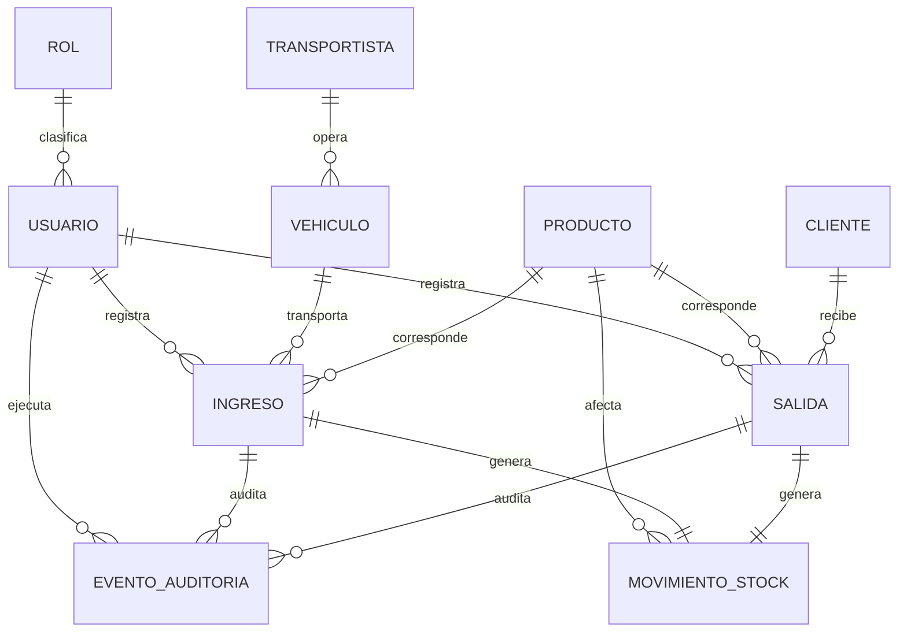

# Modelo de datos — Entidad-Relación

**Fuente única.** Todas las entidades del sistema se modelan aquí, sin importar cuántos módulos las usen. `Ingreso`, por ejemplo, la escriben M03 y M07, la leen M05, M06 y M09, y la audita M08: existe una sola definición.

---

## 1. Diagrama general

## 2. Entidades

### USUARIO (M01)

| Campo | Tipo | Notas |
|---|---|---|
| id_usuario | PK | |
| username | varchar(50) | único |
| password_hash | varchar | nunca en texto plano |
| nombres, apellidos | varchar(100) | |
| id_rol | FK -> ROL | |
| activo | boolean | la baja es lógica |
| intentos_fallidos | int | soporta el bloqueo temporal |
| ultimo_acceso | datetime | |

### ROL (M01)

| Campo | Tipo | Notas |
|---|---|---|
| id_rol | PK | |
| nombre | varchar(30) | Administrador, Administrativo, Supervisor |
| descripcion | text | |

### PRODUCTO (M02)

| Campo | Tipo | Notas |
|---|---|---|
| id_producto | PK | |
| codigo | varchar(20) | único |
| nombre | varchar(100) | Saranda, Molido |
| unidad_medida | varchar(10) | toneladas |
| activo | boolean | baja lógica: no se elimina si tiene movimientos |

### VEHICULO (M02)

| Campo | Tipo | Notas |
|---|---|---|
| id_vehiculo | PK | |
| placa | varchar(10) | única, formato validado |
| tipo_titularidad | enum | PROPIO / EXTERNO — **clave para el indicador I2** (ver D-06) |
| capacidad_tn | decimal(6,2) | |
| id_transportista | FK -> TRANSPORTISTA | nulo si es propio |
| activo | boolean | |

### TRANSPORTISTA (M02)

| Campo | Tipo | Notas |
|---|---|---|
| id_transportista | PK | |
| razon_social | varchar(150) | |
| ruc | varchar(11) | |
| activo | boolean | |

### CLIENTE (M02)

| Campo | Tipo | Notas |
|---|---|---|
| id_cliente | PK | |
| razon_social | varchar(150) | |
| ruc | varchar(11) | |
| activo | boolean | |

### INGRESO (M03) — unidad de análisis de la tesis

| Campo | Tipo | Notas |
|---|---|---|
| id_ingreso | PK | |
| correlativo | varchar(20) | único, asignado por el servidor (ver D-02) |
| uuid_local | uuid | identificador temporal de captura offline; nulo si se registró en línea |
| fecha_pesaje | date | del ticket de balanza |
| hora_pesaje | time | **ingresada por el usuario** desde el ticket (ver D-01) |
| hora_registro | datetime | **asignada por el sistema**; en offline es la hora de captura local (ver D-03) |
| hora_sincronizacion | datetime | nulo si se registró en línea; solo auditoría |
| id_vehiculo | FK -> VEHICULO | |
| id_producto | FK -> PRODUCTO | |
| peso_bruto_tn | decimal(8,2) | |
| tara_tn | decimal(8,2) | |
| peso_neto_tn | decimal(8,2) | calculado: bruto - tara |
| numero_ticket | varchar(20) | del ticket de balanza |
| id_usuario_registro | FK -> USUARIO | |
| capturado_offline | boolean | |
| estado | enum | REGISTRADO / ANULADO (ver D-07) |
| motivo_anulacion | text | obligatorio si estado = ANULADO |

**Indicador I1** = `hora_registro` − (`fecha_pesaje` + `hora_pesaje`)
**Indicador I2** = ingresos registrados / ingresos ocurridos, agrupado por `tipo_titularidad` del vehículo

### SALIDA (M04)

| Campo | Tipo | Notas |
|---|---|---|
| id_salida | PK | |
| correlativo | varchar(20) | único |
| fecha | date | |
| hora_registro | datetime | |
| id_producto | FK -> PRODUCTO | |
| id_cliente | FK -> CLIENTE | nulo si es movimiento interno |
| tipo_movimiento | enum | VENTA / TRASLADO_INTERNO / MERMA |
| cantidad_tn | decimal(8,2) | |
| id_usuario_registro | FK -> USUARIO | |
| estado | enum | REGISTRADO / ANULADO |

### MOVIMIENTO_STOCK (M05)

Tabla de asiento. Todo ingreso y toda salida generan exactamente un movimiento; el stock nunca se edita directamente.

| Campo | Tipo | Notas |
|---|---|---|
| id_movimiento | PK | |
| id_producto | FK -> PRODUCTO | |
| tipo | enum | ENTRADA / SALIDA / AJUSTE |
| cantidad_tn | decimal(8,2) | positiva siempre; el signo lo da `tipo` |
| fecha_movimiento | datetime | |
| id_ingreso | FK -> INGRESO | nulo si proviene de salida |
| id_salida | FK -> SALIDA | nulo si proviene de ingreso |
| saldo_resultante_tn | decimal(10,2) | denormalizado para consulta rápida — sostiene el indicador I3 |

### EVENTO_AUDITORIA (M08)

| Campo | Tipo | Notas |
|---|---|---|
| id_evento | PK | |
| id_usuario | FK -> USUARIO | |
| accion | enum | CREAR / MODIFICAR / ANULAR / EXPORTAR / INICIAR_SESION |
| entidad | varchar(50) | nombre de la tabla afectada |
| id_entidad | int | identificador del registro afectado |
| valores_anteriores | jsonb | nulo en creación |
| valores_nuevos | jsonb | nulo en anulación |
| fecha_hora | datetime | |
| direccion_ip | varchar(45) | |

## 3. Índices que sostienen indicadores

| Índice | Tabla | Justifica |
|---|---|---|
| `idx_ingreso_correlativo` | INGRESO(correlativo) | I5 — búsqueda por padrón |
| `idx_ingreso_fecha_producto` | INGRESO(fecha_pesaje, id_producto) | I5, I6 — consolidados |
| `idx_ingreso_vehiculo` | INGRESO(id_vehiculo) | I2 — cobertura por titularidad |
| `idx_movimiento_producto_fecha` | MOVIMIENTO_STOCK(id_producto, fecha_movimiento) | I3 — cálculo de stock |

Sin estos índices, el indicador I5 no mejora de forma apreciable frente al proceso manual cuando el volumen de registros crece. Es una decisión de rendimiento con consecuencia metodológica directa.

## 4. Pendiente

La entidad que represente el **criterio de merma por humedad** aún no puede modelarse: depende de una definición operativa que sigue abierta (ver `decisiones_diseno.md`, sección de pendientes). Bloquea el cierre de M04 y la interpretación del indicador I4.
