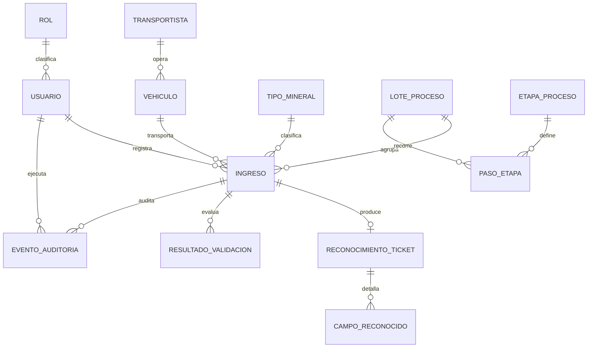

# Modelo de datos — Entidad-Relación

**Versión:** 2.0 · **Estado:** Aprobado
**Deriva de:** `../00-tesis/marco_tesis.md` y `../00-tesis/decisiones_reformulacion.md`

**Fuente única.** Todas las entidades del sistema se modelan aquí, sin importar cuántos módulos las
usen. `INGRESO`, por ejemplo, la escribe M03, la leen M07 y M08, la referencian M04, M05 y M06, y la
audita M09: existe una sola definición, y es esta.

Una app del backend solo tiene `models/` si aporta una entidad a este documento (D-10). Si un módulo
necesita persistir algo nuevo, la entidad se añade primero aquí y después al código, nunca al revés.

---

## 1. Diagrama general

Las entidades `CLIENTE`, `SALIDA` y `MOVIMIENTO_STOCK` del modelo anterior se retiran: pertenecen al
alcance que la reformulación dejó fuera.

## 2. Entidades

### USUARIO (M01)

| Campo | Tipo | Notas |
|---|---|---|
| id_usuario | PK | |
| username | varchar(50) | único |
| password_hash | varchar | nunca en texto plano |
| nombres, apellidos | varchar(100) | |
| id_rol | FK → ROL | |
| activo | boolean | la baja es lógica |
| intentos_fallidos | int | soporta el bloqueo temporal |
| ultimo_acceso | datetime | |

**Para qué existe.** Atribuir cada operación a una persona. Sin ella, ningún registro es imputable.
**Quién la usa.** La escribe M01; la referencian todos los módulos que persisten algo.

### ROL (M01)

| Campo | Tipo | Notas |
|---|---|---|
| id_rol | PK | |
| nombre | varchar(30) | ADMINISTRADOR, ADMINISTRATIVO, SUPERVISOR |
| descripcion | text | |

### TIPO_MINERAL (M02)

Catálogo único, usado al registrar el ingreso y al consolidar (DR-03).

| Campo | Tipo | Notas |
|---|---|---|
| id_tipo_mineral | PK | |
| codigo | varchar(20) | único |
| nombre | varchar(100) | valores a definir con la empresa |
| unidad_medida | varchar(10) | toneladas |
| activo | boolean | baja lógica: no se elimina si tiene ingresos |

**Para qué existe.** Clasificar qué trajo el volquete y permitir agrupar la producción del mes.
**Quién la usa.** La escribe M02; la leen M03 y M08.

> **Pendiente.** Los valores del catálogo no están definidos. Bloquea la implementación de M02 y la
> forma final del total mensual de M08.

### VEHICULO (M02)

| Campo | Tipo | Notas |
|---|---|---|
| id_vehiculo | PK | |
| placa | varchar(10) | única, formato validado (regla V3) |
| tipo_titularidad | enum | PROPIO / EXTERNO — de aquí se deriva el tipo de vehículo del ingreso (D-06) |
| capacidad_tn | decimal(6,2) | límite de carga que contrasta la regla V4 |
| id_transportista | FK → TRANSPORTISTA | nulo si es propio |
| activo | boolean | |

**Para qué existe.** Que el tipo de vehículo y su capacidad no se digiten en cada ingreso.
**Quién la usa.** La escribe M02; la leen M03, M05 y M07.

### TRANSPORTISTA (M02)

| Campo | Tipo | Notas |
|---|---|---|
| id_transportista | PK | |
| razon_social | varchar(150) | |
| ruc | varchar(11) | |
| activo | boolean | |

### INGRESO (M03) — unidad de registro del sistema

| Campo | Tipo | Notas |
|---|---|---|
| id_ingreso | PK | |
| codigo | varchar(20) | único, asignado por el servidor (D-02), `editable=False` |
| imagen_ticket | varchar(255) | ruta del respaldo; **obligatoria** (D-14 fija el medio) |
| fecha_hora_ticket | datetime | leída del ticket, corregible antes de confirmar |
| hora_inicio_registro | datetime | asignada por el servidor al recibir la imagen, `editable=False` |
| hora_fin_registro | datetime | asignada por el servidor al persistir, `editable=False` |
| id_vehiculo | FK → VEHICULO | la placa debe existir en el catálogo (DR-05) |
| id_tipo_mineral | FK → TIPO_MINERAL | |
| peso_bruto_tn | decimal(8,2) | leído del ticket |
| tara_tn | decimal(8,2) | leído del ticket |
| peso_neto_tn | decimal(8,2) | **leído del ticket**, no calculado; la regla V1 lo contrasta |
| numero_ticket | varchar(20) | opcional; único entre los no anulados |
| justificacion_peso | text | obligatorio si la regla V4 se resolvió con justificación |
| id_lote | FK → LOTE_PROCESO | nulo mientras el ingreso no se asigne a un lote |
| id_usuario_registro | FK → USUARIO | `editable=False` |
| estado | enum | REGISTRADO / ANULADO (D-07) |
| motivo_anulacion | text | obligatorio si estado = ANULADO |

**Para qué existe.** Es la unidad de registro: un volquete que entrega mineral en planta, con su
respaldo fotográfico y las tres marcas de tiempo que describen cómo se registró (D-01).

**Los siete datos obligatorios del registro** son la placa —a través de `id_vehiculo`—,
`fecha_hora_ticket`, `peso_bruto_tn`, `tara_tn`, `peso_neto_tn`, `id_tipo_mineral` y el tipo de
vehículo, derivado de `VEHICULO.tipo_titularidad`. Ninguno admite nulo en un ingreso confirmado.

**Por qué el peso neto no se calcula.** El ticket de balanza ya lo trae impreso. Calcularlo
sustituiría el dato real por uno derivado y haría imposible detectar un ticket incoherente, que es
justamente lo que la regla V1 debe señalar.

**Quién la usa.** La escribe M03; la leen M07 y M08; la referencian M04, M05 y M06; la audita M09.

### RECONOCIMIENTO_TICKET (M04)

Un reconocimiento por ingreso. Conserva qué leyó el motor, frente a lo que confirmó la persona.

| Campo | Tipo | Notas |
|---|---|---|
| id_reconocimiento | PK | |
| id_ingreso | FK → INGRESO | único: un reconocimiento por ingreso |
| motor | varchar(50) | identificador del motor empleado (D-12) |
| version_motor | varchar(30) | no cambia durante la medición (D-16) |
| fecha_proceso | datetime | |
| umbral_confianza | decimal(3,2) | vigente al procesar; 0,80 por defecto |
| exito | boolean | falso si la imagen resultó ilegible |

### CAMPO_RECONOCIDO (M04)

Seis filas por reconocimiento: placa, fecha, hora, peso bruto, tara y peso neto.

| Campo | Tipo | Notas |
|---|---|---|
| id_campo | PK | |
| id_reconocimiento | FK → RECONOCIMIENTO_TICKET | |
| nombre_campo | enum | PLACA / FECHA / HORA / PESO_BRUTO / TARA / PESO_NETO |
| valor_reconocido | varchar(50) | nulo si el motor no pudo leerlo |
| valor_confirmado | varchar(50) | lo que el usuario aceptó o corrigió |
| confianza | decimal(4,3) | entre 0 y 1; nulo si no hubo lectura |
| fue_corregido | boolean | derivado: reconocido ≠ confirmado |

**Para qué existe.** Separar la propuesta del dato (D-13). Guardar un solo valor haría imposible
distinguir lo que leyó el motor de lo que escribió la persona, y con ello se perdería la única
evidencia de si el reconocimiento funciona.

**Quién la usa.** La escribe M04 al confirmarse el ingreso; la lee M04 para el detalle comparativo.

### RESULTADO_VALIDACION (M05)

Una fila por regla aplicada a un ingreso.

| Campo | Tipo | Notas |
|---|---|---|
| id_resultado | PK | |
| id_ingreso | FK → INGRESO | |
| regla | enum | V1 / V2 / V3 / V4 / V5 |
| momento | enum | PROPUESTA / CONFIRMACION — las reglas se aplican dos veces |
| cumple | boolean | |
| detalle | text | valores concretos que motivaron el incumplimiento |
| resolucion | enum | NO_APLICA / CORREGIDA / JUSTIFICADA |
| fecha_hora | datetime | |

**Para qué existe.** Dejar constancia de qué se revisó y cómo se resolvió. Sin ella no se puede
reconstruir por qué un ingreso se aceptó ni quién justificó una advertencia.
**Quién la usa.** La escribe M05; la lee M09.

### ETAPA_PROCESO (M06)

Catálogo cerrado de cuatro filas: secado, zarandeo, molienda y ensacado.

| Campo | Tipo | Notas |
|---|---|---|
| id_etapa | PK | |
| codigo | enum | SECADO / ZARANDEO / MOLIENDA / ENSACADO |
| nombre | varchar(50) | |
| orden | smallint | 1 a 4, orden del proceso |

### LOTE_PROCESO (M06)

| Campo | Tipo | Notas |
|---|---|---|
| id_lote | PK | |
| codigo | varchar(20) | único, asignado por el servidor |
| id_tipo_mineral | FK → TIPO_MINERAL | |
| fecha_apertura | date | |
| fecha_cierre | date | nulo mientras admita ingresos |
| estado | enum | ABIERTO / CERRADO |

**Para qué existe.** El mineral de varios volquetes se mezcla en cancha, de modo que un ingreso no
recorre las etapas por sí solo: lo hace el lote al que pertenece (DR-04). El lote es la indirección
que hace realista la trazabilidad.

### PASO_ETAPA (M06)

| Campo | Tipo | Notas |
|---|---|---|
| id_paso | PK | |
| id_lote | FK → LOTE_PROCESO | |
| id_etapa | FK → ETAPA_PROCESO | único junto con `id_lote` |
| fecha_hora | datetime | |
| id_usuario_registro | FK → USUARIO | |
| observacion | text | opcional |

**Cómo se determina la trazabilidad de un ingreso.** Un ingreso ha pasado por una etapa cuando su
lote tiene el `PASO_ETAPA` correspondiente. Un ingreso sin lote no ha recorrido ninguna.

### EVENTO_AUDITORIA (M09)

| Campo | Tipo | Notas |
|---|---|---|
| id_evento | PK | |
| id_usuario | FK → USUARIO | |
| accion | enum | CREAR / MODIFICAR / ANULAR / RECONOCER / CORREGIR_DATO / EXPORTAR / INICIAR_SESION / CERRAR_SESION / ACCESO_RECHAZADO |
| entidad | varchar(50) | nombre de la tabla afectada |
| id_entidad | int | identificador del registro afectado |
| valores_anteriores | jsonb | nulo en creación |
| valores_nuevos | jsonb | nulo en anulación |
| fecha_hora | datetime | |
| direccion_ip | varchar(45) | |

`RECONOCER` y `CORREGIR_DATO` son las acciones que incorpora el sistema inteligente: la primera
registra que el motor procesó una imagen, la segunda que una persona cambió un valor propuesto.
`CERRAR_SESION` lo exige RS-M01-08 y `ACCESO_RECHAZADO`, la regla de que toda solicitud rechazada
por autorización quede registrada. El dominio vive en `common/eventos.py`, listo para usarse como
`choices`.

## 3. Índices

Cada índice se justifica por la consulta que sostiene y por su frecuencia esperada. Se crean desde
la primera migración: añadirlos después cambia las condiciones de trabajo a mitad del periodo.

| Índice | Tabla | Consulta que sostiene | Frecuencia |
|---|---|---|---|
| `idx_ingreso_codigo` | INGRESO(codigo) | Localizar un ingreso por su código. Cubierto por `unique=True` | Alta |
| `idx_ingreso_vehiculo_fecha` | INGRESO(id_vehiculo, fecha_hora_ticket) | Consulta por placa y fecha de M07, que es su caso de uso principal | Alta |
| `idx_ingreso_fecha_mineral` | INGRESO(fecha_hora_ticket, id_tipo_mineral) | Total acumulado mensual por producto de M08 | Media |
| `idx_ingreso_estado` | INGRESO(estado) | Excluir los anulados de todo total | Alta, siempre combinada |
| `idx_campo_reconocimiento` | CAMPO_RECONOCIDO(id_reconocimiento) | Recuperar los seis campos de un reconocimiento | Media |
| `idx_resultado_ingreso` | RESULTADO_VALIDACION(id_ingreso) | Inconsistencias de un ingreso | Media |
| `idx_paso_lote` | PASO_ETAPA(id_lote) | Etapas recorridas por un lote | Media |
| `idx_evento_entidad` | EVENTO_AUDITORIA(entidad, id_entidad) | Historial de un registro concreto | Baja |

Se retiran `idx_movimiento_producto_fecha`, que pertenecía al inventario de producto terminado, y la
justificación por titularidad de `idx_vehiculo_titularidad`; el índice sobre `VEHICULO` puede
conservarse por el filtro del catálogo.

## 4. Decisiones de modelado que conviene no revertir

| Decisión | Razón |
|---|---|
| Las dos marcas de tiempo del servidor son `editable=False` | Si se pudieran editar, el registro dejaría de describir cómo se trabajó realmente (D-01) |
| El peso neto se almacena tal como aparece en el ticket | Calcularlo impediría detectar un ticket incoherente (regla V1) |
| El valor reconocido y el confirmado son columnas distintas | Una sola columna borraría la diferencia entre lo que leyó el motor y lo que corrigió la persona (D-13) |
| La imagen del ticket es obligatoria y no se sustituye | Es el respaldo del ingreso; sin ella el registro no es verificable |
| Los ingresos anulados permanecen con su motivo | El histórico debe poder demostrarse íntegro (D-07) |
| Las cantidades son `decimal`, nunca punto flotante | El error acumulado se confundiría con diferencias reales entre el ticket y lo registrado |

## 5. Pendientes

| Pendiente | Bloquea |
|---|---|
| Valores del catálogo `TIPO_MINERAL`, a definir con la empresa (DR-03) | Implementación de M02 y forma del total mensual de M08 |
| Medio de almacenamiento y retención de `imagen_ticket` (D-14) | Implementación de M03 |
| Confirmación de la tolerancia de 0,01 t de la regla V1 | Conjunto de prueba de M05 |
| Forma real de agrupar el mineral en cancha | Alcance de `LOTE_PROCESO`; si la planta procesara volquete por volquete, el lote podría simplificarse a un vínculo directo |

## 6. Referencias

- Marco y reglas V1 a V5: `../00-tesis/marco_tesis.md`
- Decisiones de diseño: `decisiones_diseno.md`
- Módulos y responsabilidades: `../model-c4/ARQ-01_Modulos_del_Sistema.md`
- Trazabilidad completa: `../02-trazabilidad/matriz_HU_RF_indicador.md`
