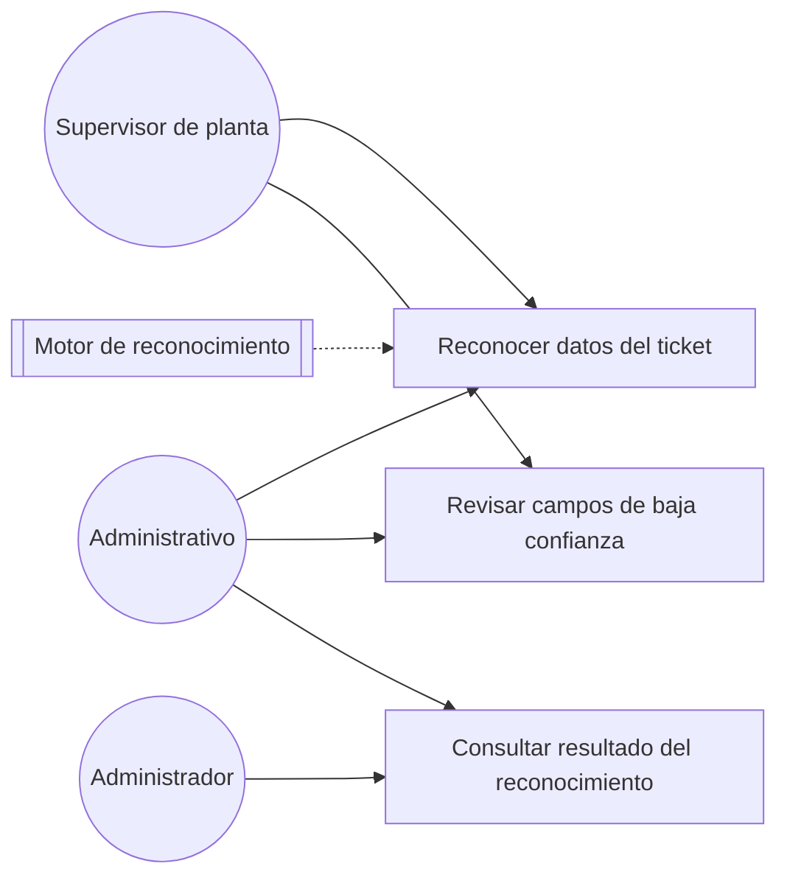
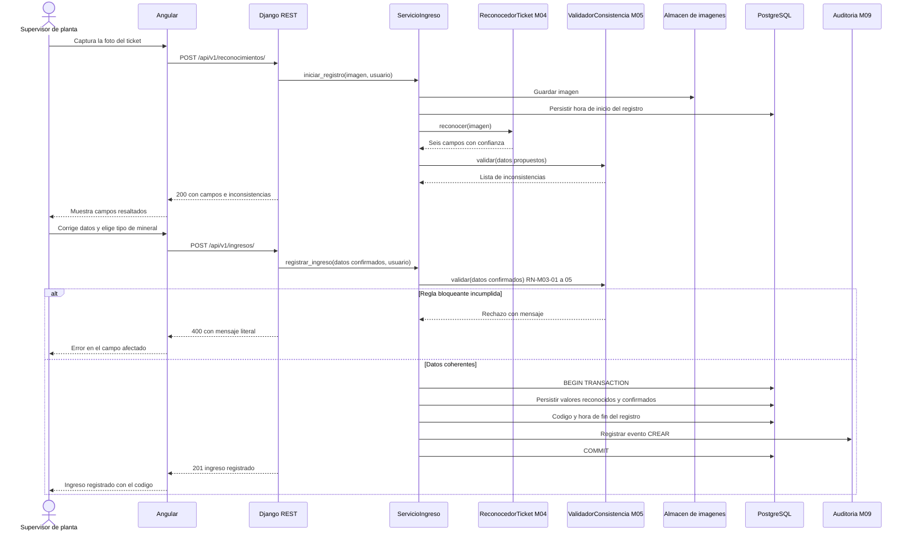
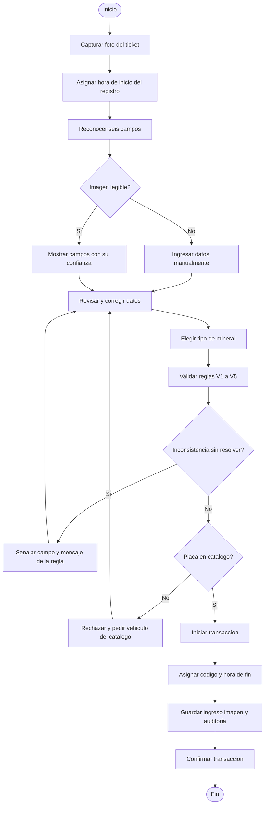

# Ejemplos de plantilla — historias, requerimientos y diagramas

| Campo | Valor |
|---|---|
| Documento | Plantillas de referencia |
| Origen | Anexos D y E de `../PLAN_TRABAJO.md`, corregidos según el principio rector |
| Fecha | 22/09/2026 |

Estos ejemplos son el **patrón exacto** que deben seguir los paquetes de módulo. Las reglas de
redacción están en las skills `historias-usuario`, `requisitos-modulo` y `diagramas-uml`; aquí está
la forma final.

> **Principio rector aplicado.** Ninguna historia, requerimiento ni diagrama cita indicadores de la
> tesis (I1 a I6, ERA, TDI, SUS, TCA) ni cierra con una sección sobre la medición. Lo que protege la
> medición se expresa como criterio de aceptación o como regla de negocio, en términos del dominio.
> La relación con la tesis se registra en `../02-trazabilidad/matriz_HU_RF_indicador.md`, cuyo
> fragmento de ejemplo está en la sección E.6.

---

## D — Ejemplos de historias de usuario

> En los `HU.md` reales, cada historia usa encabezado `##`.

### HU-M03-01 — Registro de un ingreso a partir del ticket de balanza

| Campo | Descripción |
|:--|:--|
| **Identificador** | HU-M03-01 |
| **Épica** | Registro de ingresos |
| **Prioridad** | Crítica |

**Historia**

Como supervisor de planta, quiero registrar el ingreso fotografiando el ticket de balanza apenas el
volquete sale de la balanza, para que el dato y su respaldo queden disponibles sin transcripción
posterior en la oficina.

**Descripción**

El registro empieza cuando el usuario captura o carga la imagen del ticket. En ese momento el
sistema asigna la hora de inicio del registro. El motor de reconocimiento (M04) propone los seis
datos del ticket y el validador (M05) señala las inconsistencias. El usuario revisa, corrige si hace
falta y completa el tipo de mineral. El tipo de vehículo no se digita, porque se deriva del catálogo
a partir de la placa. Al confirmar, el servidor asigna el código único y la hora de fin del registro,
y conserva la imagen como respaldo del ingreso.

El ingreso guarda tres marcas de tiempo independientes: la fecha y hora del ticket, el inicio del
registro y el fin del registro. La primera se lee del ticket y es editable antes de confirmar; las
otras dos las asigna el servidor y ningún rol las modifica.

**Detalles**
- Imagen del ticket: obligatoria, JPG o PNG, hasta 10 MB.
- Placa: obligatoria, reconocida y editable; debe corresponder a un vehículo vigente del catálogo.
- Fecha y hora del ticket: obligatorias, reconocidas y editables antes de confirmar.
- Peso bruto, tara y peso neto: obligatorios, reconocidos y editables, en toneladas, decimales
  positivos.
- Tipo de mineral: obligatorio, seleccionado del catálogo (M02).
- Tipo de vehículo: derivado del catálogo, no editable.
- Número de ticket: opcional; si se consigna, único entre los ingresos no anulados.
- Inicio y fin del registro: asignados por el sistema, no editables.
- Código: asignado por el servidor.

**Criterios de aceptación**

> **CA01.** Dado que el usuario capturó la imagen y confirma datos válidos y sin inconsistencias
> pendientes, cuando confirma el registro, entonces el sistema persiste el ingreso, le asigna un
> código y muestra "Ingreso registrado con el código {codigo}".

> **CA02.** Dado que el usuario no adjuntó la imagen del ticket, cuando intenta confirmar, entonces
> el sistema rechaza la operación mostrando "Debe adjuntar la imagen del ticket de balanza".

> **CA03.** Dado que falta alguno de los siete campos requeridos, cuando el usuario intenta
> confirmar, entonces el sistema rechaza la operación mostrando "Debe completar los campos
> obligatorios" e indica cuáles faltan.

> **CA04.** Dado que la placa no corresponde a un vehículo vigente del catálogo, cuando el usuario
> intenta confirmar, entonces el sistema rechaza la operación mostrando "La placa {placa} no está
> registrada en el catálogo de vehículos".

> **CA05.** Dado que existe una inconsistencia bloqueante o una advertencia sin justificar, cuando
> el usuario intenta confirmar, entonces el sistema rechaza la operación mostrando "Debe corregir o
> justificar las inconsistencias señaladas".

> **CA06.** Dado que un ingreso fue registrado, cuando se consulta su detalle, entonces el sistema
> muestra la fecha y hora del ticket, el inicio del registro y el fin del registro como tres valores
> distintos, y no permite editar los dos últimos.

> **CA07.** Dado que el ingreso se persiste, cuando concluye la operación, entonces el sistema
> conserva la imagen asociada al ingreso y registra el evento en auditoría.

---

### HU-M04-01 — Reconocimiento automático de los datos del ticket

| Campo | Descripción |
|:--|:--|
| **Identificador** | HU-M04-01 |
| **Épica** | Reconocimiento automático del ticket |
| **Prioridad** | Crítica |

**Historia**

Como supervisor de planta, quiero que el sistema lea automáticamente los datos del ticket a partir
de su imagen, para no transcribirlos manualmente y registrar el ingreso en menos tiempo.

**Descripción**

El motor de reconocimiento procesa la imagen y devuelve seis campos —placa, fecha, hora, peso bruto,
tara y peso neto—, cada uno con su nivel de confianza. El resultado es una **propuesta**: nunca se
persiste como dato del ingreso sin la confirmación del usuario (D-13). El sistema conserva por
separado el valor reconocido y el valor confirmado de cada campo, porque esa diferencia es la que
permite auditar después qué leyó el motor y qué corrigió la persona.

**Detalles**
- Campos reconocidos: placa, fecha, hora, peso bruto, tara y peso neto.
- Confianza por campo: valor entre 0 y 1.
- Umbral de confianza: configurable, 0,80 por defecto.
- Motor y versión: se registran en cada reconocimiento.

**Criterios de aceptación**

> **CA01.** Dado que la imagen es legible, cuando el sistema la procesa, entonces presenta los seis
> campos precargados junto con su nivel de confianza.

> **CA02.** Dado que un campo tiene una confianza inferior al umbral, cuando se presentan los
> resultados, entonces el sistema lo resalta y muestra "Verifique este dato: lectura con baja
> confianza".

> **CA03.** Dado que el motor no logra leer un campo, cuando se presentan los resultados, entonces
> el sistema deja ese campo vacío y editable, sin proponer un valor.

> **CA04.** Dado que la imagen es ilegible o tiene un formato no admitido, cuando el sistema intenta
> procesarla, entonces muestra "No fue posible leer el ticket. Tome una nueva fotografía o ingrese
> los datos manualmente".

> **CA05.** Dado que el usuario confirma el ingreso, cuando el sistema lo persiste, entonces guarda
> para cada campo el valor reconocido, el valor confirmado, la confianza, el motor y la versión.

---

### HU-M05-01 — Detección automática de inconsistencias del ticket

| Campo | Descripción |
|:--|:--|
| **Identificador** | HU-M05-01 |
| **Épica** | Validación automática de consistencia |
| **Prioridad** | Crítica |

**Historia**

Como supervisor de planta, quiero que el sistema señale automáticamente los datos del ticket que no
son coherentes, para corregirlos antes de que el ingreso quede registrado.

**Descripción**

El validador aplica las reglas V1 a V5 sobre los datos reconocidos y, de nuevo, sobre los datos
confirmados. Las reglas se ejecutan en el servidor (D-08). La interfaz solo muestra el resultado. V4
no bloquea, porque una sobrecarga real puede ocurrir, pero exige una justificación escrita.

**Detalles**

| Regla | Condición | Mensaje | Tipo |
|---|---|---|---|
| V1 | \|neto − (bruto − tara)\| > tolerancia | "El peso neto no coincide con el peso bruto menos la tara" | Bloqueante |
| V2 | tara ≥ bruto | "La tara no puede ser mayor o igual que el peso bruto" | Bloqueante |
| V3 | placa fuera del patrón | "La placa no tiene un formato válido" | Bloqueante |
| V4 | neto > capacidad del vehículo o neto ≤ 0 | "El peso neto está fuera del rango de carga del vehículo {placa}" | Exige justificación |
| V5 | fecha del ticket > fecha actual | "La fecha del ticket no puede ser posterior a la fecha de registro" | Bloqueante |

**Criterios de aceptación**

> **CA01.** Dado que los datos incumplen una regla bloqueante, cuando el sistema los valida,
> entonces señala el campo afectado con el mensaje literal de esa regla.

> **CA02.** Dado que el peso neto supera la capacidad del vehículo, cuando el usuario intenta
> confirmar sin justificación, entonces el sistema rechaza la operación mostrando "Debe indicar la
> justificación del peso fuera de rango".

> **CA03.** Dado que el usuario corrige un dato señalado, cuando el sistema vuelve a validar,
> entonces retira la alerta si la regla ya se cumple.

> **CA04.** Dado que todos los datos cumplen las cinco reglas, cuando el sistema los valida,
> entonces no muestra alertas y habilita la confirmación.

> **CA05.** Dado que el ingreso se confirma, cuando el sistema lo persiste, entonces guarda el
> resultado de cada regla aplicada y la justificación, si la hubo.

---

## E — Ejemplos de requerimientos y diagramas

### E.1 `requerimientos/funcionales.md` — M05 (fragmento)

**RF asociado:** **RF03** — Validar automáticamente la consistencia de los datos del ticket.

| Función | Descripción | HU | Endpoint |
|---|---|---|---|
| Validar datos propuestos | Aplica V1 a V5 sobre el resultado del reconocimiento | HU-M05-01 | `POST /api/v1/validaciones/` |
| Validar al confirmar | Repite V1 a V5 sobre los datos confirmados | HU-M05-01 | (interno, desde M03) |
| Registrar resultado | Persiste el resultado por regla y la justificación | HU-M05-01 | (interno) |

#### Responsabilidad y límites

M05 decide si un conjunto de datos es coherente; no los lee del ticket ni los persiste como ingreso.
Recibe valores ya extraídos —por M04 o digitados por el usuario— y devuelve la lista de
inconsistencias. Quien decide qué hacer con esa lista es M03, a través de la interfaz
`ValidadorConsistencia`. M05 no conoce la imagen ni el motor de reconocimiento.

#### Permisos

| Función | Administrador | Administrativo | Supervisor de planta |
|---|:---:|:---:|:---:|
| Validar datos propuestos | Sí | Sí | Sí |
| Consultar resultados de validación | Sí | Sí | No |

### E.2 `requerimientos/reglas_negocio.md` — M05 (fragmento)

| Código | Regla | Consecuencia si se viola |
|---|---|---|
| RN-M05-01 | Las reglas V1 a V5 se ejecutan en el servidor; el cliente solo muestra el resultado | Un ingreso enviado sin pasar por la interfaz entraría sin validar, y el histórico contendría datos que el sistema declara imposibles |
| RN-M05-02 | Un ingreso no se confirma con una regla bloqueante incumplida | Se registrarían toneladas que el ticket no respalda |
| RN-M05-03 | V4 exige justificación escrita para confirmar | Una sobrecarga quedaría registrada sin explicación y sería indistinguible de un error de lectura |
| RN-M05-04 | El resultado de cada regla aplicada se persiste junto al ingreso | No se podría reconstruir por qué un ingreso se aceptó ni quién justificó una advertencia |
| RN-M05-05 | Las reglas y sus parámetros no cambian durante la ventana de medición (D-16) | Dos ingresos del mismo periodo habrían sido evaluados con criterios distintos |

### E.3 `diagramas/caso_uso.md` — M04

| Caso | HU | Actores | Nota |
|---|---|---|---|
| Reconocer datos del ticket | HU-M04-01 | Supervisor de planta, Administrativo | El resultado es una propuesta; no se persiste sin confirmación |
| Revisar campos de baja confianza | HU-M04-01 | Supervisor de planta, Administrativo | Umbral por defecto de 0,80 |
| Consultar resultado del reconocimiento | HU-M04-02 | Administrativo, Administrador | Muestra el valor reconocido frente al confirmado |

Los actores se definen en `../../M01-autenticacion/diagramas/caso_uso.md` y no se redefinen aquí.

### E.4 `diagramas/secuencia.md` — M03

#### S-M03-01 · Registro de un ingreso con reconocimiento y validación (HU-M03-01, HU-M04-01, HU-M05-01)

### E.5 `diagramas/actividades.md` — M03

#### A-M03-01 · Registro de un ingreso a partir del ticket (HU-M03-01)

### E.6 Matriz de trazabilidad (fragmento)

Este es el **único** documento donde el sistema se relaciona con los indicadores de la tesis.

| HU | Título | Rol | Prioridad | RF | Indicador | Tarea | Caso de prueba |
|---|---|---|---|---|---|---|---|
| HU-M03-01 | Registro de un ingreso a partir del ticket | Supervisor de planta | Crítica | RF01, RF06 | I1, I2, I3 | T01 | CP01 |
| HU-M03-06 | Corrección de un ingreso registrado | Administrativo | Alta | RF04 | I3 | T02 | CP04 |
| HU-M04-01 | Reconocimiento automático de los datos del ticket | Supervisor de planta | Crítica | RF02 | ERA | T01 | CP02 |
| HU-M05-01 | Detección automática de inconsistencias | Supervisor de planta | Crítica | RF03 | TDI | T02 | CP03 |
| HU-M07-01 | Consulta de un ingreso por placa y fecha | Administrativo | Crítica | RF08 | I4 | T03 | CP08 |
