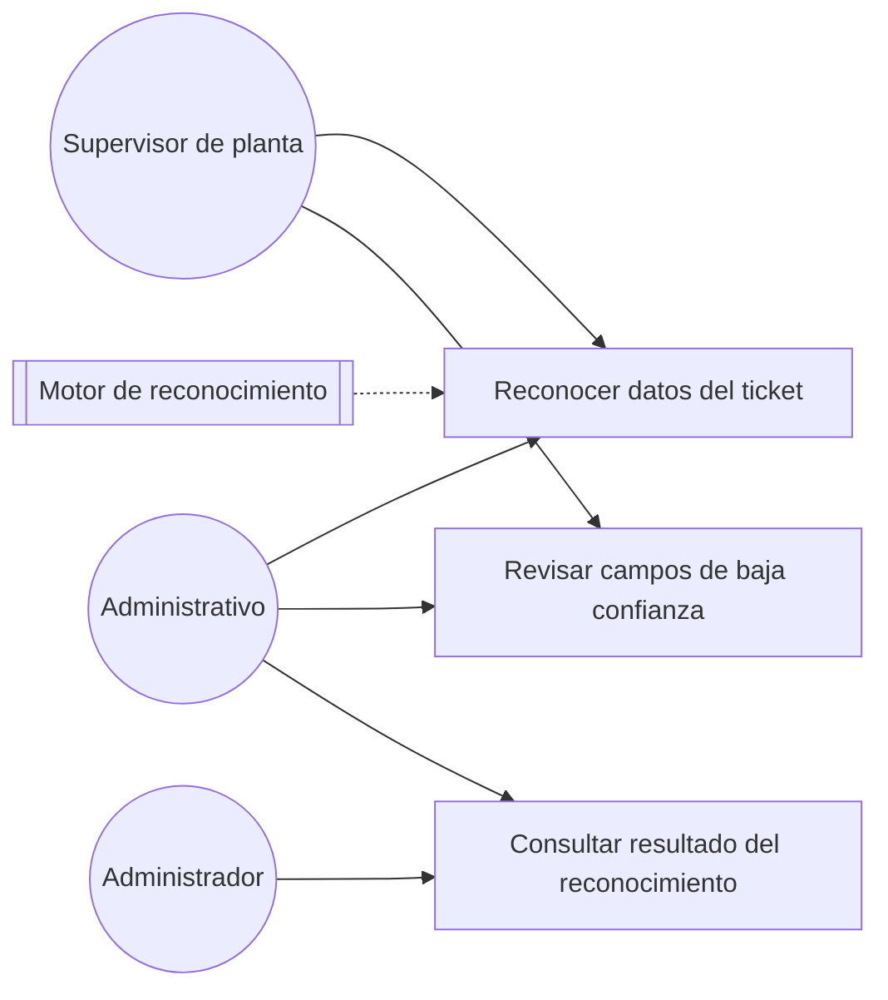
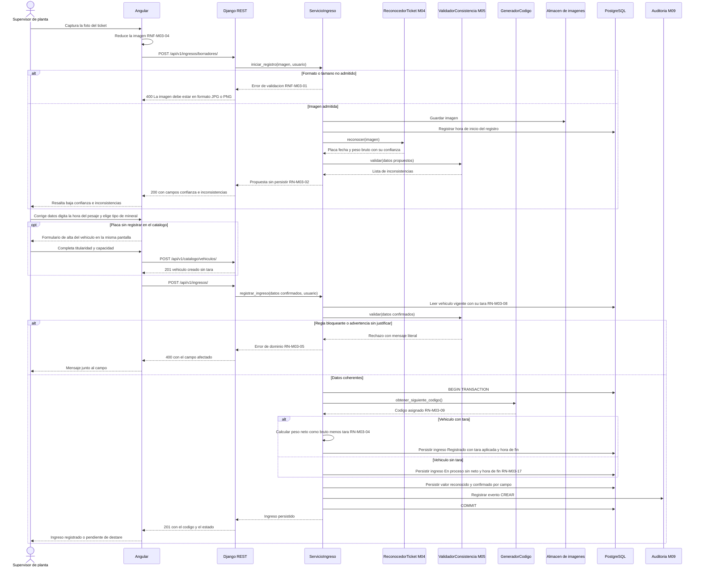
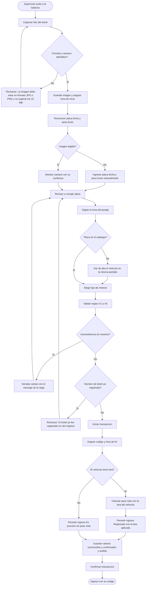

# Ejemplos de plantilla — historias, requerimientos y diagramas

| Campo | Valor |
|---|---|
| Documento | Plantillas de referencia |
| Origen | Anexos D y E de `../PLAN_TRABAJO.md`, corregidos según el principio rector |
| Fecha | 22/09/2026 · actualizado el 28/09/2026 con el formato real del ticket (DR-09, DR-10) |

Estos ejemplos son el **patrón exacto** que deben seguir los paquetes de módulo. Las reglas de
redacción están en las skills `historias-usuario`, `requisitos-modulo` y `diagramas-uml`; aquí está
la forma final.

> **Principio rector aplicado.** Ninguna historia, requerimiento ni diagrama cita indicadores de la
> tesis (I1 a I6, ERA, TDI, SUS, TCA) ni cierra con una sección sobre la medición. Lo que protege la
> medición se expresa como criterio de aceptación o como regla de negocio, en términos del dominio.
> La relación con la tesis se registra en `../02-trazabilidad/matriz_HU_RF_indicador.md`, cuyo
> fragmento de ejemplo está en la sección E.6.

---

## D — Ejemplos de historias de usuario

> En los `HU.md` reales, cada historia usa encabezado `##`.

### HU-M03-01 — Registro de un ingreso a partir del ticket de balanza

| Campo | Descripción |
|:--|:--|
| **Identificador** | HU-M03-01 |
| **Épica** | Registro de ingresos |
| **Prioridad** | Crítica |

**Historia**

Como supervisor de planta, quiero registrar el ingreso fotografiando el ticket de balanza apenas el
volquete sale de la balanza, para que el dato y su respaldo queden disponibles sin transcripción
posterior en la oficina.

**Descripción**

El registro empieza cuando el usuario captura o carga la imagen del ticket. En ese momento el
sistema conserva la imagen y asigna la hora de inicio del registro. El ticket de balanza imprime la
placa, la fecha y un único peso, que es el peso bruto: el reconocedor propone esos tres datos con su
nivel de confianza y el validador señala las inconsistencias. El usuario revisa, corrige lo que haga
falta, digita la hora del pesaje —que el ticket no imprime— y elige el tipo de mineral.

El tipo de vehículo y la tara no se digitan: se toman del catálogo a partir de la placa. El peso neto
tampoco: lo calcula el servidor como peso bruto menos la tara del vehículo, y el ingreso conserva la
tara que se le aplicó.

Si la placa no está en el catálogo, se trata del primer viaje de ese vehículo. El usuario lo da de
alta **en la misma pantalla**, sin perder lo ya capturado, y el registro continúa. Como un vehículo
nuevo aún no tiene tara, el ingreso se confirma en estado **En proceso**: queda con su código, su
peso bruto y sus marcas de tiempo, y recibe el peso neto cuando se registre el destare
(HU-M03-04). Lo mismo ocurre con un vehículo que ya existe en el catálogo pero todavía no fue
destarado.

Nada de lo propuesto se guarda como dato del ingreso hasta que el usuario confirma. Al confirmar, el
servidor vuelve a validar, asigna el código único y la hora de fin del registro, y persiste el
ingreso junto con los valores reconocidos y los confirmados, en una sola transacción.

El ingreso guarda tres marcas de tiempo independientes: la fecha y hora del pesaje, el inicio del
registro y el fin del registro. La primera combina la fecha reconocida del ticket con la hora que
digita el usuario, y es editable antes de confirmar; las otras dos las asigna el servidor y ningún
rol las modifica.

**Detalles**
- Imagen del ticket: obligatoria, JPG o PNG, hasta 10 MB.
- Placa: obligatoria, reconocida y editable. Si no está en el catálogo, se da de alta el vehículo en
  la misma pantalla con placa, titularidad, capacidad de carga y, si es externo, transportista.
- Fecha del pesaje: obligatoria, reconocida del ticket y editable antes de confirmar.
- Hora del pesaje: obligatoria, digitada por el usuario.
- Peso bruto: obligatorio, reconocido y editable, en toneladas, decimal positivo.
- Tara: tomada del catálogo del vehículo, no editable en el registro.
- Peso neto: calculado por el servidor como peso bruto menos tara, no editable; se muestra antes de
  confirmar como referencia.
- Tipo de mineral: obligatorio, seleccionado del catálogo.
- Tipo de vehículo: derivado del catálogo, no editable.
- Número de ticket: opcional; si se consigna, único entre los ingresos no anulados.
- Justificación: obligatoria solo si la validación advierte un ticket posiblemente duplicado o un
  peso fuera del rango de carga.
- Inicio y fin del registro: asignados por el servidor, no editables.
- Código: asignado por el servidor, no editable.
- Estado: Registrado si el vehículo tiene tara; En proceso si está pendiente de destare.

**Criterios de aceptación**

> **CA01.** Dado que el vehículo tiene tara registrada y el usuario confirma datos válidos y sin
> inconsistencias pendientes, cuando confirma el registro, entonces el sistema calcula el peso neto,
> persiste el ingreso como Registrado, le asigna un código y muestra "Ingreso registrado con el
> código {codigo}".

> **CA02.** Dado que el usuario no adjuntó la imagen del ticket, cuando intenta confirmar, entonces
> el sistema rechaza la operación mostrando "Debe adjuntar la imagen del ticket de balanza".

> **CA03.** Dado que falta la placa, la fecha, la hora del pesaje, el peso bruto o el tipo de
> mineral, cuando el usuario intenta confirmar, entonces el sistema rechaza la operación mostrando
> "Debe completar los campos obligatorios" e indica cuáles faltan.

> **CA04.** Dado que la placa no está registrada en el catálogo, cuando el sistema la valida,
> entonces muestra "La placa {placa} no está registrada. Complete los datos del vehículo para
> continuar" y ofrece el alta del vehículo en la misma pantalla, sin perder los datos ya capturados.

> **CA05.** Dado que el vehículo no tiene tara registrada, cuando el usuario confirma datos válidos,
> entonces el sistema persiste el ingreso En proceso, sin peso neto, y muestra "Ingreso {codigo}
> registrado en proceso: pendiente del destare del vehículo {placa}".

> **CA06.** Dado que existe una inconsistencia bloqueante o una advertencia sin justificar, cuando
> el usuario intenta confirmar, entonces el sistema rechaza la operación mostrando "Debe corregir o
> justificar las inconsistencias señaladas".

> **CA07.** Dado que el usuario adjunta un archivo que no es JPG ni PNG, o que supera los 10 MB,
> cuando intenta cargarlo, entonces el sistema lo rechaza mostrando "La imagen debe estar en formato
> JPG o PNG y no superar los 10 MB".

> **CA08.** Dado que un ingreso se confirma como Registrado, cuando el sistema lo persiste, entonces
> el peso neto es igual al peso bruto menos la tara del vehículo, no es editable, y el ingreso
> conserva la tara que se le aplicó.

> **CA09.** Dado que un ingreso fue confirmado, cuando se consulta su detalle, entonces el sistema
> muestra la fecha y hora del pesaje, el inicio del registro y el fin del registro como tres valores
> distintos, y no permite editar los dos últimos.

> **CA10.** Dado que el número de ticket ya figura en un ingreso no anulado, cuando el usuario
> intenta confirmar, entonces el sistema rechaza la operación mostrando "El ticket número {n} ya fue
> registrado en el ingreso {codigo}".

> **CA11.** Dado que el ingreso se persiste, cuando concluye la operación, entonces el sistema
> conserva la imagen asociada al ingreso, guarda para cada campo reconocido el valor propuesto y el
> confirmado, y registra el evento en auditoría.

> **CA12.** Dado que la operación falla en cualquier punto después de confirmar, cuando el sistema
> la interrumpe, entonces no queda un ingreso a medio registrar: o se persiste todo o no se persiste
> nada.

---

### HU-M04-01 — Reconocimiento automático de los datos del ticket

| Campo | Descripción |
|:--|:--|
| **Identificador** | HU-M04-01 |
| **Épica** | Reconocimiento automático del ticket |
| **Prioridad** | Crítica |

**Historia**

Como supervisor de planta, quiero que el sistema lea automáticamente los datos del ticket a partir
de su fotografía, para no transcribirlos a mano y terminar el registro en menos tiempo.

**Descripción**

El ticket de balanza imprime la placa, la fecha y un único peso, que es el peso bruto; el resto del
papel —quién recibe, la tarifa del pesaje, el concepto y las firmas— no se registra. El motor procesa
la imagen y devuelve esos tres campos, cada uno con un nivel de confianza entre 0 y 1. Los campos cuya confianza queda por debajo
del umbral se presentan resaltados, para que el usuario los verifique antes de confirmar.

El resultado es una propuesta. Nada de lo que devuelve el motor se guarda como dato del ingreso
hasta que el usuario lo revisa y confirma. Al confirmarse el ingreso, el sistema conserva por
separado el valor que leyó el motor y el valor que quedó confirmado, junto con la confianza, el
identificador del motor y su versión.

Cuando el motor no logra leer un campo, el sistema deja ese campo vacío y editable. No propone un
valor aproximado: un dato inventado con apariencia de lectura es peor que un campo en blanco, porque
el usuario podría aceptarlo sin verificarlo.

**Detalles**
- Campos reconocidos: placa, fecha y peso bruto.
- Campos que no se reconocen: la hora del pesaje, que el ticket no imprime y digita el usuario; la
  tara, que viene del catálogo del vehículo; y el peso neto, que calcula el sistema. La anotación
  manuscrita del destare tampoco se reconoce: la tara se digita (DR-10).
- Confianza por campo: valor entre 0 y 1; vacía si no hubo lectura.
- Umbral de confianza: configurable, 0,80 por defecto.
- Motor y versión: se registran en cada reconocimiento y no cambian durante la operación.
- Un reconocimiento por ingreso.

**Criterios de aceptación**

> **CA01.** Dado que la imagen es legible, cuando el sistema la procesa, entonces presenta los tres
> campos precargados junto con su nivel de confianza.

> **CA02.** Dado que un campo tiene una confianza inferior al umbral, cuando se presentan los
> resultados, entonces el sistema lo resalta y muestra "Verifique este dato: lectura con baja
> confianza".

> **CA03.** Dado que el motor no logra leer un campo, cuando se presentan los resultados, entonces
> el sistema deja ese campo vacío y editable, sin proponer ningún valor.

> **CA04.** Dado que la imagen es ilegible o tiene un formato no admitido, cuando el sistema intenta
> procesarla, entonces muestra "No fue posible leer el ticket. Tome una nueva fotografía o ingrese
> los datos manualmente" y permite continuar con el registro manual.

> **CA05.** Dado que el motor no responde o excede el tiempo de espera, cuando el sistema intenta
> procesarla, entonces muestra "El reconocimiento no está disponible. Puede ingresar los datos
> manualmente" y permite continuar.

> **CA06.** Dado que el sistema obtiene un resultado, cuando lo presenta al usuario, entonces no ha
> persistido ninguno de esos valores como dato del ingreso.

> **CA07.** Dado que el usuario confirma el ingreso, cuando el sistema lo persiste, entonces guarda
> para cada uno de los tres campos el valor reconocido, el valor confirmado y la confianza, junto
> con el motor y su versión.

---

### HU-M05-01 — Detección y resolución de inconsistencias del ticket

| Campo | Descripción |
|:--|:--|
| **Identificador** | HU-M05-01 |
| **Épica** | Validación automática de consistencia |
| **Prioridad** | Crítica |

**Historia**

Como supervisor de planta, quiero que el sistema señale automáticamente los datos del ticket que no
son coherentes, para corregirlos antes de que el ingreso quede registrado y no descubrirlos cuando
el volquete ya se fue.

**Descripción**

El validador aplica cinco reglas sobre los datos del ingreso: que no exista ya un ingreso con la
misma placa, la misma fecha y el mismo peso bruto; que la tara del vehículo sea menor que el peso
bruto; que la placa tenga un formato válido; que el peso neto calculado esté dentro del rango de
carga del vehículo; y que la fecha del ticket no sea posterior al momento del registro.

Las reglas que dependen de la tara —V2 y V4— no pueden evaluarse en el primer viaje de un vehículo,
porque todavía no tiene tara: se omiten al registrar el ingreso En proceso y se evalúan al registrar
el destare.

Las reglas se ejecutan dos veces: sobre los valores que propone el reconocimiento, para señalar de
inmediato lo que no cuadra, y de nuevo sobre los valores que el usuario confirma, porque entre una y
otra el usuario pudo haber introducido un error nuevo. Se ejecutan siempre en el servidor: la
interfaz solo muestra el resultado.

Tres de las cinco reglas bloquean la confirmación. Las otras dos no bloquean, pero exigen una
justificación escrita: la del posible duplicado, porque un mismo vehículo puede hacer dos viajes el
mismo día con un peso idéntico, y la del rango de carga, porque una sobrecarga real puede ocurrir. En
ambos casos el sistema no impide registrar el hecho: impide registrarlo sin explicación.

Al confirmarse el ingreso, el sistema guarda el resultado de cada regla aplicada y la justificación
si la hubo, de modo que después pueda saberse qué se revisó y cómo se resolvió.

**Detalles**

| Regla | Condición que señala | Mensaje | Efecto |
|---|---|---|---|
| V1 | Ya existe un ingreso no anulado con la misma placa, la misma fecha y el mismo peso bruto | "El ticket parece duplicado: ya existe el ingreso {codigo} con la misma placa, fecha y peso" | Exige justificación |
| V2 | La tara del vehículo es mayor o igual que el peso bruto | "La tara no puede ser mayor o igual que el peso bruto" | Bloquea |
| V3 | La placa no corresponde al patrón de placa peruana | "La placa no tiene un formato válido" | Bloquea |
| V4 | El peso neto calculado supera la capacidad del vehículo | "El peso neto está fuera del rango de carga del vehículo {placa}" | Exige justificación |
| V5 | La fecha del ticket es posterior al momento del registro | "La fecha del ticket no puede ser posterior a la fecha de registro" | Bloquea |

- Criterio de V1: coincidencia exacta de placa, fecha del pesaje y peso bruto con un ingreso no
  anulado.
- Tara de V2 y peso neto de V4: los del vehículo en el catálogo; en el primer viaje se evalúan al
  registrar el destare.
- Capacidad de V4: la declarada para el vehículo en el catálogo.
- Justificación de V1 y V4: texto obligatorio para poder confirmar con la advertencia presente.
- Las reglas no se evalúan sobre campos vacíos: un campo sin dato lo reclama el registro, no el
  validador.

**Criterios de aceptación**

> **CA01.** Dado que los datos incumplen una regla bloqueante, cuando el sistema los valida,
> entonces señala el campo afectado con el mensaje literal de esa regla.

> **CA02.** Dado que el peso neto queda fuera del rango de carga del vehículo, cuando el usuario
> intenta confirmar sin justificación, entonces el sistema rechaza la operación mostrando "Debe
> indicar la justificación del peso fuera de rango".

> **CA03.** Dado que el usuario escribe la justificación de una advertencia, cuando confirma el
> ingreso, entonces el sistema lo acepta y conserva la justificación junto al resultado de la regla.

> **CA04.** Dado que el usuario corrige un dato señalado, cuando el sistema vuelve a validar,
> entonces retira la alerta si la regla ya se cumple.

> **CA05.** Dado que los datos incumplen varias reglas a la vez, cuando el sistema los valida,
> entonces informa todas las inconsistencias, no solo la primera.

> **CA06.** Dado que todos los datos cumplen las cinco reglas, cuando el sistema los valida,
> entonces no muestra alertas y habilita la confirmación.

> **CA07.** Dado que una petición llega sin pasar por el formulario, cuando el sistema la procesa,
> entonces aplica las mismas cinco reglas y la rechaza si incumple alguna bloqueante.

> **CA08.** Dado que el ingreso se confirma, cuando el sistema lo persiste, entonces guarda el
> resultado de cada una de las cinco reglas y la justificación, si la hubo.

> **CA09.** Dado que un campo requerido está vacío, cuando el sistema valida, entonces no lo señala
> como inconsistencia: la ausencia del dato la reclama el registro.

> **CA10.** Dado que ya existe un ingreso no anulado con la misma placa, fecha y peso bruto, cuando
> el usuario intenta confirmar sin justificación, entonces el sistema rechaza la operación mostrando
> "Debe indicar la justificación del posible duplicado".

> **CA11.** Dado que el vehículo todavía no tiene tara, cuando el sistema valida el registro,
> entonces omite V2 y V4, y las evalúa al registrarse el destare.

---

## E — Ejemplos de requerimientos y diagramas

### E.1 `requerimientos/funcionales.md` — M05 (fragmento)

**RF asociado:** **RF03** — Validar automáticamente la consistencia de los datos del ticket.

| Función | Descripción | HU | Endpoint |
|---|---|---|---|
| Validar datos propuestos | Aplica V1 a V5 sobre el resultado del reconocimiento y devuelve las inconsistencias | HU-M05-01 | (interno, desde M03) |
| Validar al confirmar | Repite V1 a V5 sobre los datos confirmados antes de persistir | HU-M05-01 | (interno, desde M03) |
| Registrar resultado | Persiste el resultado por regla, con su momento y su resolución | HU-M05-01 | (interno, en la transacción de M03) |
| Consultar validaciones de un ingreso | Devuelve qué reglas se evaluaron y cómo se resolvieron | HU-M05-01 | `GET /api/v1/ingresos/{id}/validaciones/` |

#### Responsabilidad y límites

M05 decide si un conjunto de datos es coherente; no los lee del ticket ni los persiste como ingreso.
Recibe valores ya extraídos —por M04 o digitados por el usuario— y devuelve la lista de
inconsistencias. Quien decide qué hacer con esa lista es M03, a través de la interfaz
`ValidadorConsistencia`. M05 no conoce la imagen ni el motor de reconocimiento.

#### Permisos

| Función | Administrador | Administrativo | Supervisor de planta |
|---|:---:|:---:|:---:|
| Validar datos propuestos | Sí | Sí | Sí |
| Consultar resultados de validación | Sí | Sí | No |

### E.2 `requerimientos/reglas_negocio.md` — M05 (fragmento)

| Código | Regla | Consecuencia si se viola |
|---|---|---|
| RN-M05-01 | Las reglas V1 a V5 se ejecutan en el servidor; el cliente solo muestra el resultado | Una petición que no pase por el formulario entraría sin validar, y el histórico contendría datos que el sistema declara imposibles |
| RN-M05-02 | Un ingreso no se confirma con una regla bloqueante incumplida | Se registrarían toneladas que el ticket no respalda |
| RN-M05-03 | V1 y V4 no bloquean, pero exigen justificación escrita para confirmar | Un posible duplicado o una sobrecarga quedarían registrados sin explicación, indistinguibles de un error |
| RN-M05-04 | Las cinco reglas se evalúan siempre; ninguna se omite porque otra ya haya fallado | El usuario corregiría un error por intento, y un trabajo de segundos se convertiría en varios ciclos |
| RN-M05-05 | Las reglas se aplican sobre los datos propuestos, de nuevo sobre los confirmados y, en el primer viaje, al registrar el destare | Un error introducido al corregir, o una tara incoherente con el peso bruto, entraría sin comprobarse |

### E.3 `diagramas/caso_uso.md` — M04

```mermaid
flowchart LR
    SUP(("Supervisor de planta"))
    ADV(("Administrativo"))
    ADM(("Administrador"))
    MOT[["Motor de reconocimiento"]]

    UC1["Reconocer datos del ticket"]
    UC2["Revisar campos de baja confianza"]
    UC3["Consultar resultado del reconocimiento"]

    SUP --> UC1
    SUP --> UC2
    ADV --> UC1
    ADV --> UC2
    ADV --> UC3
    ADM --> UC3
    MOT -.-> UC1
```

| Caso | HU | Actores | Nota |
|---|---|---|---|
| Reconocer datos del ticket | HU-M04-01 | Supervisor de planta, Administrativo | El resultado es una propuesta; no se persiste sin confirmación |
| Revisar campos de baja confianza | HU-M04-01 | Supervisor de planta, Administrativo | Umbral por defecto de 0,80 |
| Consultar resultado del reconocimiento | HU-M04-02 | Administrativo, Administrador | Muestra el valor reconocido frente al confirmado |

Los actores se definen en `../../M01-autenticacion/diagramas/caso_uso.md` y no se redefinen aquí.

### E.4 `diagramas/secuencia.md` — M03

#### S-M03-01 · Registro de un ingreso con reconocimiento y validación (HU-M03-01)

```mermaid
sequenceDiagram
    actor S as Supervisor de planta
    participant NG as Angular
    participant API as Django REST
    participant SRV as ServicioIngreso
    participant REC as ReconocedorTicket M04
    participant VAL as ValidadorConsistencia M05
    participant COR as GeneradorCodigo
    participant IMG as Almacen de imagenes
    participant DB as PostgreSQL
    participant AUD as Auditoria M09

    S->>NG: Captura la foto del ticket
    NG->>NG: Reduce la imagen RNF-M03-04
    NG->>API: POST /api/v1/ingresos/borradores/
    API->>SRV: iniciar_registro(imagen, usuario)

    alt Formato o tamano no admitido
        SRV-->>API: Error de validacion RNF-M03-01
        API-->>NG: 400 La imagen debe estar en formato JPG o PNG
    else Imagen admitida
        SRV->>IMG: Guardar imagen
        SRV->>DB: Registrar hora de inicio del registro
        SRV->>REC: reconocer(imagen)
        REC-->>SRV: Placa fecha y peso bruto con su confianza
        SRV->>VAL: validar(datos propuestos)
        VAL-->>SRV: Lista de inconsistencias
        SRV-->>API: Propuesta sin persistir RN-M03-02
        API-->>NG: 200 con campos confianza e inconsistencias
        NG-->>S: Resalta baja confianza e inconsistencias
    end

    S->>NG: Corrige datos digita la hora del pesaje y elige tipo de mineral
    opt Placa sin registrar en el catalogo
        NG-->>S: Formulario de alta del vehiculo en la misma pantalla
        S->>NG: Completa titularidad y capacidad
        NG->>API: POST /api/v1/catalogo/vehiculos/
        API-->>NG: 201 vehiculo creado sin tara
    end
    NG->>API: POST /api/v1/ingresos/
    API->>SRV: registrar_ingreso(datos confirmados, usuario)
    SRV->>DB: Leer vehiculo vigente con su tara RN-M03-08
    SRV->>VAL: validar(datos confirmados)

    alt Regla bloqueante o advertencia sin justificar
        VAL-->>SRV: Rechazo con mensaje literal
        SRV-->>API: Error de dominio RN-M03-05
        API-->>NG: 400 con el campo afectado
        NG-->>S: Mensaje junto al campo
    else Datos coherentes
        SRV->>DB: BEGIN TRANSACTION
        SRV->>COR: obtener_siguiente_codigo()
        COR-->>SRV: Codigo asignado RN-M03-09
        alt Vehiculo con tara
            SRV->>SRV: Calcular peso neto como bruto menos tara RN-M03-04
            SRV->>DB: Persistir ingreso Registrado con tara aplicada y hora de fin
        else Vehiculo sin tara
            SRV->>DB: Persistir ingreso En proceso sin neto y hora de fin RN-M03-17
        end
        SRV->>DB: Persistir valor reconocido y confirmado por campo
        SRV->>AUD: Registrar evento CREAR
        SRV->>DB: COMMIT
        SRV-->>API: Ingreso persistido
        API-->>NG: 201 con el codigo y el estado
        NG-->>S: Ingreso registrado o pendiente de destare
    end
```

### E.5 `diagramas/actividades.md` — M03

#### A-M03-01 · Registro de un ingreso a partir del ticket (HU-M03-01)

```mermaid
flowchart TD
    I([Supervisor junto a la balanza]) --> C1[Capturar foto del ticket]
    C1 --> V1{Formato y tamano admitidos?}
    V1 -->|No| E1[Rechazar: La imagen debe estar en formato JPG o PNG y no superar los 10 MB]
    E1 --> C1
    V1 -->|Si| A1[Guardar imagen y asignar hora de inicio]
    A1 --> R1[Reconocer placa fecha y peso bruto]
    R1 --> D1{Imagen legible?}
    D1 -->|No| L1[Ingresar placa fecha y peso bruto manualmente]
    D1 -->|Si| C2[Mostrar campos con su confianza]
    L1 --> L2[Revisar y corregir datos]
    C2 --> L2
    L2 --> L3[Digitar la hora del pesaje]
    L3 --> D2{Placa en el catalogo?}
    D2 -->|No| L4[Dar de alta el vehiculo en la misma pantalla]
    L4 --> L5[Elegir tipo de mineral]
    D2 -->|Si| L5
    L5 --> V2[Validar reglas V1 a V5]
    V2 --> D3{Inconsistencia sin resolver?}
    D3 -->|Si| E2[Senalar campo con el mensaje de la regla]
    E2 --> L2
    D3 -->|No| V3{Numero de ticket ya registrado?}
    V3 -->|Si| E3[Rechazar: El ticket ya fue registrado en otro ingreso]
    E3 --> L2
    V3 -->|No| T1[Iniciar transaccion]
    T1 --> A2[Asignar codigo y hora de fin]
    A2 --> D4{El vehiculo tiene tara?}
    D4 -->|Si| A3[Calcular peso neto con la tara del vehiculo]
    A3 --> P1[Persistir ingreso Registrado con la tara aplicada]
    D4 -->|No| P2[Persistir ingreso En proceso sin peso neto]
    P1 --> P3[Guardar valores reconocidos y confirmados y auditar]
    P2 --> P3
    P3 --> T2[Confirmar transaccion]
    T2 --> F([Ingreso con su codigo])
```

### E.6 Matriz de trazabilidad (fragmento)

Este es el **único** documento donde el sistema se relaciona con los indicadores de la tesis.

| HU | Título | Rol | Prioridad | RF | Indicador | Tarea | Caso de prueba |
|---|---|---|---|---|---|---|---|
| HU-M03-01 | Registro de un ingreso a partir del ticket | Supervisor de planta | Crítica | RF01, RF06 | I1, I2, I3 | T01 | CP01 |
| HU-M03-02 | Corrección de un ingreso registrado | Administrativo | Alta | RF04 | I3 | T02 | CP04 |
| HU-M04-01 | Reconocimiento automático de los datos del ticket | Supervisor de planta | Crítica | RF02 | ERA | T01 | CP02 |
| HU-M03-04 | Registro del destare de un vehículo en su primer viaje | Supervisor de planta | Crítica | RF01 | I3 (C4, C5), TDI (V2, V4) | T01 | CP01 |
| HU-M05-01 | Detección y resolución de inconsistencias del ticket | Supervisor de planta | Crítica | RF03 | TDI | T02 | CP03 |
| HU-M07-01 | Consulta de un ingreso por placa y fecha | Administrativo | Crítica | RF08 | I4 | T03 | CP08 |
