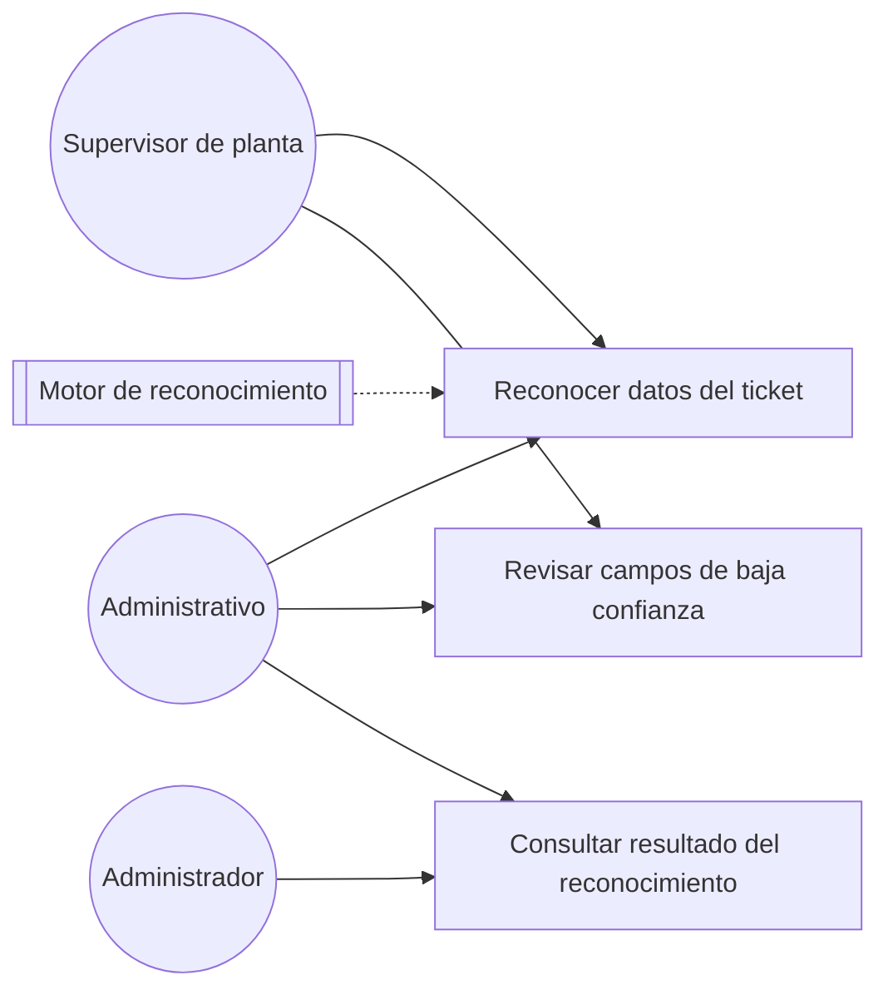
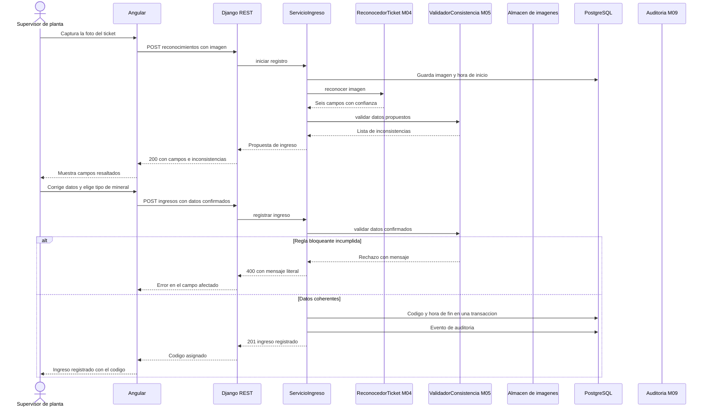
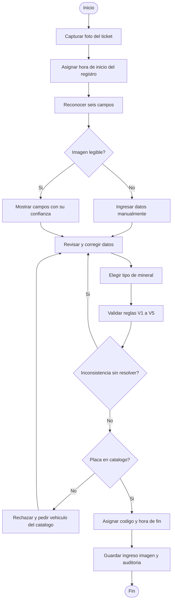

# PLAN-02 — Migración de LogisticaMinera a sistema web inteligente

| Campo | Valor |
|---|---|
| Documento | PLAN-02 |
| Base | `IMPACTO_Reformulacion_Sistema_Inteligente.md` (análisis de impacto del 21/09/2026) |
| Ejecutor | Agente de IA sobre el repositorio (Claude Code u otro), con revisión humana por fase |
| Rama | `docs/reformulacion/sistema-inteligente` |
| Regla de oro | Ninguna fase empieza sin que la anterior haya pasado su verificación y tu revisión |
| Principio rector | La documentación describe **un sistema**, no una tesis. Prevalece sobre los ejemplos de los Anexos D y E |
| Estado | Fase 0 y Fase 1 ejecutadas el 22/09/2026 |

---

## 1. Cómo usar este plan

1. Ejecuta las fases **en orden**. Cada fase depende de lo que fijó la anterior.
2. Abre **una sesión nueva del agente por fase**. Así el contexto no arrastra conceptos antiguos.
3. Copia el bloque **Prompt** tal cual. Si una decisión del Anexo B cambia, edita el prompt antes de pegarlo.
4. Al terminar cada fase, ejecuta la **Verificación** y revisa tú los archivos. Solo entonces haces el commit.
5. La Fase 5 (módulo piloto M03) es el punto de control más importante. Lo que apruebes ahí se convierte en la plantilla de los demás módulos.

**Principio rector.** Los módulos se definen por su **responsabilidad** en el dominio, no por el
indicador que sostienen. Ningún archivo de `docs/modulos/` cita indicadores (I1 a I6, ERA, TDI, SUS,
TCA, RFC, CPS) ni cierra con una sección sobre la medición: lo que protege un indicador se expresa
como regla de negocio o RNF, con su consecuencia en términos del dominio. La relación tesis ↔ sistema
vive en un solo lugar, `docs/02-trazabilidad/matriz_HU_RF_indicador.md`. Las reglas V1 a V5 sí se
citan en los módulos, porque son reglas del sistema. El cronograma vive solo en `docs/01-plan/`.

**Por qué las skills se actualizan primero.** Las skills del repositorio (`historias-usuario`, `diagramas-uml`, `requisitos-modulo`, etc.) le dan instrucciones al agente. Hoy contienen reglas del sistema anterior. Por ejemplo, `historias-usuario` prohíbe que el peso neto sea un campo de entrada, y en el nuevo diseño el neto se lee del ticket. Si no se corrigen antes, el agente reproducirá el sistema antiguo aunque el prompt diga lo contrario.

---

## 2. Mapa de fases

| Fase | Qué produce | Quién | Punto de control |
|---|---|---|---|
| 0 | Rama, marco de tesis, decisiones cerradas, `CLAUDE.md` | Tú | Decisiones del Anexo B firmadas — **hecha** |
| 1 | Skills de documentación reescritas | Agente | Revisión de `contexto-tesis` — **hecha** |
| 2 | ARQ-01 (módulos) y decisiones de diseño D-01 a D-16 | Agente | Lista cerrada de módulos |
| 3 | Modelo entidad-relación | Agente | Entidades e índices |
| 4 | Matriz de trazabilidad y backlog índice | Agente | Cada RF y tarea tiene HU |
| 5 | **Módulo piloto M03 completo** | Agente | **Aprobación de estilo** |
| 6 | Módulos nuevos M04, M05, M06 | Agente | Una revisión por módulo |
| 7 | M07, M08, M09, ajustes a M01 y M02, retiro de módulos antiguos | Agente | Carpetas antiguas eliminadas |
| 8 | ARQ-02, ARQ-03 (C4) y guías | Agente | Diagramas C4 coherentes |
| 9 | Plan de trabajo, plan de pruebas y skills técnicas | Agente | Protocolo ERA/TDI |
| 10 | Limpieza del backend | Agente | Pruebas en verde |
| 11 | Auditoría final y merge | Agente + tú | Script sin hallazgos |

---

## 3. Fases

### Fase 0 — Preparación y decisiones — **ejecutada el 22/09/2026**

> Se creó `CLAUDE.md`, `docs/00-tesis/marco_tesis.md`, `docs/00-tesis/decisiones_reformulacion.md`
> (DR-01 a DR-08 aceptadas), `docs/00-tesis/ejemplos_plantilla.md` y `scripts/verificar_migracion.sh`.
> El análisis de impacto **no se copió** a `docs/00-tesis/`: permanece en `docs/REFORMULACION.md` y
> se referencia desde ahí, para no mantener dos copias del mismo documento. El trabajo sobre el Word
> de la tesis (DR-06) sigue pendiente y es responsabilidad del autor.

**Objetivo.** Dejar en el repositorio la fuente de verdad de la tesis y las decisiones cerradas, para que el agente no invente nada.

**Pasos.**

1. Crea la rama:
   ```bash
   git checkout main && git pull
   git checkout -b docs/reformulacion/sistema-inteligente
   mkdir -p docs/00-tesis docs/02-trazabilidad docs/03-pruebas scripts
   ```
2. Copia el análisis de impacto a `docs/00-tesis/IMPACTO_Reformulacion_Sistema_Inteligente.md`.
3. Crea `docs/00-tesis/marco_tesis.md` con el contenido del **Anexo A**. Revisa los valores marcados `[CONFIRMAR]`.
4. Crea `docs/00-tesis/decisiones_reformulacion.md` con la tabla del **Anexo B**. Marca cada decisión como Aceptada o escribe tu alternativa.
5. Crea `CLAUDE.md` en la raíz con el contenido del **Anexo C**.
6. Fuera del repositorio, en el Word de la tesis: si aceptas DR-06, actualiza RF03 y RF09 en el Anexo 03 y la tarea T06 en el Anexo 04 **antes** del juicio de expertos.

**Verificación.** Los cuatro archivos existen y ninguna decisión del Anexo B queda sin estado.

**Commit.** `docs(reformulacion): Marco de tesis y decisiones de reformulacion`

---

### Fase 1 — Fuente de verdad y skills de documentación — **ejecutada el 22/09/2026**

> Reescritas `contexto-tesis`, `historias-usuario`, `requisitos-modulo`, `diagramas-uml`,
> `revision-coherencia` y `modulo-nuevo`, más un ejemplo de `commit-tesis`. El prompt que sigue se
> conserva como registro de lo que se pidió.

**Objetivo.** Que el agente, en las fases siguientes, cargue reglas del sistema nuevo y no del antiguo.

**Prompt**

```text
Lee CLAUDE.md, docs/00-tesis/marco_tesis.md, docs/00-tesis/decisiones_reformulacion.md
y docs/00-tesis/IMPACTO_Reformulacion_Sistema_Inteligente.md.

Tarea: reescribir las skills de documentación para el sistema web inteligente.

1. skills/contexto-tesis/SKILL.md — reescríbela completa. Debe contener: título, variables,
   dimensiones, indicadores de la VD (I1 a I6 del Anexo 02) y de la VI (RFC, CPS, ERA, TDI,
   SUS, TCA), los 7 campos de completitud, RF01 a RF10, tareas T01 a T06, reglas V1 a V5,
   roles, mapa de módulos M01 a M09 del marco, decisiones vigentes, fuera de alcance y
   nomenclatura (RF sin guion: RF01). Conserva la estructura y el tono de la versión actual.
   Elimina toda mención a stock, salidas, merma, kardex, captura sin conexión, declaración
   semestral, Ley 32213 y a los indicadores antiguos.
2. skills/historias-usuario/SKILL.md — actualiza: descripción del sistema, referencia de estilo
   (seguirá siendo M03), la tabla "Lo que nunca debe aparecer" (el peso neto ahora se lee del
   ticket y se valida con V1; lo prohibido es persistir un dato reconocido sin confirmación del
   usuario) y la regla de "una sola marca de tiempo" (ahora son tres: fecha y hora del ticket,
   inicio del registro y fin del registro).
3. skills/requisitos-modulo, skills/diagramas-uml, skills/revision-coherencia,
   skills/modulo-nuevo — reemplaza referencias a indicadores, RF y módulos antiguos. Corrige la
   nota obsoleta sobre carpetas: todos los módulos usan requerimientos/.

No modifiques docs/ ni backend/ en esta fase. Al terminar, lista los archivos cambiados y
cualquier contradicción que encuentres entre el marco y las decisiones.
```

**Verificación.**

```bash
grep -rnE "stock|merma|kardex|sin conexi|semestral|Ley 32213|RF-[0-9]|cobertura|Produccion y Existencias|Producción y Existencias" \
  skills/contexto-tesis skills/historias-usuario skills/requisitos-modulo \
  skills/diagramas-uml skills/revision-coherencia skills/modulo-nuevo
```

Debe devolver cero líneas. Lee `contexto-tesis` completa: es la pieza de la que dependen todas las demás.

**Commit.** `docs(reformulacion): Skills de documentacion alineadas al sistema inteligente`

---

### Fase 2 — Módulos y decisiones de diseño

**Prompt**

```text
Carga la skill contexto-tesis. Lee docs/00-tesis/decisiones_reformulacion.md.

1. Reescribe docs/model-c4/ARQ-01_Modulos_del_Sistema.md con la lista cerrada M01 a M09 del
   marco. Conserva las secciones: propósito, criterio de derivación, lista, justificación módulo
   por módulo, fuera de alcance, distribución por semanas, riesgos y referencias. El criterio de
   derivación es la RESPONSABILIDAD del módulo en el dominio, no el indicador que habilita: la
   tabla no lleva columna de indicador y la justificación de cada módulo se redacta en términos
   del sistema. El denominador del avance ya no son los módulos sino los 10 RF de la lista de
   control; esa relación se enuncia una sola vez, en la sección de propósito.
   Añade en riesgos: precisión insuficiente del motor de reconocimiento, calidad de las fotos
   en planta y mezcla de mineral en cancha (trazabilidad).
2. Actualiza docs/00-arquitectura/decisiones_diseno.md: aplica la tabla de la sección 7.1 del
   documento de impacto (conservar, ampliar, retirar) y agrega D-12 a D-16 con el contenido de
   la sección 7.2 y lo resuelto en el Anexo B. Cada decisión mantiene el formato actual:
   enunciado, razón, indicador que protege y consecuencia de revertirla.

No toques otros archivos.
```

**Verificación.** ARQ-01 lista 9 módulos y 10 RF, cada RF aparece en exactamente un módulo como principal, y ninguna decisión retirada sigue vigente.

**Commit.** `docs(arquitectura): Modulos y decisiones del sistema inteligente`

---

### Fase 3 — Modelo de datos

**Prompt**

```text
Carga contexto-tesis. Reescribe docs/00-arquitectura/modelo_datos_entidad_relacion.md para el
sistema inteligente, aplicando la sección 6 del documento de impacto y las decisiones DR-03,
DR-04 y DR-05 del Anexo B.

Requisitos:
- INGRESO con imagen del ticket obligatoria, fecha_hora_ticket, hora_inicio_registro,
  hora_fin_registro (las dos últimas asignadas por el sistema), pesos leídos del ticket,
  tipo de mineral, vehículo, código único y estado.
- Entidades nuevas: RECONOCIMIENTO_TICKET (valor reconocido y confianza por campo, motor y
  versión), RESULTADO_VALIDACION (regla V1 a V5, resultado, resolución), ETAPA_PROCESO y la
  entidad de vínculo que defina DR-04.
- Eliminar SALIDA, MOVIMIENTO_STOCK y CLIENTE.
- Debajo de cada entidad, indica qué necesidad del dominio cubre y qué módulo la escribe o la lee.
- Sección de índices: justifica cada uno por la consulta que sostiene y su frecuencia esperada.
  El modelo de datos es documentación del sistema: la relación con los indicadores vive en la
  matriz de trazabilidad.
- Diagrama erDiagram en Mermaid, sin tildes dentro del bloque.
```

**Verificación.** Cada uno de los 7 campos de completitud tiene columna, y ERA y TDI se pueden recalcular desde las tablas nuevas.

**Commit.** `docs(arquitectura): Modelo de datos del sistema inteligente`

---

### Fase 4 — Trazabilidad y backlog

**Objetivo.** Construir el esqueleto de HU **antes** de escribirlas, para que ningún RF ni tarea quede sin historia. Esto también resuelve la divergencia actual entre `HistoriasUsuario.md` y los `HU.md`: el backlog pasa a ser un índice y el detalle vive solo en el módulo.

**Prompt**

```text
Carga contexto-tesis e historias-usuario.

1. Crea docs/02-trazabilidad/matriz_HU_RF_indicador.md con una fila por HU planificada:
   HU | Título | Rol | Prioridad | RF | Indicador de tesis | Tarea TCA | Caso de prueba previsto.
   Usa el inventario de la sección 5 del documento de impacto: HU conservadas con su
   identificador nuevo, HU reescritas y unas 10 nuevas para M04, M05 y M06.
2. Reescribe docs/HistoriasUsuario.md como ÍNDICE: tabla por módulo con identificador,
   título, rol, prioridad y enlace al HU.md del módulo. Sin criterios de aceptación: el
   detalle vive solo en docs/modulos/.
3. Al final de la matriz, agrega dos comprobaciones: cada RF01 a RF10 tiene al menos una HU,
   y cada tarea T01 a T06 tiene al menos una HU.

No escribas todavía los HU.md de los módulos.
```

**Verificación.** Ningún RF ni tarea queda sin HU. Si T06 queda huérfana, vuelve a DR-06.

**Commit.** `docs(trazabilidad): Matriz HU RF indicador y backlog indice`

---

### Fase 5 — Módulo piloto M03 (punto de control)

**Objetivo.** Producir un paquete completo que sirva de plantilla. Los ejemplos del **Anexo D** y el **Anexo E** son el patrón que el agente debe seguir.

**Prompt**

```text
Carga contexto-tesis, historias-usuario, requisitos-modulo y diagramas-uml.
Lee docs/02-trazabilidad/matriz_HU_RF_indicador.md y docs/00-arquitectura/modelo_datos_entidad_relacion.md.

Reescribe completo docs/modulos/M03-ingresos/:
- HU.md: las historias de M03 según la matriz. Usa como patrón exacto la HU-M03-01 de
  docs/00-tesis/ejemplos_plantilla.md.
- requerimientos/usuario.md, sistema.md, funcionales.md, no_funcionales.md, reglas_negocio.md.
  RNF de conservación del borrador ante pérdida de conexión (reemplaza a la captura sin
  conexión según DR-01).
- diagramas/caso_uso.md, secuencia.md, actividades.md, siguiendo los ejemplos del mismo archivo.
- notas.md: implementación Django y Angular, inyección de ReconocedorTicket y
  ValidadorConsistencia en el servicio de registro, y transacción única.

Cada archivo cierra con la sección que el sistema necesita: funcionales.md con
"Responsabilidad y límites" y la tabla de permisos, reglas_negocio.md con la consecuencia de cada
regla, notas.md con dependencias y riesgo de implementación. Ningún archivo cita indicadores.
Al terminar, verifica que cada HU aparezca en funcionales.md, en al menos un diagrama y en la
matriz de trazabilidad.
```

Antes de pegar este prompt, guarda los Anexos D y E en `docs/00-tesis/ejemplos_plantilla.md`.

**Verificación (tuya, detallada).**

- [ ] La HU de registro exige las tres marcas de tiempo como valores distintos y no editables las
      dos del servidor, y los siete campos obligatorios.
- [ ] Ningún criterio persiste datos reconocidos sin confirmación.
- [ ] Ningún archivo del módulo cita indicadores de la tesis ni cierra con una sección sobre la
      medición; `bash scripts/verificar_migracion.sh` pasa sin hallazgos en M03.
- [ ] Los mensajes de error están entre comillas y son literales.
- [ ] Los diagramas renderizan en GitHub y no tienen tildes dentro de los bloques Mermaid.
- [ ] `reglas_negocio.md` ya no menciona inventario de producto ni el cálculo del neto como única
      fuente, y cada consecuencia está redactada en términos del dominio.

Si apruebas, actualiza la línea de referencia de estilo en `skills/historias-usuario` para que apunte a este M03.

**Commit.** `docs(ingresos): Reformulacion de Historias de Usuario, requisitos y diagramas`

---

### Fase 6 — Módulos nuevos (una sesión por módulo)

**Prompt (repetir cambiando los valores entre llaves)**

```text
Carga contexto-tesis, historias-usuario, requisitos-modulo y diagramas-uml.
Usa docs/modulos/M03-ingresos/ como referencia de estilo aprobada.

Crea el paquete completo de {M04-reconocimiento | M05-validacion | M06-trazabilidad}
en docs/modulos/: HU.md, requerimientos/ (5 archivos), diagramas/ (3 archivos) y notas.md.
Toma las HU de la matriz de trazabilidad. {Para M04 y M05 usa como base las HU de ejemplo de
docs/00-tesis/ejemplos_plantilla.md.}
{M04: el motor queda detrás de la interfaz ReconocedorTicket; el motor concreto es el de D-12.}
{M05: una regla por fila V1 a V5, con mensaje literal y si es bloqueante o exige justificación.}
{M06: aplica DR-04 para el vinculo del ingreso con las etapas mediante lote de proceso, y deja
explicito como se determina que un ingreso ha pasado por cada una de las cuatro etapas.}
No modifiques otros módulos. Si necesitas algo de M03, anótalo como dependencia en notas.md.
```

**Verificación.** Cada paquete tiene 10 archivos, las HU coinciden con la matriz, y M04 y M05 permiten recalcular ERA y TDI.

**Commits.** Uno por módulo: `docs(reconocimiento): ...`, `docs(validacion): ...`, `docs(trazabilidad): ...`

---

### Fase 7 — Módulos reformulados, ajustes y retiro

**Prompt**

```text
Carga contexto-tesis, historias-usuario, requisitos-modulo y diagramas-uml. Referencia de
estilo: docs/modulos/M03-ingresos/.

1. Crea docs/modulos/M07-consulta/ (RF08: localizar un ingreso por placa y fecha y presentar su
   ticket de respaldo), docs/modulos/M08-consolidacion/ (RF09: generar y exportar el total
   acumulado mensual por producto, segun DR-06) y docs/modulos/M09-auditoria/ (transversal, sin
   RF propio).
2. M01-autenticacion: cambia solo las secciones de relación con indicadores y las
   referencias a RF (RF10).
3. M02-catalogo: retira todo lo relacionado con clientes, aplica DR-03 al catálogo de
   producto o tipo de mineral y documenta que capacidad_tn alimenta la regla V4.
4. Elimina con git rm: docs/modulos/M04-salidas-movimientos, M05-existencias,
   M06-consolidados-reportes y M07-sin-conexion.
Un commit por módulo. Al final lista cualquier enlace roto hacia las carpetas eliminadas.
```

**Verificación.**

```bash
ls docs/modulos/
grep -rn "M04-salidas\|M05-existencias\|M06-consolidados\|M07-sin-conexion" docs skills
```

La segunda orden debe devolver cero líneas.

---

### Fase 8 — Arquitectura y C4

**Prompt**

```text
Carga contexto-tesis. Actualiza:
- docs/model-c4/ARQ-03_Modelo_C4.md: nivel 1 con la balanza no integrada cuyo ticket se
  fotografía y se reconoce, sin autoridad de formalización y con el motor de reconocimiento
  como sistema externo si D-12 eligió un servicio en la nube. Nivel 2 con el almacén de
  imágenes y sin IndexedDB como cola. Reescribe la tabla de contenedores que no existen.
  Nivel 3 con ReconocedorTicket y ValidadorConsistencia inyectados. Retira los componentes
  de sincronización.
- docs/model-c4/ARQ-02_Arquitectura_Tecnica.md: apps y dependencias nuevas.
- docs/00-arquitectura/GUIA_MARCO_DE_TRABAJO.md y GUIA_FRONTEND_ANGULAR.md: retira la cola
  offline y agrega la captura de imagen con la pantalla de confirmación.
- docs/00-arquitectura/convenciones_codigo.md: formato RF01.
```

**Commit.** `docs(arquitectura): Modelo C4 y guias del sistema inteligente`

---

### Fase 9 — Plan de trabajo, pruebas y skills técnicas

**Prompt**

```text
Carga contexto-tesis y pruebas-y-desempeno.

1. docs/01-plan/PLAN_DE_TRABAJO.md: cronograma por semanas con los módulos nuevos. En
   seguimiento, el avance se mide como RF cumplidos sobre 10. La semana de estabilización
   aplica los instrumentos de la VI (lista de control, ficha de capacidad inteligente y
   tareas, SUS), no JMeter. Añade la condición: el sistema no se usa en planta hasta que
   termine el pretest.
2. Crea docs/03-pruebas/plan_de_pruebas.md con: un caso de prueba por RF (CP01 a CP10; los casos
   por criterio de aceptacion mantienen el formato CP-HU-M03-01-01),
   protocolo del conjunto de prueba de ERA (DR-08: cantidad de tickets, campos, cálculo),
   protocolo de TDI (inconsistencias sembradas por tipo V1 a V5), protocolo de las tareas
   T01 a T06, y congelamiento del motor y las reglas (D-16).
3. Skills técnicas: ajusta pruebas-y-desempeno, backend-django, base-datos-postgresql,
   solid-proyecto, frontend-angular, despliegue-docker y backend-auth-permisos. Retira
   skills/offline-sincronizacion. Crea skills/reconocimiento-validacion/SKILL.md (interfaz del
   motor, umbral de confianza, reglas V1 a V5, cómo registrar datos para ERA y TDI).
```

**Commit.** `docs(plan): Plan de trabajo, plan de pruebas y skills tecnicas`

---

### Fase 10 — Limpieza del backend

**Prompt**

```text
Carga backend-django y contexto-tesis. En backend/:
0. Estado real de la rama: apps/salidas esta IMPLEMENTADA (modelos, migracion, servicios, vistas
   y pruebas) y apps/ingresos tambien, con el diseno anterior (hora_pesaje, neto calculado,
   capturado_offline, uuid_local). apps/existencias y apps/sincronizacion si son esqueletos.
1. Elimina las apps salidas, existencias y sincronizacion, con su migracion de retiro cuando
   corresponda. Refactoriza apps/ingresos al nuevo modelo de INGRESO en lugar de recrearla.
2. En catalogo, elimina Cliente (modelo, serializer, servicio, vista, rutas, factory y pruebas)
   con una migración nueva; no edites 0001_initial.
3. Crea los esqueletos de las apps reconocimiento, validacion y trazabilidad con la misma
   estructura de capas que catalogo. Renombra busqueda a consulta y reportes a consolidacion
   si ARQ-02 así lo fijó.
4. Actualiza LOCAL_APPS, agrega MEDIA_ROOT y el límite de carga de imágenes, y agrega Pillow a
   requirements/base.txt.
5. Actualiza los docstrings que citan el indicador I2 antiguo.
Ejecuta pytest y reporta el resultado. No implementes lógica de negocio todavía.
```

**Verificación.**

```bash
cd backend && python manage.py makemigrations --check --dry-run && pytest -q
```

**Commit.** `M02: retira Cliente y prepara apps del sistema inteligente (HU-M02-04)`

---

### Fase 11 — Auditoría final

**Prompt**

```text
Carga revision-coherencia y contexto-tesis. Ejecuta scripts/verificar_migracion.sh y
revisa todo docs/ y skills/:
- cada RF01 a RF10 aparece en ARQ-01, en la matriz, en al menos un funcionales.md y en el
  plan de pruebas;
- cada HU de la matriz existe en su HU.md y viceversa;
- cada indicador (I1 a I6, RFC, CPS, ERA, TDI, SUS, TCA) tiene al menos un documento que
  explica cómo se sostiene;
- no quedan conceptos del sistema anterior.
Entrega un informe en docs/00-tesis/auditoria_migracion.md y corrige solo lo que sea
inequívoco. Lo dudoso, lístalo para revisión humana.
```

Luego: revisas el informe, abres el PR hacia `main` y haces el merge.

---

## Anexo A — `docs/00-tesis/marco_tesis.md`

> **Ya creado.** El archivo vigente es `docs/00-tesis/marco_tesis.md`, con los `[CONFIRMAR]` de
> DR-06 ya resueltos. Lo de abajo se conserva como registro del contenido original.

```markdown
# Marco de tesis — fuente de verdad

> Este archivo manda sobre cualquier otro documento del repositorio. Si hay contradicción,
> gana este archivo y la contradicción se reporta.

## Identificación
- Título: Efecto de un sistema web inteligente en el control de inventarios de ingreso de
  mineral en la empresa Construcción y Minería, Huánuco, 2027.
- Empresa: Construcción y Minería (sin abreviatura societaria, a pedido de la empresa).
- Ámbito: planta de procesamiento de Pillcomarca. La mina de Chaulán queda fuera.
- Autores: dos. Redacción en plural: "los investigadores".

## Diseño
- Tipo aplicada, enfoque cuantitativo, diseño preexperimental G O1 X O2.
- Unidad de análisis: el ingreso de mineral registrado mediante ticket de balanza.
- Muestra: 90 a 100 ingresos por medición, censal. Pretest prospectivo por observación.
- Prueba: Shapiro-Wilk; t de Student para muestras independientes o U de Mann-Whitney; α = 0,05.

## Variable independiente: sistema web inteligente
| Dimensión | Indicador | Sigla | Instrumento |
|---|---|---|---|
| D1 Funcionalidad del sistema | % de requerimientos funcionales cumplidos | RFC | Lista de control de funcionalidad |
| D1 Funcionalidad del sistema | % de casos de prueba superados | CPS | Lista de control de funcionalidad |
| D2 Capacidad inteligente | Exactitud del reconocimiento automático del ticket | ERA | Ficha de capacidad inteligente, hoja A |
| D2 Capacidad inteligente | Tasa de detección de inconsistencias | TDI | Ficha de capacidad inteligente, hoja B |
| D3 Usabilidad del sistema | Puntaje SUS (≥ 68 aceptable) | SUS | Cuestionario SUS |
| D3 Usabilidad del sistema | % de tareas completadas sin asistencia | TCA | Ficha de capacidad inteligente, hoja C |

Se evalúa una sola vez, después de la implementación.

## Variable dependiente: control de inventarios de ingreso de mineral
| Dimensión | Indicador | Fórmula por ingreso | Unidad |
|---|---|---|---|
| D1 Oportunidad del registro | I1 Tiempo de espera del registro | Inicio del registro − fecha y hora del ticket | h |
| D1 Oportunidad del registro | I2 Tiempo de registro del ingreso | Fin del registro − inicio del registro | min |
| D2 Integridad del registro | I3 Completitud del registro | Campos consignados / 7 × 100 | % |
| D2 Integridad del registro | I4 Tiempo de recuperación del respaldo | Consulta → presentación del ticket y sus datos | min |
| D3 Consolidación de la producción | I5 Tiempo de consolidación | Solicitud → entrega del total acumulado del mes por producto que incluye el ingreso | min |
| D3 Consolidación de la producción | I6 Grado de trazabilidad | Etapas vinculadas / 4 × 100 | % |

Campos de completitud: C1 placa, C2 fecha y hora, C3 peso bruto, C4 tara, C5 peso neto,
C6 tipo de mineral, C7 tipo de vehículo (propio o externo).
Etapas: secado, zarandeo, molienda, ensacado.

## Requerimientos funcionales (lista de control, Anexo 03)
| RF | Descripción |
|---|---|
| RF01 | Registrar el ingreso de mineral con la imagen del ticket de balanza |
| RF02 | Reconocer automáticamente los datos del ticket (placa, fecha, hora, peso bruto, tara y peso neto) |
| RF03 | Validar automáticamente la consistencia de los datos del ticket: pesos, formato de placa, capacidad del vehículo y fecha [CONFIRMAR redacción ampliada, DR-06] |
| RF04 | Permitir el registro y la corrección manual de los datos reconocidos |
| RF05 | Asignar un código único a cada ingreso de mineral |
| RF06 | Registrar el tipo de mineral y el tipo de vehículo (propio o externo) |
| RF07 | Vincular cada ingreso con las etapas de secado, zarandeo, molienda y ensacado |
| RF08 | Consultar un ingreso por placa y fecha con su ticket de respaldo |
| RF09 | Generar y exportar el total acumulado mensual por producto [CONFIRMAR, DR-06] |
| RF10 | Gestionar usuarios y roles de acceso |

## Tareas de usabilidad (hoja C)
T01 Registrar un ingreso a partir de la imagen del ticket · T02 Corregir un dato reconocido
de forma incorrecta · T03 Consultar un ingreso por placa y fecha · T04 Vincular un ingreso con
una etapa del proceso · T05 Obtener el total acumulado mensual por producto · T06 Exportar el
total acumulado mensual por producto [CONFIRMAR, DR-06].

## Reglas de validación (hoja B)
| Regla | Inconsistencia | Tipo |
|---|---|---|
| V1 | Peso neto distinto de peso bruto menos tara (tolerancia [CONFIRMAR] 0,01 t) | Bloqueante |
| V2 | Tara mayor o igual que el peso bruto | Bloqueante |
| V3 | Placa con formato inválido | Bloqueante |
| V4 | Peso neto fuera del rango de carga del vehículo (capacidad del catálogo) | Exige justificación |
| V5 | Fecha del ticket posterior a la fecha de registro | Bloqueante |

## Roles
Administrador (todo, incluidos usuarios, catálogos y anulaciones) · Administrativo (registro,
corrección, consultas, consolidación, exportación) · Supervisor de planta (registro y consulta).

## Módulos
| Módulo | Nombre | RF | Indicador |
|---|---|---|---|
| M01 | Autenticación y roles | RF10 | Habilitante |
| M02 | Catálogo maestro | RF06 | I3 (C6, C7), TDI (V4) |
| M03 | Registro de ingresos | RF01, RF04, RF05, RF06 | I1, I2, I3 |
| M04 | Reconocimiento automático del ticket | RF02 | ERA |
| M05 | Validación automática de consistencia | RF03 | TDI |
| M06 | Trazabilidad del proceso | RF07 | I6 |
| M07 | Consulta de ingresos y respaldo | RF08 | I4 |
| M08 | Consolidación de la producción | RF09 | I5 |
| M09 | Auditoría | — | Confiabilidad del dato |

## Fuera de alcance
Salidas, ventas, existencias, kardex y merma · declaración semestral · facturación, precios y
fletes · contabilidad y planillas · actividad en la mina · mineral sulfuro · integración con
la balanza · predicción de demanda o pronósticos · aplicación móvil nativa · operación sin
conexión (solo se conserva el borrador) · multiempresa · balance metalúrgico y leyes.
```

---

## Anexo B — Decisiones de reformulación (`docs/00-tesis/decisiones_reformulacion.md`)

> **Cerrado el 22/09/2026.** Las ocho decisiones se aceptaron con su recomendación. El archivo
> vigente es `docs/00-tesis/decisiones_reformulacion.md`.

Cada fila trae una recomendación. Los ejemplos de los Anexos D y E asumen las recomendaciones.

| Código | Decisión | Recomendación | Bloquea | Estado |
|---|---|---|---|---|
| DR-01 | Captura sin conexión | Retirar M07. Conservar solo el RNF de borrador ante pérdida de conexión | Fases 2 y 5 | Aceptada |
| DR-02 | Motor de reconocimiento | Piloto con 20 a 30 tickets reales de dos o tres motores antes de fijar D-12. La documentación usa la interfaz `ReconocedorTicket` y no depende del motor | Fases 6 y 10 | Aceptada |
| DR-03 | Tipo de mineral frente a producto | Un solo catálogo (tipo de mineral) usado al ingreso (C6) y al consolidar (RF09). Definir sus valores con la empresa | Fase 3 | Aceptada |
| DR-04 | Vínculo del ingreso con las etapas | Mediante un lote de proceso: el ingreso se asigna a un lote y el lote registra su paso por cada etapa. Si la planta procesa volquete por volquete, el vínculo directo es más simple | Fases 3 y 6 | Aceptada |
| DR-05 | Placa reconocida que no está en el catálogo | No se confirma el ingreso. El usuario elige el vehículo del catálogo o el Administrativo lo da de alta. Se preservan D-06 y C7 | Fase 5 | Aceptada |
| DR-06 | RF03, RF09 y tarea T06 | Ampliar RF03 a los cinco tipos de V1 a V5. RF09 = generar y exportar el total acumulado mensual. T06 = exportar ese total | Fase 0 (Word) | Aceptada — pendiente aplicarlo al Word |
| DR-07 | Numeración de módulos | Renumerar M01 a M09 según el marco. Solo M01 y M02 tienen código y conservan su número | Fase 2 | Aceptada |
| DR-08 | Conjunto de prueba | ERA: 50 tickets reales × 6 campos. TDI: 10 inconsistencias sembradas, 2 por regla. Motor y reglas congelados durante la medición | Fase 9 | Aceptada |

---

## Anexo C — `CLAUDE.md` (raíz del repositorio)

```markdown
# Instrucciones para el agente — migración a sistema web inteligente

Estás migrando la documentación de este repositorio del sistema anterior ("Control de
Producción y Existencias") al sistema web inteligente de la tesis.

Fuentes de verdad, en este orden:
1. docs/00-tesis/marco_tesis.md
2. docs/00-tesis/decisiones_reformulacion.md
3. docs/00-tesis/ejemplos_plantilla.md (patrón de HU y diagramas)
4. docs/REFORMULACION.md (qué cambia y por qué)

Principio rector: la documentación describe UN SISTEMA, no una tesis.
- Los módulos se definen por su responsabilidad en el dominio, no por el indicador que habilitan.
- Ningún archivo de docs/modulos/ cita indicadores (I1 a I6, ERA, TDI, SUS, TCA, RFC, CPS) ni
  cierra con una sección sobre la medición.
- La relación tesis ↔ sistema vive solo en docs/02-trazabilidad/matriz_HU_RF_indicador.md.
- Lo que protege un indicador se expresa como regla de negocio o RNF, con su consecuencia en
  términos del dominio y su método de verificación.
- Las reglas V1 a V5 sí se citan en los módulos: son reglas del sistema.
- El cronograma vive solo en docs/01-plan/.

Reglas:
- No inventes RF, indicadores, tareas ni reglas que no estén en el marco. Si falta algo,
  detente y pregúntalo.
- Los indicadores I1 a I6 del sistema anterior significaban otra cosa. Usa solo los del marco.
- Formato de RF: RF01 (sin guion).
- Nunca persistas un dato reconocido sin confirmación del usuario. Nunca borres registros:
  se anulan.
- Mermaid: sin tildes, eñes ni signos de apertura dentro del bloque; sin paréntesis ni
  comas dentro de [ ] o { }; sin HTML.
- Español académico formal. Cada archivo cierra con la sección que el sistema necesita:
  dependencias, permisos, consecuencia de violar una regla, riesgo de implementación.
- Un módulo por sesión y por commit. Al terminar, lista los archivos cambiados y las dudas.
- No toques backend/ salvo en la fase que lo indique.
```

---

## Anexo D — Ejemplos de historias de usuario

> **Estos anexos ya están en `docs/00-tesis/ejemplos_plantilla.md`, en su versión corregida.** Usa
> ese archivo, no este: las versiones de abajo se conservan como registro y llevan aplicadas las
> mismas correcciones del principio rector. En los `HU.md` reales, cada historia usa encabezado `##`.

### HU-M03-01 — Registro de un ingreso a partir del ticket de balanza *(reformulada)*

| Campo | Descripción |
|:--|:--|
| **Identificador** | HU-M03-01 |
| **Épica** | Registro de ingresos |
| **Prioridad** | Crítica |

**Historia**

Como supervisor de planta, quiero registrar el ingreso fotografiando el ticket de balanza apenas el volquete sale de la balanza, para que el dato y su respaldo queden disponibles sin transcripción posterior en la oficina.

**Descripción**

El registro empieza cuando el usuario captura o carga la imagen del ticket. En ese momento el sistema asigna la hora de inicio del registro. El motor de reconocimiento (M04) propone los seis datos del ticket y el validador (M05) señala las inconsistencias. El usuario revisa, corrige si hace falta y completa el tipo de mineral. El tipo de vehículo no se digita, porque se toma del catálogo a partir de la placa. Al confirmar, el servidor asigna el código único y la hora de fin del registro, y conserva la imagen como respaldo del ingreso.

El ingreso guarda tres marcas de tiempo independientes: la fecha y hora del ticket, el inicio del registro y el fin del registro. La primera se lee del ticket y es editable antes de confirmar; las otras dos las asigna el servidor y ningún rol las modifica.

**Detalles**
- Imagen del ticket: obligatoria, JPG o PNG, hasta 10 MB.
- Placa: obligatoria, reconocida y editable; debe corresponder a un vehículo vigente del catálogo.
- Fecha y hora del ticket: obligatorias, reconocidas y editables antes de confirmar.
- Peso bruto, tara y peso neto: obligatorios, reconocidos y editables, en toneladas, decimales positivos.
- Tipo de mineral: obligatorio, seleccionado del catálogo (M02).
- Tipo de vehículo: derivado del catálogo, no editable.
- Número de ticket: opcional; si se consigna, único entre los ingresos no anulados.
- Inicio y fin del registro: asignados por el sistema, no editables.
- Código: asignado por el servidor.

**Criterios de aceptación**

> **CA01.** Dado que el usuario capturó la imagen y confirma datos válidos y sin inconsistencias pendientes, cuando confirma el registro, entonces el sistema persiste el ingreso, le asigna un código y muestra "Ingreso registrado con el código {codigo}".

> **CA02.** Dado que el usuario no adjuntó la imagen del ticket, cuando intenta confirmar, entonces el sistema rechaza la operación mostrando "Debe adjuntar la imagen del ticket de balanza".

> **CA03.** Dado que falta alguno de los siete campos requeridos, cuando el usuario intenta confirmar, entonces el sistema rechaza la operación mostrando "Debe completar los campos obligatorios" e indica cuáles faltan.

> **CA04.** Dado que la placa no corresponde a un vehículo vigente del catálogo, cuando el usuario intenta confirmar, entonces el sistema rechaza la operación mostrando "La placa {placa} no está registrada en el catálogo de vehículos".

> **CA05.** Dado que existe una inconsistencia bloqueante o una advertencia sin justificar, cuando el usuario intenta confirmar, entonces el sistema rechaza la operación mostrando "Debe corregir o justificar las inconsistencias señaladas".

> **CA06.** Dado que un ingreso fue registrado, cuando se consulta su detalle, entonces el sistema muestra la fecha y hora del ticket, el inicio del registro y el fin del registro como tres valores distintos, y no permite editar los dos últimos.

> **CA07.** Dado que el ingreso se persiste, cuando concluye la operación, entonces el sistema conserva la imagen asociada al ingreso y registra el evento en auditoría.

---

### HU-M04-01 — Reconocimiento automático de los datos del ticket *(nueva)*

| Campo | Descripción |
|:--|:--|
| **Identificador** | HU-M04-01 |
| **Épica** | Reconocimiento automático del ticket |
| **Prioridad** | Crítica |

**Historia**

Como supervisor de planta, quiero que el sistema lea automáticamente los datos del ticket a partir de su imagen, para no transcribirlos manualmente y registrar el ingreso en menos tiempo.

**Descripción**

El motor de reconocimiento procesa la imagen y devuelve seis campos (placa, fecha, hora, peso bruto, tara y peso neto), cada uno con su nivel de confianza. El resultado es una propuesta: nunca se persiste como dato del ingreso sin la confirmación del usuario (D-13). El sistema conserva por separado el valor reconocido y el valor confirmado de cada campo, porque esa diferencia es la que permite auditar después qué leyó el motor y qué corrigió la persona.

**Detalles**
- Campos reconocidos: placa, fecha, hora, peso bruto, tara y peso neto.
- Confianza por campo: valor entre 0 y 1.
- Umbral de confianza: configurable, 0,80 por defecto.
- Motor y versión: se registran en cada reconocimiento.

**Criterios de aceptación**

> **CA01.** Dado que la imagen es legible, cuando el sistema la procesa, entonces presenta los seis campos precargados junto con su nivel de confianza.

> **CA02.** Dado que un campo tiene una confianza inferior al umbral, cuando se presentan los resultados, entonces el sistema lo resalta y muestra "Verifique este dato: lectura con baja confianza".

> **CA03.** Dado que el motor no logra leer un campo, cuando se presentan los resultados, entonces el sistema deja ese campo vacío y editable, sin proponer un valor.

> **CA04.** Dado que la imagen es ilegible o tiene un formato no admitido, cuando el sistema intenta procesarla, entonces muestra "No fue posible leer el ticket. Tome una nueva fotografía o ingrese los datos manualmente".

> **CA05.** Dado que el usuario confirma el ingreso, cuando el sistema lo persiste, entonces guarda para cada campo el valor reconocido, el valor confirmado, la confianza, el motor y la versión.

---

### HU-M05-01 — Detección automática de inconsistencias del ticket *(nueva)*

| Campo | Descripción |
|:--|:--|
| **Identificador** | HU-M05-01 |
| **Épica** | Validación automática de consistencia |
| **Prioridad** | Crítica |

**Historia**

Como supervisor de planta, quiero que el sistema señale automáticamente los datos del ticket que no son coherentes, para corregirlos antes de que el ingreso quede registrado.

**Descripción**

El validador aplica las reglas V1 a V5 sobre los datos reconocidos y, de nuevo, sobre los datos confirmados. Las reglas se ejecutan en el servidor (D-08). La interfaz solo muestra el resultado. V4 no bloquea, porque una sobrecarga real puede ocurrir, pero exige una justificación escrita.

**Detalles**

| Regla | Condición | Mensaje | Tipo |
|---|---|---|---|
| V1 | \|neto − (bruto − tara)\| > tolerancia | "El peso neto no coincide con el peso bruto menos la tara" | Bloqueante |
| V2 | tara ≥ bruto | "La tara no puede ser mayor o igual que el peso bruto" | Bloqueante |
| V3 | placa fuera del patrón | "La placa no tiene un formato válido" | Bloqueante |
| V4 | neto > capacidad del vehículo o neto ≤ 0 | "El peso neto está fuera del rango de carga del vehículo {placa}" | Exige justificación |
| V5 | fecha del ticket > fecha actual | "La fecha del ticket no puede ser posterior a la fecha de registro" | Bloqueante |

**Criterios de aceptación**

> **CA01.** Dado que los datos incumplen una regla bloqueante, cuando el sistema los valida, entonces señala el campo afectado con el mensaje literal de esa regla.

> **CA02.** Dado que el peso neto supera la capacidad del vehículo, cuando el usuario intenta confirmar sin justificación, entonces el sistema rechaza la operación mostrando "Debe indicar la justificación del peso fuera de rango".

> **CA03.** Dado que el usuario corrige un dato señalado, cuando el sistema vuelve a validar, entonces retira la alerta si la regla ya se cumple.

> **CA04.** Dado que todos los datos cumplen las cinco reglas, cuando el sistema los valida, entonces no muestra alertas y habilita la confirmación.

> **CA05.** Dado que el ingreso se confirma, cuando el sistema lo persiste, entonces guarda el resultado de cada regla aplicada y la justificación, si la hubo.

---

## Anexo E — Ejemplos de requerimientos y diagramas

### E.1 `requerimientos/funcionales.md` — M05 (fragmento)

**RF global asociado:** **RF03** — Validar automáticamente la consistencia de los datos del ticket.

| Función | Descripción | HU | Endpoint |
|---|---|---|---|
| Validar datos propuestos | Aplica V1 a V5 sobre el resultado del reconocimiento | HU-M05-01 | `POST /api/v1/validaciones/` |
| Validar al confirmar | Repite V1 a V5 sobre los datos confirmados | HU-M05-01 | (interno, desde M03) |
| Registrar resultado | Persiste el resultado por regla y la justificación | HU-M05-01 | (interno) |

#### Responsabilidad y límites

M05 decide si un conjunto de datos es coherente; no los lee del ticket ni los persiste como ingreso.
Recibe valores ya extraídos y devuelve la lista de inconsistencias. Quien decide qué hacer con esa
lista es M03, a través de la interfaz `ValidadorConsistencia`.

### E.2 `requerimientos/reglas_negocio.md` — M05 (fragmento)

| Código | Regla | Consecuencia si se viola |
|---|---|---|
| RN-M05-01 | Las reglas V1 a V5 se ejecutan en el servidor; el cliente solo muestra el resultado | Un ingreso enviado sin pasar por la interfaz entraría sin validar, y el histórico contendría datos que el sistema declara imposibles |
| RN-M05-02 | Un ingreso no se confirma con una regla bloqueante incumplida | Se registrarían toneladas que el ticket no respalda |
| RN-M05-03 | V4 exige justificación escrita para confirmar | Una sobrecarga quedaría registrada sin explicación y sería indistinguible de un error de lectura |
| RN-M05-04 | El resultado de cada regla aplicada se persiste junto al ingreso | No se podría reconstruir por qué un ingreso se aceptó ni quién justificó una advertencia |
| RN-M05-05 | Las reglas y sus parámetros no cambian durante la ventana de medición (D-16) | Dos ingresos del mismo periodo habrían sido evaluados con criterios distintos |

### E.3 `diagramas/caso_uso.md` — M04



| Caso | HU | Actores | Nota |
|---|---|---|---|
| Reconocer datos del ticket | HU-M04-01 | Supervisor de planta, Administrativo | El resultado es una propuesta; no se persiste sin confirmación |
| Revisar campos de baja confianza | HU-M04-01 | Supervisor de planta, Administrativo | Umbral por defecto de 0,80 |
| Consultar resultado del reconocimiento | HU-M04-02 | Administrativo, Administrador | Muestra el valor reconocido frente al confirmado |

Los actores se definen en `../../M01-autenticacion/diagramas/caso_uso.md` y no se redefinen aquí.

### E.4 `diagramas/secuencia.md` — M03

#### S-M03-01 · Registro de un ingreso con reconocimiento y validación (HU-M03-01, HU-M04-01, HU-M05-01)



### E.5 `diagramas/actividades.md` — M03

#### A-M03-01 · Registro de un ingreso a partir del ticket (HU-M03-01)



### E.6 Matriz de trazabilidad (fragmento)

Este es el **único** documento donde el sistema se relaciona con los indicadores de la tesis.

| HU | Título | Rol | Prioridad | RF | Indicador | Tarea | Caso de prueba |
|---|---|---|---|---|---|---|---|
| HU-M03-01 | Registro de un ingreso a partir del ticket | Supervisor de planta | Crítica | RF01, RF06 | I1, I2, I3 | T01 | CP01 |
| HU-M03-06 | Corrección de un ingreso registrado | Administrativo | Alta | RF04 | I3 | T02 | CP04 |
| HU-M04-01 | Reconocimiento automático de los datos del ticket | Supervisor | Crítica | RF02 | ERA | T01 | CP02 |
| HU-M05-01 | Detección automática de inconsistencias | Supervisor | Crítica | RF03 | TDI | T02 | CP03 |
| HU-M07-01 | Consulta de un ingreso por placa y fecha | Administrativo | Crítica | RF08 | I4 | T03 | CP08 |

---

## Anexo F — `scripts/verificar_migracion.sh`

> **Ya creado y ejecutable.** El script vigente amplía el patrón de abajo con `hora_pesaje`,
> `hora_registro` y las secciones de indicadores, y centraliza el patrón para que las skills no
> tengan que transcribirlo.

```bash
#!/usr/bin/env bash
# Detecta conceptos del sistema anterior en docs/ y skills/.
# Uso: bash scripts/verificar_migracion.sh

patrones='Producci[oó]n y Existencias|RF-[0-9]{2}|\bstock\b|kardex|merma|declaraci[oó]n semestral|Ley 32213|sin conexi[oó]n|IndexedDB|cobertura de registro|meses con consolidado|JMeter|m[oó]dulos implementados|M0[4-7]-(salidas|existencias|consolidados|sin-conexion)'

hallazgos=$(grep -rnE "$patrones" docs skills --include=*.md \
  | grep -v "docs/00-tesis/IMPACTO_" \
  | grep -v "docs/00-tesis/auditoria_migracion.md" \
  | grep -v "docs/00-tesis/marco_tesis.md")

if [ -z "$hallazgos" ]; then
  echo "OK: sin conceptos del sistema anterior"
else
  echo "$hallazgos"
  echo "---"
  echo "Hallazgos: $(echo "$hallazgos" | wc -l)"
  exit 1
fi
```

El marco se excluye porque su sección "Fuera de alcance" nombra esos conceptos a propósito. Todo hallazgo restante debe corregirse o justificarse en el informe de auditoría.