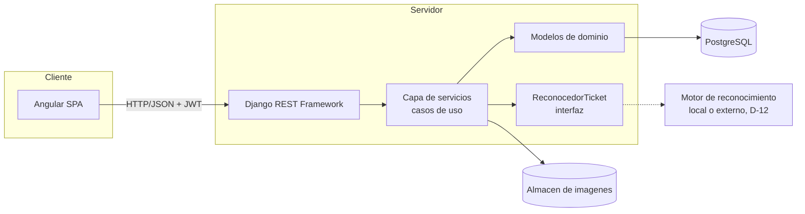

# ARQ-02 — Arquitectura técnica (Django + Angular)

**Documento:** ARQ-02
**Versión:** 2.0
**Alcance:** organización del código, capas, y aplicación de los principios SOLID
**Deriva de:** `ARQ-01_Modulos_del_Sistema.md`

---

## 1. Stack

| Capa | Tecnología | Justificación |
|---|---|---|
| Base de datos | PostgreSQL 16 | Transacciones ACID necesarias para el código único del ingreso y para que registro, reconocimiento, validación y auditoría se persistan como una sola operación |
| Backend | Django 5.x + Django REST Framework | API REST desacoplada; el ORM permite expresar las reglas de negocio en la capa de dominio |
| Autenticación | JWT (SimpleJWT) | Sesión sin estado en el servidor |
| Frontend | Angular 17+ (standalone components, signals) | SPA con módulos por funcionalidad y carga diferida |
| Imágenes | Pillow | Recepción, validación de formato y compresión de las fotografías del ticket antes de guardarlas |
| Reconocimiento | Detrás de la interfaz `ReconocedorTicket` | El motor concreto (OCR local, servicio en la nube o modelo multimodal) lo fija D-12, tras un piloto con tickets reales |
| Exportación | openpyxl | Exportación del consolidado mensual (M08) a hoja de cálculo |
| Pruebas backend | pytest + pytest-django | Cobertura de reglas de negocio y casos de uso |
| Pruebas de carga | Herramienta a definir en la fase de pruebas | Evidencia técnica de los RNF de tiempo de respuesta; no es instrumento de la tesis (ver `docs/00-tesis/marco_tesis.md` §3) |

No hay ningún mecanismo de cola de sincronización ni de almacén local con capacidad de reintento en
segundo plano: ese componente pertenecía a un módulo que ya no forma parte del alcance (DR-01). Lo
que queda es un borrador conservado en el dispositivo mientras no hay señal (RNF-M03-05 en
`docs/modulos/M03-ingresos/requerimientos/`), que no exige esa infraestructura.

## 2. Arquitectura general



El motor de reconocimiento se dibuja fuera del servidor porque D-12 aún no decide si es local o un
servicio externo; en cualquier caso, `SRV` nunca lo invoca directamente, solo a través de `REC`.

## 3. Organización del backend (Django)

Una aplicación Django por módulo. El nombre de la app espeja el código del módulo para que la
trazabilidad sea directa.

```
backend/
  config/                 settings, urls, wsgi/asgi
  apps/
    accounts/         M01   usuarios, roles, autenticación
    catalogo/         M02   vehículos, tipos de mineral, transportistas
    ingresos/         M03   registro de ingresos a partir del ticket
    reconocimiento/    M04   lectura automática de los datos del ticket
    validacion/        M05   reglas V1 a V5 de consistencia del ticket
    trazabilidad/      M06   lotes de proceso y paso por etapas
    consulta/          M07   búsqueda por placa y fecha, con respaldo
    consolidacion/     M08   total acumulado mensual por tipo de mineral
    auditoria/         M09   registro de eventos
  utils/                  utilidades transversales, excepciones de dominio
  manage.py
  .env.example            versionado; .env nunca se versiona
```

`utils/` es el paquete transversal: `excepciones.py` (dominio), `manejador_errores.py` (cuerpo
uniforme de error), `paginacion.py`, `query_builder.py`, `serializer_mixin.py`, `throttles.py` y
`modelos.py` (`ModeloBase`). Nada entra ahí sin ser consumido por al menos dos módulos; de lo
contrario pertenece a la app que lo usa.

### 3.1 Capas dentro de cada app

```
apps/ingresos/
    migrations/       incluye los indices del modelo entidad-relacion desde la PRIMERA migracion
    models/           Entidades e invariantes del dominio (RN-*)
    repositories/     Consultas de LECTURA. No escriben nunca
    services/         Casos de uso (RS-*): orquestan, no contienen reglas
    serializers/      Traduccion entre dominio y JSON
    views/            Controladores REST (RF-*): solo entrada/salida HTTP
    permissions.py    Autorizacion por accion, no por objeto monolitico (ISP)
    filters.py        django-filter
    urls.py
    apps.py           verbose_name = "M03 - Registro de ingresos"
    tests/
```

`models`, `repositories`, `services`, `serializers` y `views` son **paquetes**, no archivos sueltos:
`catalogo` sostiene tres entidades y `consolidacion` un exportador por formato. Cada paquete
reexporta sus nombres en el `__init__.py`:

```python
# apps/catalogo/models/__init__.py
from .vehiculo import Vehiculo
from .tipo_mineral import TipoMineral
from .transportista import Transportista

__all__ = ["Vehiculo", "TipoMineral", "Transportista"]
```

Sin la reexportación, mover un archivo rompe las migraciones y las referencias por cadena
(`"catalogo.Vehiculo"`).

Regla de asignación: **una regla de negocio nunca vive en `views/`**. Si una validación puede
enunciarse sin mencionar HTTP, pertenece a `models/` o a `services/`.

**No toda app tiene las mismas capas.** M07 (consulta) y M08 (consolidación) no aportan ninguna
entidad al modelo entidad-relación: agregan y consultan sobre las de M03, M04, M05 y M06. No llevan
`models/` ni `migrations/`, y M08 añade `exportadores/`, una clase por formato (ver D-10). Una app
tiene `models/` solo si aporta una entidad al modelo entidad-relación.

`repositories/` es el lado de lectura, no una abstracción sobre el ORM: una clase concreta por
entidad, sin interfaz y sin segunda implementación, salvo las excepciones que D-09 justifica
explícitamente (el reconocedor, el generador de código, el reloj, los exportadores).

## 4. Organización del frontend (Angular)

El frontend vive en su **propio repositorio** (`logistica-minera-frontend`), por D-11: se despliega
como estáticos, con un ciclo de vida distinto al de la API. La guía de instalación está en
`docs/00-arquitectura/GUIA_FRONTEND_ANGULAR.md`.

```
src/app/
  core/               interceptores JWT, guards, manejo de errores, borrador local del registro
  shared/             componentes, pipes y directivas reutilizables, sin estado
  models/             interfaces TypeScript espejo de los serializers
  features/
    auth/             M01     trazabilidad/   M06
    catalogo/         M02     consulta/       M07
    ingresos/         M03     consolidacion/  M08
                              auditoria/      M09
```

M04 (reconocimiento) y M05 (validación) no tienen `feature/` propia: sus pantallas viven dentro de
`features/ingresos/`, porque son parte del mismo flujo de registro y no una navegación aparte.

Cada feature se divide en tres capas, espejo de las del backend (D-11):

```
features/ingresos/
  data-access/    servicio del feature: unica puerta a HttpClient
  pages/          componentes ruteados: orquestan una pantalla
  ui/             componentes presentacionales: input() y output(), sin servicios
  ingresos.routes.ts
```

| Backend | Frontend |
|---|---|
| `models/` | `models/` |
| `repositories/` + `services/` | `data-access/` |
| `views/` | `pages/` |
| `serializers/` | `ui/` |
| `utils/` | `core/` + `shared/` |

Cada feature se carga de forma diferida (`loadChildren`), y ninguno importa de otro: lo compartido
sube a `shared/` o a `models/`. Los componentes nunca llaman a `HttpClient` directamente.

**El borrador del registro vive en `core/`**, no en una feature: se guarda en almacenamiento del
navegador mientras no hay señal y se descarta al confirmar (RNF-M03-05). No hay cola de
sincronización ni reintento en segundo plano: el ingreso siempre se confirma contra el servidor.

## 5. Aplicación de los principios SOLID

La separación de requisitos por tipo dentro de cada módulo (`requerimientos/`) existe precisamente
para que cada tipo aterrice en una capa distinta del código. Esta es la correspondencia:

| Tipo de requisito | Capa Django | Capa Angular | Principio que sostiene |
|---|---|---|---|
| Reglas de negocio (RN) | `models/`, validadores de dominio | — (nunca se replican en el cliente como fuente de verdad) | SRP |
| Requisitos de sistema (RS) | `services/` | servicio del feature | SRP, DIP |
| Requisitos funcionales (RF) | `views/` + `serializers/` | componentes y rutas | ISP |
| Requisitos no funcionales (RNF) | configuración, índices, timeouts | estrategias de captura y compresión de imagen | OCP |

**S — Responsabilidad única.** Una vista REST solo traduce HTTP; un servicio solo orquesta un caso
de uso; un modelo solo protege sus invariantes. La validación "el peso neto no coincide con el peso
bruto menos la tara" (V1) vive en una regla de M05, no en el formulario Angular ni en el controlador
de M03.

**O — Abierto/cerrado.** Las reglas de validación (M05) se implementan como una clase por regla que
se registra en una colección; añadir V6 no obliga a modificar V1 a V5 ni el servicio que las
compone. Lo mismo aplica a los exportadores de M08 (`ExportadorExcel` hoy, otros formatos después).

**L — Sustitución de Liskov.** Los motores de reconocimiento, los exportadores y los repositorios
de lectura son intercambiables sin romper a quien los consume. Cualquier implementación de
`ReconocedorTicket` puede sustituir a otra en el punto donde M03 la inyecta.

**I — Segregación de interfaces.** Los permisos se declaran por acción, no por un objeto monolítico
de "usuario con todos los permisos". El rol Supervisor de planta obtiene únicamente las interfaces
de registro y consulta; no se le inyecta la de gestión de usuarios ni la de consolidación.

**D — Inversión de dependencias.** Los servicios dependen de abstracciones, no de implementaciones
concretas. `ServicioIngreso` recibe `ReconocedorTicket`, `ValidadorConsistencia` y un generador de
código por inyección; en pruebas se sustituyen por dobles deterministas sin tocar la lógica del caso
de uso.

## 6. Contrato de la API

Convención de rutas, coherente con los códigos de módulo:

```
POST   /api/v1/auth/login/                       M01
GET    /api/v1/catalogo/vehiculos/                M02
GET    /api/v1/catalogo/tipos-mineral/            M02
POST   /api/v1/ingresos/borradores/               M03
POST   /api/v1/ingresos/                          M03
GET    /api/v1/ingresos/{id}/                     M03
GET    /api/v1/reconocimientos/{id}/              M04
GET    /api/v1/ingresos/{id}/validaciones/        M05
POST   /api/v1/lotes/                             M06
POST   /api/v1/lotes/{id}/etapas/                 M06
GET    /api/v1/ingresos/{id}/trazabilidad/        M06
GET    /api/v1/consulta/ingresos/                 M07
GET    /api/v1/consolidacion/mensual/             M08
GET    /api/v1/auditoria/{entidad}/{id}/          M09
```

Todas las respuestas de error devuelven un cuerpo uniforme: `{"codigo": "...", "mensaje": "...",
"detalles": {...}}`. Los mensajes visibles al usuario están en español y coinciden literalmente con
los criterios de aceptación de las historias.

## 7. Estrategia de despliegue

| Entorno | Propósito |
|---|---|
| Desarrollo | Local, base de datos con datos de prueba |
| Preproducción | Servidor de pruebas donde se ejecutan las pruebas funcionales y de rendimiento previas a la estabilización |
| Producción | Servidor en planta/administración; la medición del pretest y del postest se recolecta con el proceso manual y, tras la validación, con el sistema en este entorno |

El sistema no se usa en planta hasta que el pretest de la investigación termine (ver
`docs/00-tesis/marco_tesis.md` §11). Cualquier despliegue posterior al inicio de esa medición debe
registrarse, porque introduce un cambio no controlado en las condiciones de observación.
