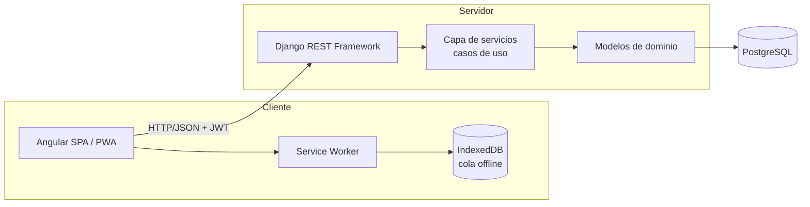

# ARQ-02 — Arquitectura técnica (Django + Angular)

**Documento:** ARQ-02
**Versión:** 1.0
**Alcance:** organización del código, capas, y aplicación de los principios SOLID

---

## 1. Stack

| Capa | Tecnología | Justificación |
|---|---|---|
| Base de datos | PostgreSQL 16 | Transacciones ACID necesarias para el correlativo del ingreso y el cálculo de existencias |
| Backend | Django 5.x + Django REST Framework | API REST desacoplada; el ORM permite expresar las reglas de negocio en la capa de dominio |
| Autenticación | JWT (SimpleJWT) | Sesión sin estado en el servidor, indispensable para la operación offline de M07 |
| Frontend | Angular 17+ (standalone components, signals) | SPA con módulos por funcionalidad y carga diferida |
| PWA / offline | Angular Service Worker + IndexedDB | Cola de sincronización local para M07 |
| Reportes | openpyxl / ReportLab | Exportación de consolidados (M06) a Excel y PDF |
| Pruebas backend | pytest + pytest-django | Cobertura de reglas de negocio y casos de uso |
| Pruebas de carga | Apache JMeter | Evidencia del indicador de eficiencia de desempeño (ISO/IEC 25010:2023) |

## 2. Arquitectura general



## 3. Organización del backend (Django)

Una aplicación Django por módulo. El nombre de la app espeja el código del módulo para que la trazabilidad sea directa.

```
backend/
  config/                 settings, urls, wsgi/asgi
  apps/
    accounts/       M01   usuarios, roles, autenticación
    catalogo/       M02   productos, vehículos, transportistas
    ingresos/       M03   registro de ingresos de volquete
    salidas/        M04   salidas y movimientos internos
    existencias/    M05   stock y kardex
    reportes/       M06   consolidados y exportaciones
    sincronizacion/ M07   endpoints de la cola offline
    auditoria/      M08   registro de eventos
    busqueda/       M09   búsqueda por criterios
  common/                 utilidades transversales, excepciones de dominio
```

### 3.1 Capas dentro de cada app

```
apps/ingresos/
    models.py         Entidades y reglas de negocio invariantes (RN-*)
    services.py       Casos de uso (RS-*): orquestan, no contienen reglas
    selectors.py      Consultas de lectura (separadas de la escritura)
    serializers.py    Traducción entre dominio y JSON
    views.py          Controladores REST (RF-*): solo entrada/salida HTTP
    permissions.py    Autorización por rol (consume M01)
    tests/
```

Regla de asignación: **una regla de negocio nunca vive en `views.py`**. Si una validación puede enunciarse sin mencionar HTTP, pertenece a `models.py` o a `services.py`.

## 4. Organización del frontend (Angular)

```
frontend/src/app/
  core/               interceptores JWT, guards, manejo de errores, servicio de conectividad
  shared/             componentes, pipes y directivas reutilizables
  features/
    autenticacion/    M01
    catalogo/         M02
    ingresos/         M03
    salidas/          M04
    existencias/      M05
    reportes/         M06
    sincronizacion/   M07
    auditoria/        M08
    busqueda/         M09
  models/             interfaces TypeScript espejo de los serializers
```

Cada `feature` se carga de forma diferida (`loadChildren`). Cada una expone un servicio propio que encapsula sus llamadas HTTP; los componentes nunca llaman a `HttpClient` directamente.

## 5. Aplicación de los principios SOLID

La separación de requisitos por tipo dentro de cada módulo (`requisitos/`) existe precisamente para que cada tipo aterrice en una capa distinta del código. Esta es la correspondencia:

| Tipo de requisito | Capa Django | Capa Angular | Principio que sostiene |
|---|---|---|---|
| Reglas de negocio (RN) | `models.py`, validadores de dominio | — (nunca se replican en el cliente como fuente de verdad) | SRP |
| Requisitos de sistema (RS) | `services.py` | servicio del feature | SRP, DIP |
| Requisitos funcionales (RF) | `views.py` + `serializers.py` | componentes y rutas | ISP |
| Requisitos no funcionales (RNF) | configuración, índices, caché, middleware | service worker, estrategias de caché | OCP |

**S — Responsabilidad única.** Una vista REST solo traduce HTTP; un servicio solo orquesta un caso de uso; un modelo solo protege sus invariantes. La validación "la hora de pesaje no puede ser posterior a la hora de registro" vive en el modelo `Ingreso`, no en el formulario Angular ni en el controlador.

**O — Abierto/cerrado.** La generación de reportes (M06) se implementa con una estrategia por formato (`ExportadorExcel`, `ExportadorPDF`) que comparten una interfaz. Añadir el formato de declaración semestral no obliga a modificar el código existente.

**L — Sustitución de Liskov.** Los exportadores, los repositorios de lectura y las estrategias de sincronización son intercambiables sin romper a quien los consume. Un `ExportadorPDF` puede sustituir a un `ExportadorExcel` en cualquier punto donde se espere la abstracción.

**I — Segregación de interfaces.** Los permisos se declaran por acción, no por un objeto monolítico de "usuario con todos los permisos". El rol Supervisor obtiene únicamente las interfaces de registro de ingreso y consulta de existencias; no se le inyecta la interfaz de gestión de usuarios.

**D — Inversión de dependencias.** Los servicios dependen de abstracciones, no de implementaciones concretas. `ServicioIngreso` recibe un generador de correlativo por inyección; en pruebas se sustituye por uno determinista sin tocar la lógica del caso de uso.

## 6. Contrato de la API

Convención de rutas, coherente con los códigos de módulo:

```
POST   /api/v1/auth/login/                 M01
GET    /api/v1/catalogo/productos/         M02
GET    /api/v1/catalogo/vehiculos/         M02
POST   /api/v1/ingresos/                   M03
GET    /api/v1/ingresos/{id}/              M03
POST   /api/v1/salidas/                    M04
GET    /api/v1/existencias/                M05
GET    /api/v1/reportes/consolidado/       M06
POST   /api/v1/sincronizacion/lote/        M07
GET    /api/v1/auditoria/eventos/          M08
GET    /api/v1/busqueda/ingresos/          M09
```

Todas las respuestas de error devuelven un cuerpo uniforme: `{"codigo": "...", "mensaje": "...", "detalles": {...}}`. Los mensajes visibles al usuario están en español y coinciden literalmente con los criterios de aceptación de las historias.

## 7. Estrategia de despliegue

| Entorno | Propósito |
|---|---|
| Desarrollo | Local, base de datos con datos de prueba |
| Preproducción | Servidor de pruebas donde se ejecutan las pruebas de carga con JMeter (semana 8) |
| Producción | Servidor en planta/administración; el postest se recolecta sobre este entorno |

El postest de la tesis solo puede recolectarse en producción con usuarios reales. Cualquier despliegue posterior al inicio de la ventana de observación debe registrarse, porque introduce una amenaza a la validez interna.
