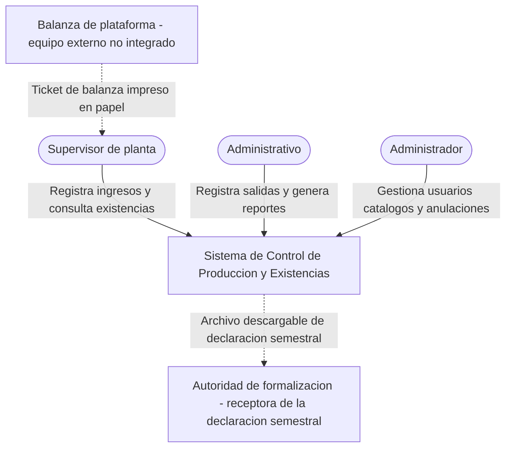
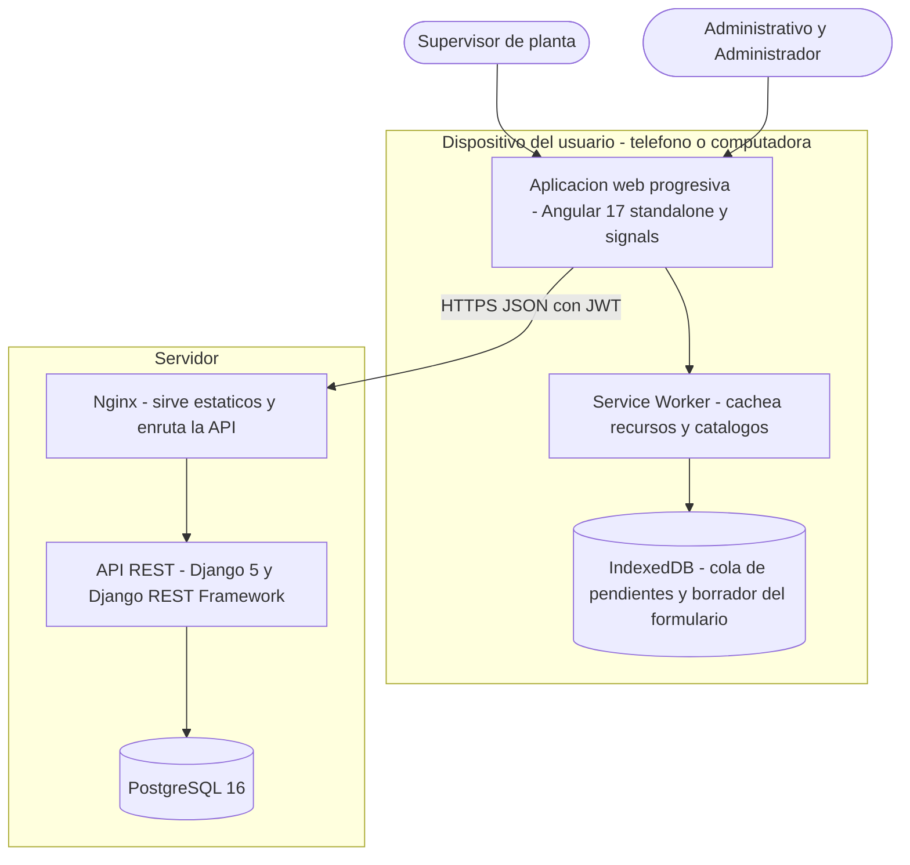
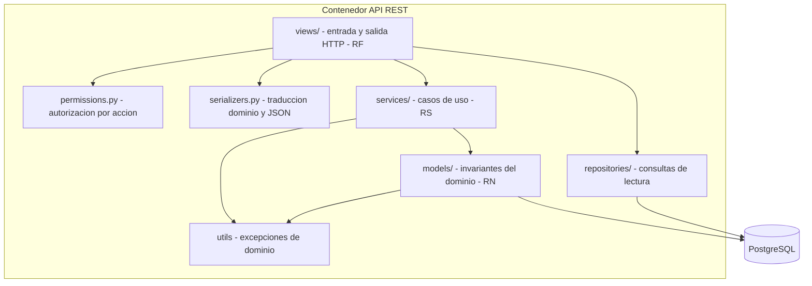
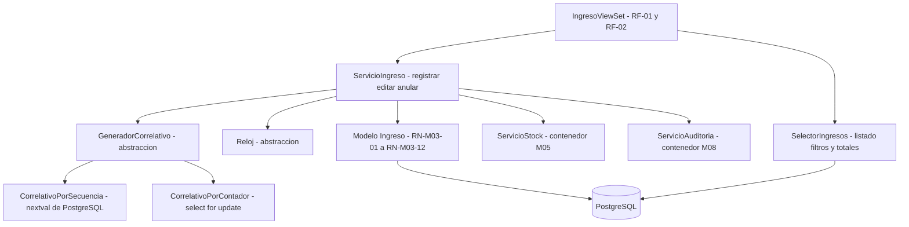
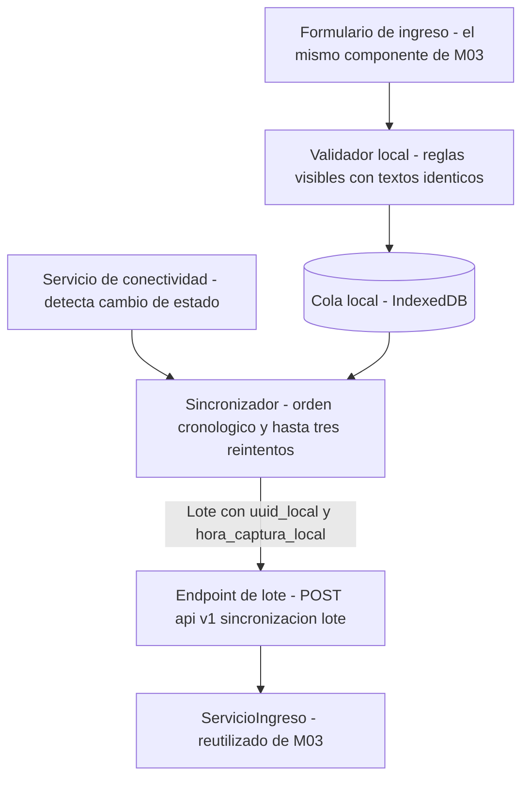
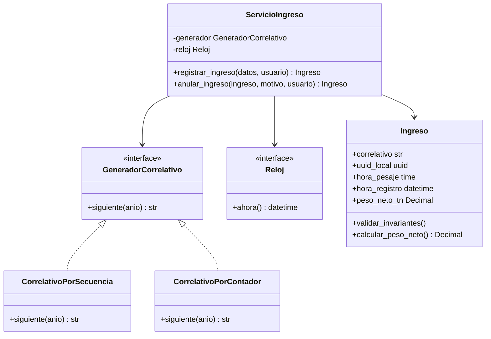

# ARQ-03 — Modelo C4 del sistema

**Documento:** ARQ-03
**Versión:** 1.0
**Estado:** Aprobado
**Alcance:** los cuatro niveles de abstracción del sistema, con la justificación de cada elemento
**Deriva de:** `ARQ-01_Modulos_del_Sistema.md` y `ARQ-02_Arquitectura_Tecnica.md`

---

## 1. Por qué C4

Un único diagrama de arquitectura obliga a elegir entre ser legible para el jurado o ser útil para
programar. C4 resuelve esa tensión con cuatro niveles de acercamiento, cada uno con su audiencia:

| Nivel | Responde a | Audiencia |
|---|---|---|
| 1 · Contexto | Qué hace el sistema y con quién interactúa | Jurado, asesora, empresa |
| 2 · Contenedores | En qué piezas ejecutables se divide | Jurado técnico, sustentación |
| 3 · Componentes | Cómo se organiza cada pieza por dentro | Desarrollo |
| 4 · Código | Cómo se estructuran las clases del caso crítico | Desarrollo y defensa de SOLID |

El modelo cumple además una función de medición: el nivel 2 es la **evidencia visual** del indicador
de la variable independiente «porcentaje de módulos implementados sobre módulos planificados». Un
diagrama que dibuje contenedores que el despliegue no tiene infla ese denominador y se vuelve en
contra en cuanto el jurado lo contrasta con el sistema real.

Notación: Mermaid, coherente con el resto de la documentación. Las etiquetas van sin tildes por la
convención del repositorio, que evita fallos de renderizado en la exportación del documento de tesis.

---

## 2. Nivel 1 — Contexto

### 2.1 Justificación de los elementos

| Elemento | Por qué está | Qué pasaría sin él |
|---|---|---|
| **Supervisor de planta** | Es quien está en el punto de pesaje cuando llega el volquete, a cualquier hora | El registro volvería a depender del horario administrativo, que es la causa raíz de la latencia I1 |
| **Administrativo** | Opera salidas, consultas y reportes | Sin registro de salidas, el stock sería acumulativo y el indicador I4 carecería de sentido |
| **Administrador** | Gestiona usuarios, catálogos, anulaciones y ajustes | Sin gestión de catálogo con titularidad, I2 quedaría inclasificable (D-06) |
| **Balanza de plataforma** | Frontera declarada: **no hay integración** | — |
| **Autoridad de formalización** | Destinataria de la declaración semestral exigida por la Ley 32213 | El módulo M06 perdería su justificación normativa |

### 2.2 La frontera con la balanza es la decisión más importante de este nivel

La balanza **no está integrada** y no se propone integrarla. El dato llega al sistema en un ticket
impreso que el supervisor transcribe. Esto no es una carencia que haya que disculpar: es lo que
**hace existir el indicador I1**.

Porque el pesaje y el registro son actos separados, hay dos marcas de tiempo distintas —`hora_pesaje`,
copiada del ticket, y `hora_registro`, asignada por el servidor— y la diferencia entre ambas es la
latencia que la tesis mide (D-01). Si la balanza estuviera integrada, ambas marcas coincidirían
siempre, la latencia sería cero por construcción y **no habría nada que medir ni que mejorar**.

Declararlo en el nivel 1 evita además la pregunta previsible en sustentación sobre por qué no se
integró el equipo: la respuesta es que la unidad de análisis dejaría de existir, y que integrar una
balanza de plataforma exige hardware y protocolo fuera del alcance de ocho semanas.

---

## 3. Nivel 2 — Contenedores

### 3.1 Justificación de cada contenedor

| Contenedor | Tecnología | Responsabilidad | Justificación |
|---|---|---|---|
| **Aplicación web progresiva** | Angular 17+ | Interfaz de los nueve módulos | Instalable desde el navegador, sin tienda de aplicaciones ni proceso de publicación. La aplicación móvil nativa está declarada fuera de alcance en ARQ-01 §5 |
| **Service Worker** | Angular Service Worker | Cachea el formulario de ingreso y los catálogos de producto y vehículo | Es lo que permite que el formulario abra **sin señal**. Sin él, M07 no existe y la latencia I1 no baja en las horas sin cobertura |
| **IndexedDB** | API del navegador | Cola de ingresos pendientes y borrador del formulario en curso | Sostiene RNF-M03-06: si el formulario pierde los datos al caerse la conexión, el supervisor vuelve al papel y I1 regresa a los valores del pretest |
| **Nginx** | Nginx | Sirve el build de Angular y enruta `/api/` al backend | Un solo origen para el navegador, sin abrir CORS en producción. Además es donde se termina HTTPS, sin el cual el service worker no se registra y la PWA no funciona |
| **API REST** | Django 5 + DRF | Reglas de negocio, casos de uso y autorización | Autoridad única de validación. Un registro que llega por la cola de sincronización no pasa por el formulario y debe someterse a las mismas reglas (D-08) |
| **PostgreSQL 16** | PostgreSQL | Persistencia | Transacciones ACID, necesarias para asignar el correlativo bajo concurrencia (D-02) y para que el movimiento de stock se genere en el mismo acto que el ingreso (RN-M03-08) |

### 3.2 Por qué el dispositivo tiene almacenamiento propio

Separar `IndexedDB` como contenedor y no como detalle interno de la aplicación es deliberado: **es un
almacén de datos que sobrevive al cierre de la aplicación y que, durante un tiempo, contiene registros
que el servidor todavía no conoce**. Eso tiene consecuencias que el nivel 2 debe hacer visibles:

- Esos ingresos aún no tienen correlativo. Lo reciben al sincronizar, nunca antes (D-02).
- Su `hora_registro` es la de captura local, no la de sincronización (D-03).
- Mientras están en la cola, el sistema tiene dos verdades parciales. La reconciliación es el punto
  de mayor riesgo del proyecto.

Dibujarlo dentro de la aplicación web, como si fuera una caché más, oculta exactamente el problema
que M07 existe para gestionar.

### 3.3 Contenedores que deliberadamente no existen

| No existe | Por qué |
|---|---|
| **Broker de tareas** (Celery, Redis) | HU-M06-01 exige el consolidado «a demanda, en el momento». Un broker añade una pieza que desplegar y vigilar sin requisito que la pida |
| **Almacén de imágenes** | La fotografía del ticket no figura en el modelo entidad-relación, ni en HU-M03-01, ni en ninguna regla de negocio. Fotografiar el ticket es la práctica manual actual de los transportistas externos (D-06), no un requisito del sistema |
| **Servicio de reportes separado** | Los reportes se generan en la misma API y se descargan; no se almacenan |
| **Segunda base de datos o caché distribuida** | El volumen previsto no la justifica. Los cuatro índices del modelo ER sostienen los tiempos exigidos |

Esta tabla es tan importante como el diagrama. Un contenedor dibujado y no construido baja el
porcentaje de módulos cumplidos; uno construido y no dibujado aparece como sorpresa en la revisión.

---

## 4. Nivel 3 — Componentes

### 4.1 Componentes del contenedor API — estructura transversal

Todas las apps de `apps/` tienen la misma organización interna. Es la aplicación directa de la
correspondencia requisito-capa de ARQ-02 §5.

| Componente | Responsabilidad única | Principio |
|---|---|---|
| `views/` | Traducir HTTP y nada más | SRP |
| `permissions.py` | Autorizar por acción, no por objeto monolítico de usuario | ISP |
| `serializers/` | Traducir dominio ↔ JSON; no valida reglas de negocio | SRP |
| `services/` | Orquestar un caso de uso; invoca reglas, no las contiene | SRP, DIP |
| `repositories/` | Consultar para leer, separado de la escritura | SRP |
| `models/` | Proteger las invariantes de la entidad | SRP |
| `utils/` | Excepciones de dominio, traducidas a HTTP en el borde | DIP |

**La flecha que no existe es la que más importa:** `models/` y `services/` no dependen de
`rest_framework`. Si lo hicieran, la regla de negocio quedaría atada al transporte HTTP y la cola de
sincronización de M07 —que no llega por una petición de formulario— no podría reutilizarla. Ese es el
motivo concreto, no una preferencia de diseño.

La separación entre `repositories/` y `services/` tampoco es ceremonial: las consultas de lectura son
las que sostienen el indicador I3, y deben poder optimizarse sin tocar la lógica de escritura.

### 4.2 Componentes de M03 — Registro de ingresos

Es el módulo núcleo: la unidad de análisis de la tesis es el ingreso de volquete.

| Componente | Justificación |
|---|---|
| `ServicioIngreso` | Concentra el caso de uso completo. La transacción única —correlativo, persistencia, movimiento de stock y evento de auditoría— vive aquí. Si el movimiento de stock falla, el ingreso no queda registrado: un ingreso sin movimiento rompe RN-M03-08 en silencio |
| `GeneradorCorrelativo` como **abstracción** | D-02 deja abiertas dos implementaciones válidas y cuál se adopte es pregunta previsible en sustentación. Se inyecta en el servicio, no se instancia dentro: así se sustituye por uno determinista en pruebas sin tocar la lógica del caso de uso |
| `Reloj` como abstracción | HU-M03-02 fija umbrales de 72 horas y 30 días de antigüedad. Un servicio que llama a `timezone.now()` internamente **no se puede probar** contra esos límites |
| `SelectorIngresos` | Listado con filtros combinables y totales del conjunto filtrado. El filtro por titularidad es la lectura directa de I2 |
| Dependencia de `ServicioStock` y `ServicioAuditoria` | Son de M05 y M08. Se dibujan porque la transacción los abarca: la trazabilidad entre módulos no es opcional |

### 4.3 Componentes de M07 — Captura sin conexión

| Componente | Justificación |
|---|---|
| Formulario **reutilizado** de M03 | Si hubiera dos formularios, divergirían. El usuario no debe percibir dos sistemas distintos, y las validaciones locales muestran los mismos textos que en línea (HU-M07-02 CA02) |
| `Validador local` | Mejora la experiencia; **no es fuente de verdad** (D-08). La validación autoritativa está en el servidor |
| `Cola local` | Guarda ingresos con `uuid_local`, que actúa como **clave de idempotencia**: un lote reenviado tras un timeout no duplica ingresos. Sin esto, un reintento infla la producción declarada |
| `Sincronizador` | Envía en orden cronológico de captura. Un elemento que falla permanece en la cola con el motivo y **no bloquea a los demás** |
| `Endpoint de lote` → `ServicioIngreso` | La flecha crítica del diagrama: el lote entra por el **mismo** caso de uso que el alta en línea. Escribir un camino paralelo de validación más laxa sería abrir la puerta por la que entrarían los datos del postest |

**El riesgo que este nivel hace visible:** dos supervisores sincronizando lotes al mismo tiempo
convergen sobre el mismo `GeneradorCorrelativo`. Es el punto más probable de fallo de todo el sistema
y debe probarse con dos clientes concurrentes, no solo con el alta en línea.

---

## 5. Nivel 4 — Código

C4 admite este nivel y recomienda usarlo con parsimonia: el código cambia más rápido que el
documento, y un nivel 4 exhaustivo produce documentación desactualizada, que es peor que no tenerla.

Se dibuja **solo el caso de uso crítico**, `registrar_ingreso`, porque es donde se concentra la
inversión de dependencias y es la pregunta que se defiende en sustentación.

### 5.1 Qué demuestra este diagrama

- **DIP.** `ServicioIngreso` depende de `GeneradorCorrelativo` y de `Reloj`, no de sus
  implementaciones. Cambiar de secuencia de PostgreSQL a tabla de contadores no toca el caso de uso
  ni obliga a rehacer sus pruebas.
- **SRP.** `Ingreso` protege sus invariantes y calcula el peso neto; no sabe de correlativos, de
  transacciones ni de HTTP.
- **Capacidad de ser probado.** Las dos abstracciones existen porque **hay pruebas que las exigen**:
  correlativos deterministas y control del tiempo para los umbrales de 72 horas y 30 días. No se
  abstrae por si acaso —con nueve módulos en ocho semanas, una interfaz sin segunda implementación ni
  prueba que la sustituya es ceremonia y se defiende peor que su ausencia.

---

## 6. Trazabilidad del modelo

| Nivel | Elemento | Módulo | Indicador | Decisión |
|---|---|---|---|---|
| 1 | Frontera con la balanza | M03 | I1 | D-01 |
| 1 | Autoridad de formalización | M06 | I6 | — |
| 2 | Service Worker e IndexedDB | M07 | I1, I2 | D-04 |
| 2 | API REST como autoridad de validación | Todos | — | D-08 |
| 2 | PostgreSQL con transacciones | M03, M05 | I3, I4 | D-02 |
| 3 | `GeneradorCorrelativo` inyectado | M03, M07 | — | D-02 |
| 3 | Formulario reutilizado en M07 | M07 | I1 | D-03 |
| 3 | `repositories/` separado | M05, M09 | I3, I5 | — |
| 4 | `Reloj` inyectado | M03 | I1 | D-01 |

---

## 7. Referencias cruzadas

- Lista cerrada de módulos y alcance declarado: `ARQ-01_Modulos_del_Sistema.md`
- Capas, contrato de API y aplicación de SOLID: `ARQ-02_Arquitectura_Tecnica.md`
- Decisiones que condicionan el modelo: `decisiones_diseno.md`
- Entidades y sus campos: `modelo_datos_entidad_relacion.md`
- Convención de códigos y nomenclatura: `convenciones_codigo.md`
