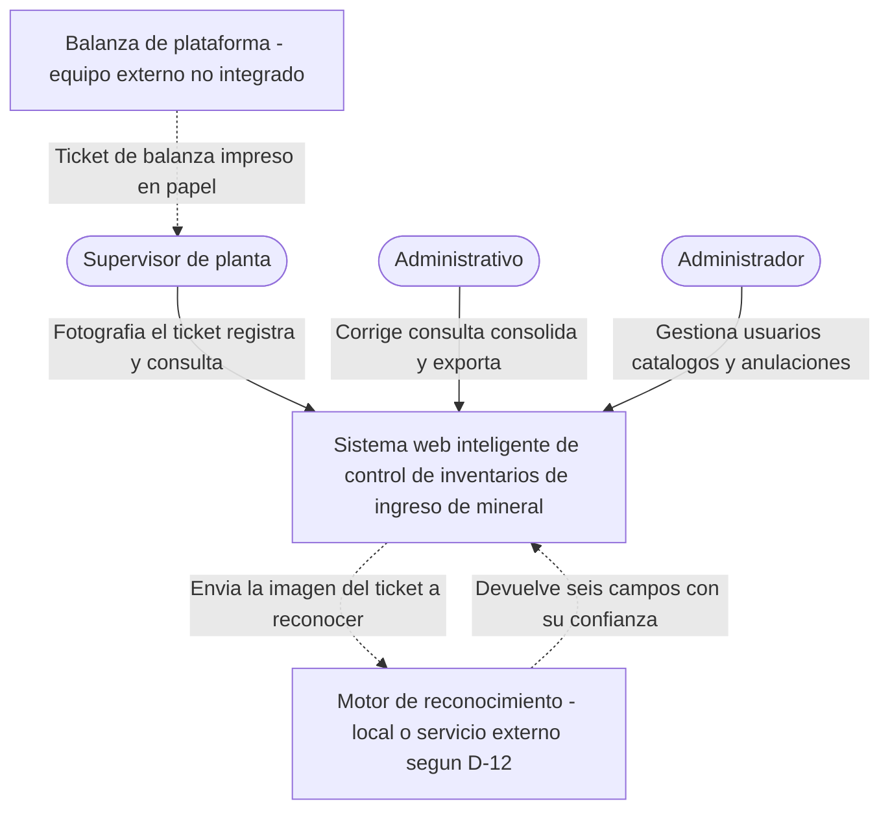
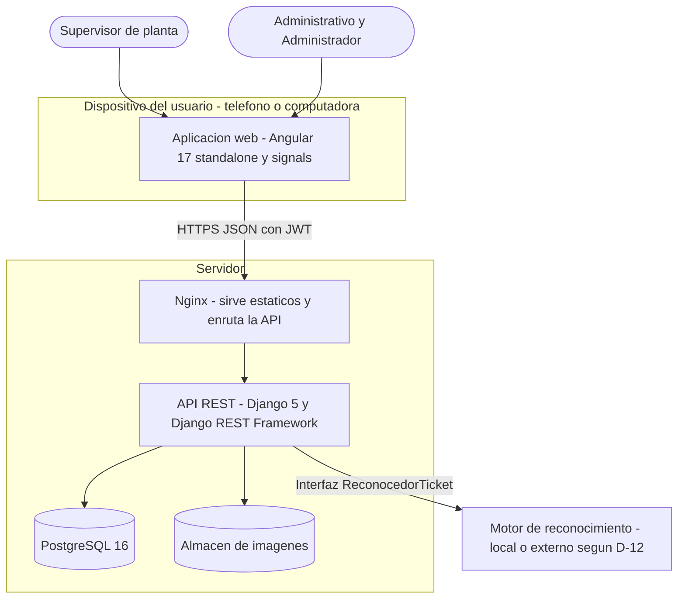
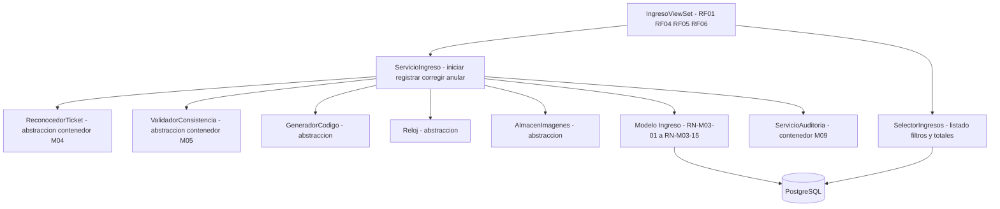
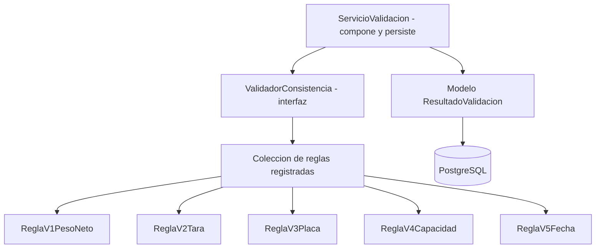
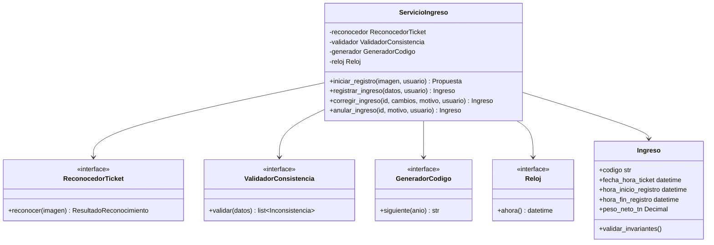

# ARQ-03 — Modelo C4 del sistema

**Documento:** ARQ-03
**Versión:** 2.0
**Estado:** Aprobado
**Alcance:** los cuatro niveles de abstracción del sistema, con la justificación de cada elemento
**Deriva de:** `ARQ-01_Modulos_del_Sistema.md` y `ARQ-02_Arquitectura_Tecnica.md`

---

## 1. Por qué C4

Un único diagrama de arquitectura obliga a elegir entre ser legible para la gerencia o ser útil para
programar. C4 resuelve esa tensión con cuatro niveles de acercamiento, cada uno con su audiencia:

| Nivel | Responde a | Audiencia |
|---|---|---|
| 1 · Contexto | Qué hace el sistema y con quién interactúa | Gerencia, jefatura de operaciones, equipo técnico |
| 2 · Contenedores | En qué piezas ejecutables se divide | Equipo técnico y desarrollo |
| 3 · Componentes | Cómo se organiza cada pieza por dentro | Desarrollo |
| 4 · Código | Cómo se estructuran las clases del caso crítico | Desarrollo y defensa de SOLID |

Un diagrama que dibuje contenedores que el despliegue no tiene, u omita los que sí tiene, se
contradice con la lista de control de funcionalidad en cuanto alguien lo contrasta con el sistema
real.

Notación: Mermaid, coherente con el resto de la documentación. Las etiquetas van sin tildes por la
convención del repositorio, que evita fallos de renderizado en la exportación del documento.

---

## 2. Nivel 1 — Contexto



### 2.1 Justificación de los elementos

| Elemento | Por qué está | Qué pasaría sin él |
|---|---|---|
| **Supervisor de planta** | Es quien está en el punto de pesaje cuando llega el volquete, y quien fotografía el ticket | El registro volvería a depender de que alguien transcriba el papel más tarde, la causa raíz de la espera que I1 mide |
| **Administrativo** | Corrige datos reconocidos, consulta, consolida y exporta | Sin esta operación, un dato mal leído por el motor quedaría sin forma de corregirse fuera del momento del registro |
| **Administrador** | Gestiona usuarios, catálogos y anulaciones | Sin gestión de catálogo con titularidad y capacidad, el tipo de vehículo y la regla V4 quedarían sin base (D-06) |
| **Balanza de plataforma** | Frontera declarada: **no hay integración** | — |
| **Motor de reconocimiento** | Sistema externo o local que lee la imagen; el sistema depende de su contrato, no de su implementación (D-12) | Sin él, el registro sería manual y RF02 no tendría cómo cumplirse |

### 2.2 La frontera con la balanza sigue siendo la decisión más importante de este nivel

La balanza **no está integrada** y no se propone integrarla. El dato llega al sistema como una
fotografía del ticket impreso, que el motor de reconocimiento lee y el usuario confirma. Esto no es
una carencia que haya que disculpar: es lo que **hace existir la medición de oportunidad del
registro**.

Porque el pesaje y el registro son actos separados, hay tres marcas de tiempo distintas —la del
ticket, leída de la fotografía; el inicio del registro, cuando llega la imagen; y el fin del
registro, cuando se confirma— y las diferencias entre ellas son lo que el sistema busca reducir
(D-01). Si la balanza estuviera integrada, esas marcas coincidirían por construcción y no habría
nada que observar.

### 2.3 El motor de reconocimiento como frontera abierta

A diferencia de la balanza, el motor de reconocimiento **sí participa activamente**: recibe una
imagen y devuelve datos. Se dibuja como sistema externo, con línea discontinua, porque D-12 aún no
decide si vive dentro del servidor (procesamiento local) o fuera de él (un servicio en la nube). El
sistema no se compromete con ninguna de las dos: la interfaz `ReconocedorTicket` (nivel 3) es la
misma en ambos casos.

---

## 3. Nivel 2 — Contenedores



### 3.1 Justificación de cada contenedor

| Contenedor | Tecnología | Responsabilidad | Justificación |
|---|---|---|---|
| **Aplicación web** | Angular 17+ | Interfaz de los nueve módulos | Instalable desde el navegador, sin tienda de aplicaciones ni proceso de publicación. La aplicación móvil nativa está fuera de alcance (ARQ-01 §5) |
| **Nginx** | Nginx | Sirve el build de Angular y enruta `/api/` al backend | Un solo origen para el navegador, sin abrir CORS en producción; termina HTTPS |
| **API REST** | Django 5 + DRF | Reglas de negocio, casos de uso y autorización | Autoridad única de validación (D-08): toda petición, venga de donde venga, se somete a las mismas reglas |
| **PostgreSQL 16** | PostgreSQL | Persistencia | Transacciones ACID, necesarias para asignar el código bajo concurrencia (D-02) y para que el reconocimiento, la validación y la auditoría se persistan en el mismo acto que el ingreso |
| **Almacén de imágenes** | A definir con D-14 | Conserva la fotografía del ticket como respaldo del ingreso | Sostiene RN-M03-01 (ningún ingreso sin imagen) y la consulta de M07; separado de PostgreSQL porque el volumen y el patrón de acceso de archivos binarios difieren del de filas relacionales |
| **Motor de reconocimiento** | A definir con D-12 | Lee los seis campos del ticket a partir de la imagen | Se accede exclusivamente a través de `ReconocedorTicket`; el contenedor puede vivir dentro del servidor o fuera de él sin que el resto del sistema lo note |

No hay Service Worker ni almacén local con cola de reintento en segundo plano: ese componente
pertenecía a un módulo que ya no forma parte del alcance (DR-01). El navegador conserva un borrador
del formulario mientras no hay señal (RNF-M03-05), pero eso no exige infraestructura de
sincronización: el ingreso siempre se confirma contra el servidor.

### 3.2 Contenedores que deliberadamente no existen

| No existe | Por qué |
|---|---|
| **Broker de tareas** (Celery, Redis) | D-15 fija el procesamiento síncrono por defecto. Se revisa solo si el piloto de motores muestra tiempos que lo justifiquen |
| **Cola de sincronización o almacén de reintento en el cliente** | Pertenecía a la captura sin señal de red, retirada del alcance (DR-01) |
| **Servicio de exportación separado** | El consolidado se genera en la misma API y se descarga; no se almacena |
| **Segunda base de datos o caché distribuida** | El volumen previsto no la justifica; los índices del modelo entidad-relación sostienen los tiempos exigidos |

Esta tabla es tan importante como el diagrama. Un contenedor dibujado y no construido contradice la
lista de control de funcionalidad; uno construido y no dibujado aparece como sorpresa en la revisión.

---

## 4. Nivel 3 — Componentes

Se dibuja solo para M03, M04 y M05: son los módulos que se explican en sustentación y donde vive la
inversión de dependencias que defiende el diseño.

### 4.1 Componentes del contenedor API — estructura transversal

Todas las apps de `apps/` tienen la misma organización interna. Es la aplicación directa de la
correspondencia requisito-capa de ARQ-02 §5.


| Componente | Responsabilidad única | Principio |
|---|---|---|
| `views` | Traducir HTTP y nada más | SRP |
| `permissions.py` | Autorizar por acción, no por objeto monolítico de usuario | ISP |
| `serializers` | Traducir dominio ↔ JSON; no valida reglas de negocio | SRP |
| `services` | Orquestar un caso de uso; invoca reglas, no las contiene | SRP, DIP |
| `repositories` | Consultar para leer, separado de la escritura | SRP |
| `models` | Proteger las invariantes de la entidad | SRP |
| `utils` | Excepciones de dominio, traducidas a HTTP en el borde | DIP |

**La flecha que no existe es la que más importa:** `models` y `services` no dependen de
`rest_framework`. Si lo hicieran, la regla de negocio quedaría atada al transporte HTTP, y un
componente distinto de vista —una tarea programada, un comando de administración— no podría
reutilizarla.

### 4.2 Componentes de M03 — Registro de ingresos

Es el módulo núcleo: la unidad de registro del sistema es el ingreso de mineral a partir del ticket.



| Componente | Justificación |
|---|---|
| `ServicioIngreso` | Concentra el caso de uso completo. La transacción única —código, persistencia de valores reconocidos y confirmados, y evento de auditoría— vive aquí. Si el evento de auditoría falla, el ingreso no queda registrado: ninguna operación se completa sin su rastro (RN-M09-01) |
| `ReconocedorTicket` como **abstracción** | D-12 deja abierta la elección del motor. Se inyecta en el servicio, no se instancia dentro: así se sustituye por un doble determinista en pruebas sin depender de un servicio externo |
| `ValidadorConsistencia` como abstracción | Las reglas V1 a V5 viven en M05 y se aplican dos veces (sobre lo propuesto y sobre lo confirmado). El servicio de M03 no conoce las reglas concretas, solo el contrato |
| `Reloj` como abstracción | Las tres marcas de tiempo son el núcleo del registro. Un servicio que llama a `timezone.now()` internamente no se puede probar controlando el instante exacto de cada una |
| `AlmacenImagenes` como abstracción | D-14 no ha fijado el medio de almacenamiento; el servicio guarda a través de la interfaz sin saber si el destino es un volumen local o un servicio de objetos |
| `SelectorIngresos` | Listado con filtros combinables y totales del conjunto filtrado, sin recorrer resultados en Python |
| Dependencia de `ServicioAuditoria` | Es de M09. Se dibuja porque la transacción lo abarca: la trazabilidad entre módulos no es opcional |

### 4.3 Componentes de M04 — Reconocimiento automático del ticket

```mermaid
flowchart TB
    IFC["ReconocedorTicket - interfaz"]
    AD1["AdaptadorMotorA - ejemplo OCR local"]
    AD2["AdaptadorMotorB - ejemplo servicio en la nube"]
    SRV["ServicioReconocimiento - persiste el resultado"]
    MOD["Modelo ReconocimientoTicket y CampoReconocido"]
    DB[("PostgreSQL")]

    IFC <|.. AD1
    IFC <|.. AD2
    SRV --> IFC
    SRV --> MOD
    MOD --> DB
```

| Componente | Justificación |
|---|---|
| `ReconocedorTicket` como interfaz, no como clase | Es el único punto de acoplamiento entre M03 y el motor concreto. Ningún otro componente del sistema importa el SDK o la librería de un motor: solo el adaptador correspondiente |
| Dos adaptadores dibujados a la vez | D-12 exige comparar motores en un piloto antes de elegir. El diagrama muestra que la arquitectura ya admite esa comparación sin cambios estructurales |
| `ServicioReconocimiento` separado de los adaptadores | Los adaptadores solo traducen: reciben una imagen y devuelven el contrato de `ReconocedorTicket`. Guardar el resultado, calcular si un campo fue corregido y registrar el evento de auditoría es responsabilidad de otro componente, para que cambiar de motor no toque la lógica de persistencia |

### 4.4 Componentes de M05 — Validación automática de consistencia



| Componente | Justificación |
|---|---|
| Una clase por regla | Añadir una regla nueva —una placa fuera del catálogo, un tipo de mineral incompatible— es una clase más en la colección, sin tocar V1 a V5 (OCP) |
| `ValidadorConsistencia` recorre la colección sin nombrar ninguna regla | Es la garantía de que RN-M05-04 (evaluar las cinco siempre) no dependa de que el desarrollador recuerde encadenar condicionales |
| `ServicioValidacion` separado de las reglas | Las reglas son puras: reciben datos, devuelven si cumplen. Persistir el resultado con su momento y su resolución es responsabilidad de otro componente |

---

## 5. Nivel 4 — Código

C4 admite este nivel y recomienda usarlo con parsimonia: el código cambia más rápido que el
documento, y un nivel 4 exhaustivo produce documentación desactualizada, que es peor que no tenerla.

Se dibuja **solo el caso de uso crítico**, `registrar_ingreso`, porque es donde se concentra la
inversión de dependencias y es la pregunta que se defiende en la revisión técnica.



### 5.1 Qué demuestra este diagrama

- **DIP.** `ServicioIngreso` depende de cuatro interfaces, no de sus implementaciones. Cambiar de
  motor de reconocimiento o de generador de código no toca el caso de uso ni obliga a rehacer sus
  pruebas.
- **SRP.** `Ingreso` protege sus invariantes; no sabe de motores de reconocimiento, de reglas de
  validación ni de HTTP. El peso neto es un dato que recibe y valida, no un valor que calcula.
- **Capacidad de ser probado.** Las cuatro abstracciones existen porque hay pruebas que las exigen:
  un motor de reconocimiento real no puede invocarse en cada corrida de pruebas, las reglas de
  validación deben poder simularse en ambos sentidos, y el reloj debe poder fijarse para verificar
  las tres marcas de tiempo con precisión. No se abstrae por si acaso: una interfaz sin segunda
  implementación ni prueba que la sustituya es ceremonia y se defiende peor que su ausencia (D-09).

---

## 6. Trazabilidad del modelo

| Nivel | Elemento | Módulo | RF | Decisión |
|---|---|---|---|---|
| 1 | Frontera con la balanza | M03 | RF01 | D-01 |
| 1 | Motor de reconocimiento como sistema externo | M04 | RF02 | D-12 |
| 2 | Almacén de imágenes | M03 | RF01 | D-14 |
| 2 | API REST como autoridad de validación | Todos | RF03 | D-08 |
| 2 | PostgreSQL con transacciones | M03, M09 | RF05 | D-02 |
| 3 | `ReconocedorTicket` inyectado | M03, M04 | RF02 | D-12 |
| 3 | `ValidadorConsistencia` inyectado | M03, M05 | RF03 | D-08 |
| 3 | `repositories` separado | M07, M08 | RF08, RF09 | D-09 |
| 4 | `Reloj` inyectado | M03 | RF01 | D-01 |

---

## 7. Referencias cruzadas

- Lista cerrada de módulos y alcance declarado: `ARQ-01_Modulos_del_Sistema.md`
- Capas, contrato de API y aplicación de SOLID: `ARQ-02_Arquitectura_Tecnica.md`
- Decisiones que condicionan el modelo: `../00-arquitectura/decisiones_diseno.md`
- Entidades y sus campos: `../00-arquitectura/modelo_datos_entidad_relacion.md`
- Convención de códigos y nomenclatura: `../00-arquitectura/convenciones_codigo.md`
