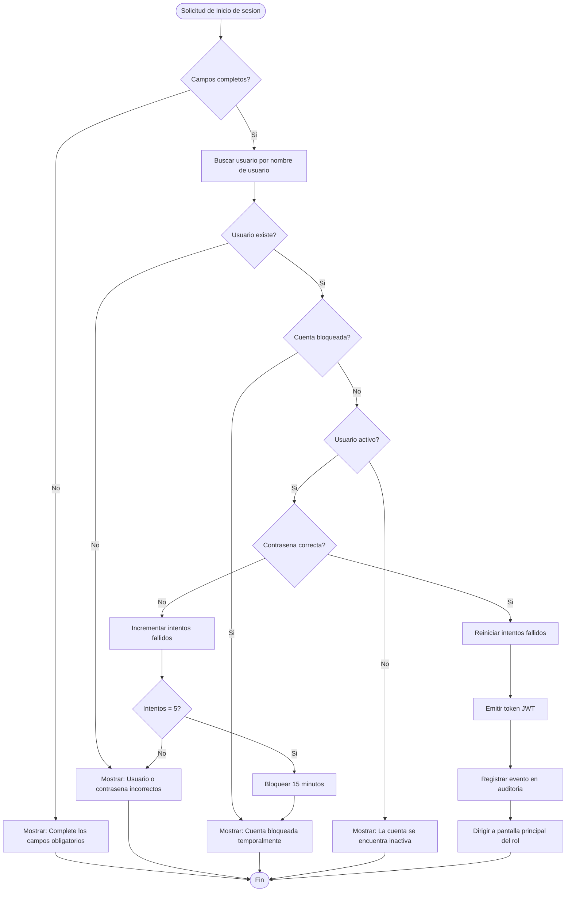
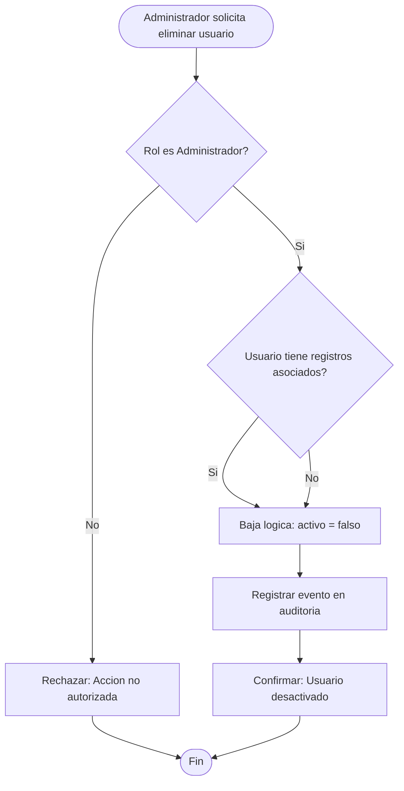

# Diagrama de actividades — M01 Autenticación

## A-M01-01 · Proceso de autenticación (RN-M01-05, RN-M01-07)

## A-M01-02 · Desactivación de usuario (RN-M01-03)

La bifurcación de V2 converge deliberadamente: el sistema **nunca** elimina físicamente, tenga o no registros asociados. Se representa la decisión para hacer explícito que fue evaluada y descartada (ver decisión D-07).
