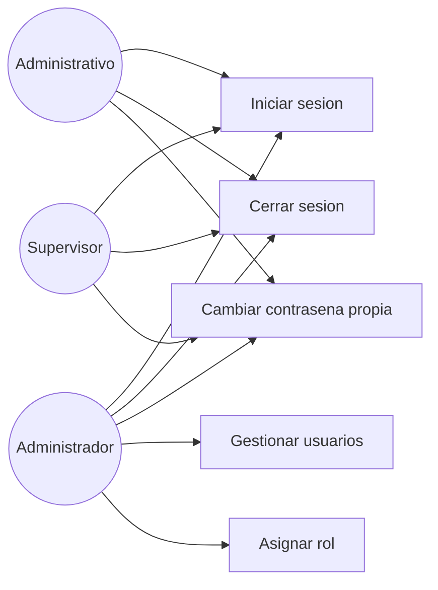

# Diagrama de casos de uso — M01 Autenticación

## Actores

| Actor | Descripción |
|---|---|
| Administrador | Personal con responsabilidad sobre la configuración del sistema. Acceso total |
| Administrativo | Personal de oficina. Registra ingresos y salidas, consulta y exporta |
| Supervisor | Personal de planta. Registra ingresos y consulta existencias, típicamente desde teléfono |

Los tres actores son transversales al sistema y se referencian desde los demás módulos sin volver a definirse.

## Casos de uso

| Caso | HU | Actores |
|---|---|---|
| Iniciar sesión | HU-M01-01 | Los tres |
| Cerrar sesión | HU-M01-02 | Los tres |
| Cambiar contraseña propia | HU-M01-05 | Los tres |
| Gestionar usuarios | HU-M01-03 | Administrador |
| Asignar rol | HU-M01-04 | Administrador |
