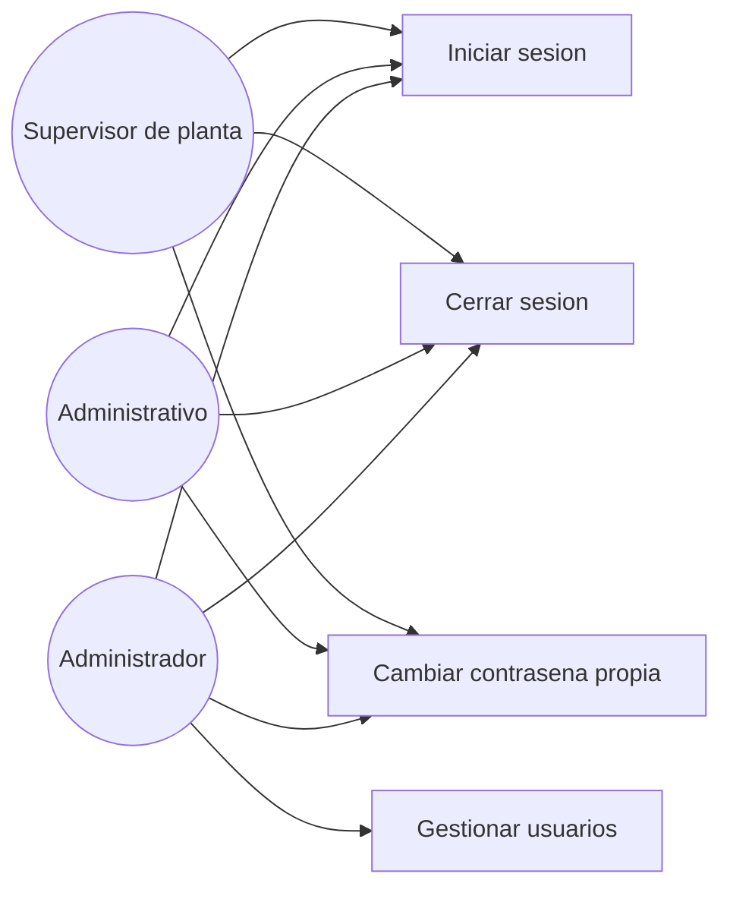

# Diagrama de casos de uso — M01 Autenticación y roles

## Actores

| Actor | Descripción |
|---|---|
| Administrador | Acceso total, incluidos usuarios, catálogos y anulaciones |
| Administrativo | Registro, corrección, consultas, consolidación y exportación |
| Supervisor de planta | Registro y consulta, típicamente desde teléfono |

Los tres actores son transversales al sistema y se referencian desde los demás módulos sin volver a
definirse: este es el diagrama que fija su definición canónica.

## Casos de uso

| Caso | HU | Actores |
|---|---|---|
| Iniciar sesión | HU-M01-01 | Los tres |
| Cerrar sesión | HU-M01-01 | Los tres |
| Cambiar contraseña propia | HU-M01-02 | Los tres |
| Gestionar usuarios | HU-M01-02 | Administrador |
