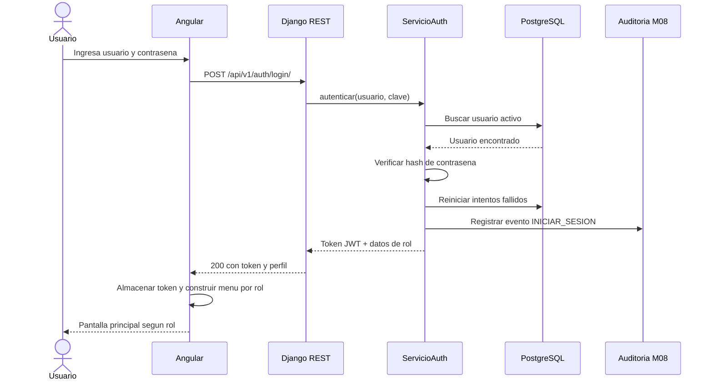
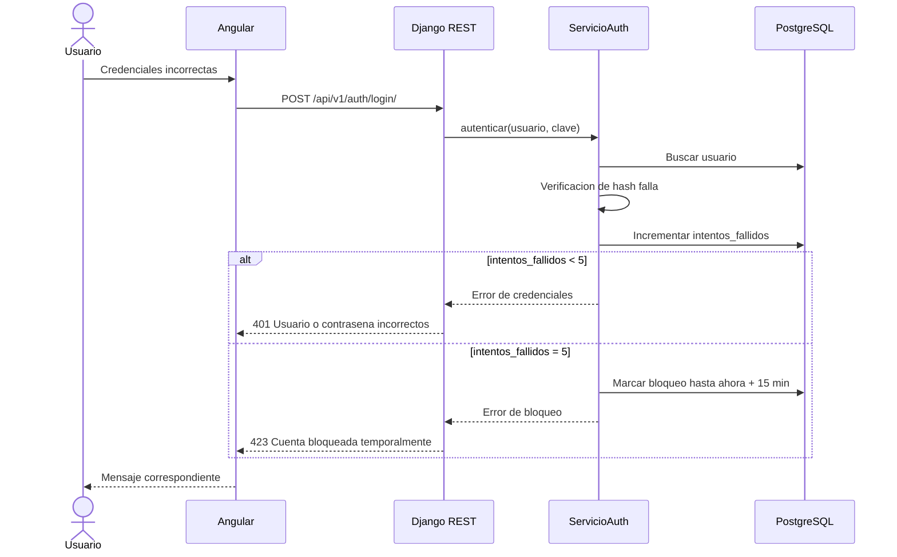
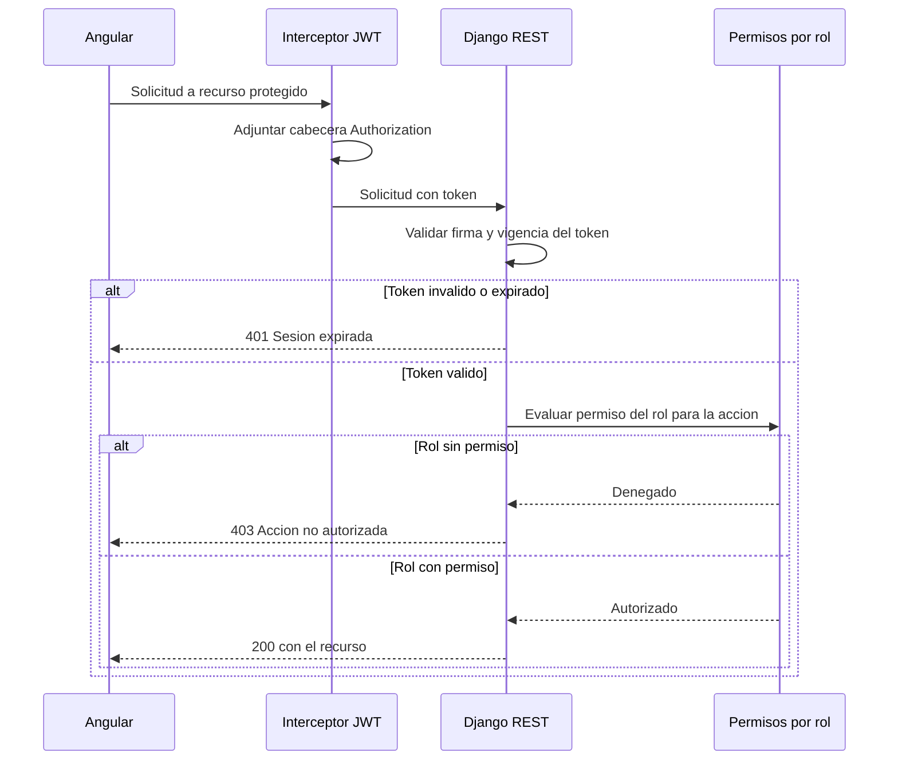

# Diagramas de secuencia — M01 Autenticación

## S-M01-01 · Inicio de sesión exitoso (HU-M01-01)

## S-M01-02 · Intento fallido y bloqueo (HU-M01-01, CA03)

## S-M01-03 · Acceso a endpoint protegido (HU-M01-04, CA02)

