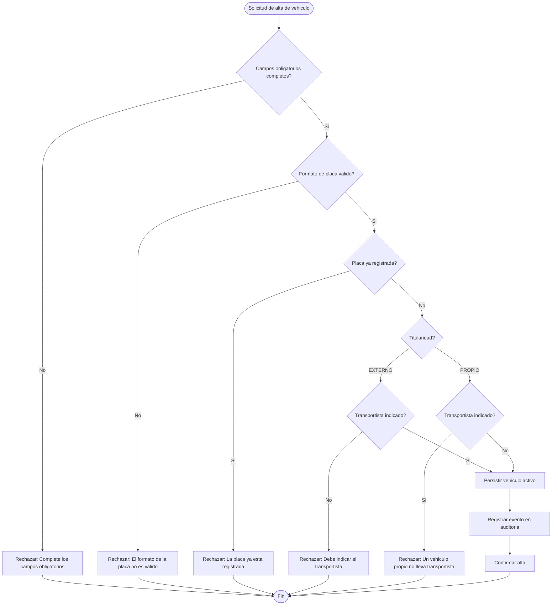
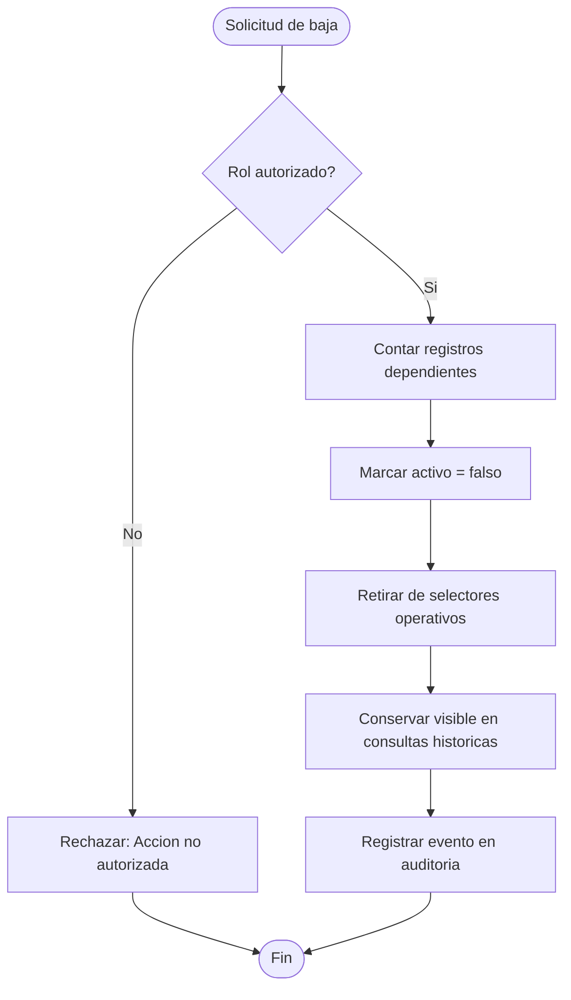

# Diagrama de actividades — M02 Catálogo maestro

## A-M02-01 · Alta de vehículo (RN-M02-02 a RN-M02-05)

## A-M02-02 · Baja lógica de entidad de catálogo (RN-M02-07, RN-M02-08)

La entidad nunca se elimina, tenga o no dependencias. El conteo de registros dependientes solo determina el mensaje que ve el usuario, no el comportamiento del sistema.
