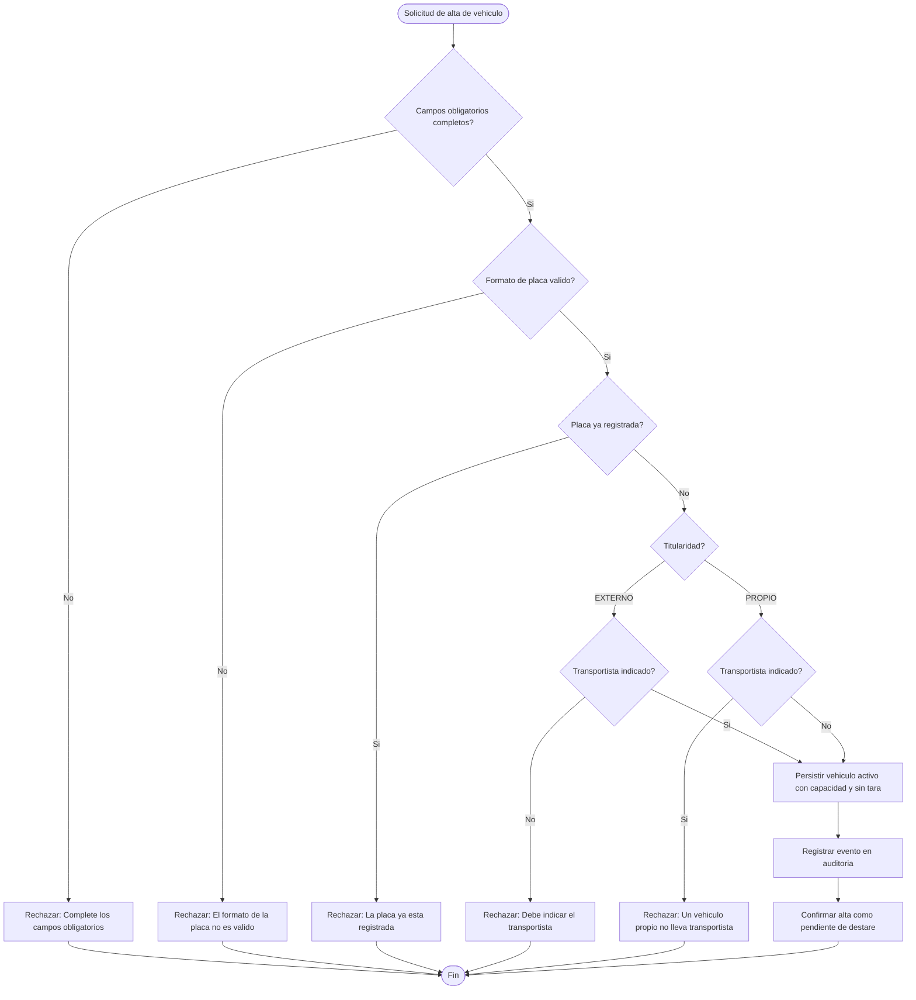
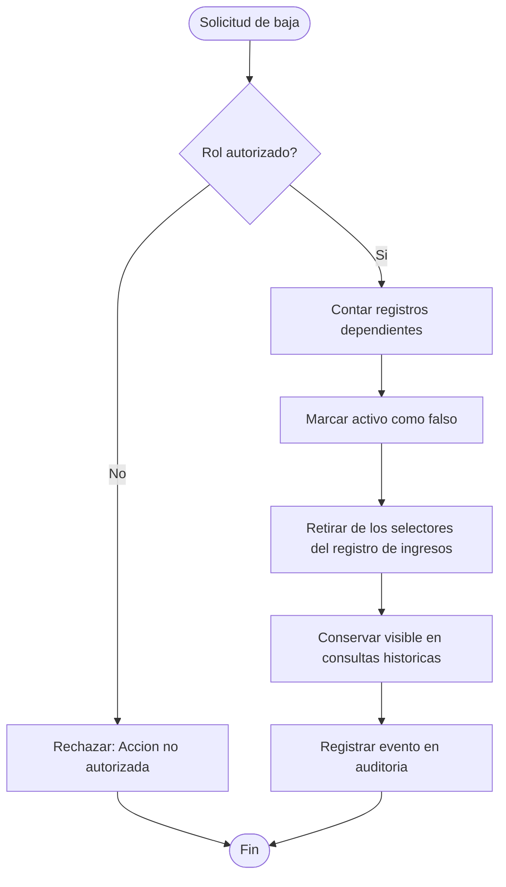
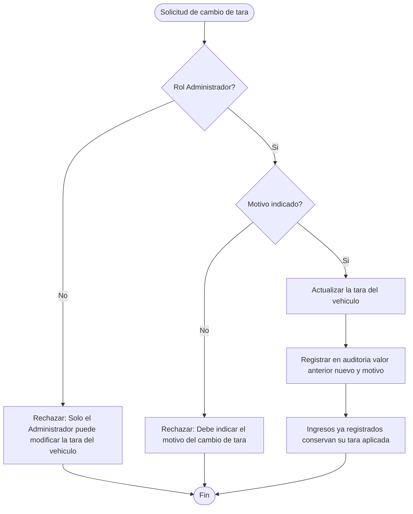

# Diagrama de actividades — M02 Catálogo maestro

## A-M02-01 · Alta de un vehículo (RN-M02-01 a RN-M02-05)

```mermaid
flowchart TD
    Start([Solicitud de alta de vehiculo]) --> V1{Campos obligatorios completos?}
    V1 -->|No| E1[Rechazar: Complete los campos obligatorios]
    E1 --> Fin([Fin])
    V1 -->|Si| V2{Formato de placa valido?}
    V2 -->|No| E2[Rechazar: El formato de la placa no es valido]
    E2 --> Fin
    V2 -->|Si| V3{Placa ya registrada?}
    V3 -->|Si| E3[Rechazar: La placa ya esta registrada]
    E3 --> Fin
    V3 -->|No| V4{Titularidad?}
    V4 -->|EXTERNO| V5{Transportista indicado?}
    V5 -->|No| E4[Rechazar: Debe indicar el transportista]
    E4 --> Fin
    V5 -->|Si| P1[Persistir vehiculo activo con capacidad y sin tara]
    V4 -->|PROPIO| V6{Transportista indicado?}
    V6 -->|Si| E5[Rechazar: Un vehiculo propio no lleva transportista]
    E5 --> Fin
    V6 -->|No| P1
    P1 --> A1[Registrar evento en auditoria]
    A1 --> C1[Confirmar alta como pendiente de destare]
    C1 --> Fin
```

El mismo flujo se ejecuta cuando el alta se pide desde la pantalla de registro de un ingreso
(RN-M02-14): allí el vehículo creado vuelve al registro ya asociado al ingreso en curso.

## A-M02-02 · Baja lógica de una entidad de catálogo (RN-M02-08, RN-M02-09)

```mermaid
flowchart TD
    Start([Solicitud de baja]) --> V1{Rol autorizado?}
    V1 -->|No| E1[Rechazar: Accion no autorizada]
    E1 --> Fin([Fin])
    V1 -->|Si| C1[Contar registros dependientes]
    C1 --> D1[Marcar activo como falso]
    D1 --> D2[Retirar de los selectores del registro de ingresos]
    D2 --> D3[Conservar visible en consultas historicas]
    D3 --> A1[Registrar evento en auditoria]
    A1 --> Fin
```

La entidad nunca se elimina, tenga o no dependencias. El conteo de registros dependientes solo
determina el mensaje que ve el usuario, no el comportamiento del sistema.

## A-M02-03 · Modificación de la tara de un vehículo (RN-M02-12, RN-M02-13)

```mermaid
flowchart TD
    Start([Solicitud de cambio de tara]) --> V1{Rol Administrador?}
    V1 -->|No| E1[Rechazar: Solo el Administrador puede modificar la tara del vehiculo]
    E1 --> Fin([Fin])
    V1 -->|Si| V2{Motivo indicado?}
    V2 -->|No| E2[Rechazar: Debe indicar el motivo del cambio de tara]
    E2 --> Fin
    V2 -->|Si| P1[Actualizar la tara del vehiculo]
    P1 --> A1[Registrar en auditoria valor anterior nuevo y motivo]
    A1 --> N1[Ingresos ya registrados conservan su tara aplicada]
    N1 --> Fin
```

La primera tara no sigue este flujo: se registra desde el destare del ingreso En proceso
(A-M03-04 de M03). Este flujo solo cubre el cambio de una tara que ya existía.
