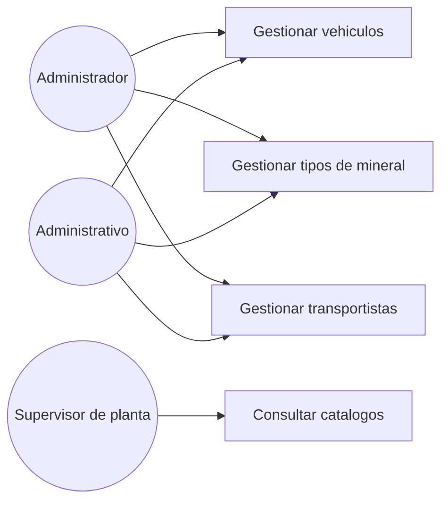

# Diagrama de casos de uso — M02 Catálogo maestro

## Casos de uso

| Caso | HU | Actores | Nota |
|---|---|---|---|
| Gestionar vehículos | HU-M02-01 | Administrador, Administrativo | La titularidad y la capacidad son obligatorias |
| Gestionar tipos de mineral | HU-M02-02 | Administrador, Administrativo | Catálogo único, usado al registrar y al consolidar |
| Gestionar transportistas | HU-M02-03 | Administrador, Administrativo | Del que depende un vehículo con titularidad externa |
| Consultar catálogos | HU-M02-01 a 03 | Los tres roles | El Supervisor de planta solo consulta, para seleccionar en el registro de ingresos |

Los actores se definen en `../../M01-autenticacion/diagramas/caso_uso.md` y no se redefinen aquí.
