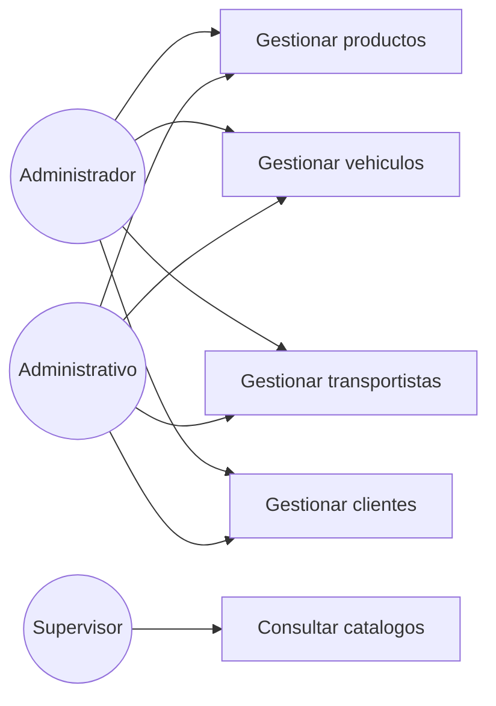

# Diagrama de casos de uso — M02 Catálogo maestro

## Casos de uso

| Caso | HU | Actores | Nota |
|---|---|---|---|
| Gestionar productos | HU-M02-01 | Administrador, Administrativo | Incluye alta, edición y baja lógica |
| Gestionar vehículos | HU-M02-02 | Administrador, Administrativo | La titularidad es obligatoria |
| Gestionar transportistas | HU-M02-03 | Administrador, Administrativo | |
| Gestionar clientes | HU-M02-04 | Administrador, Administrativo | |
| Consultar catálogos | HU-M02-01 a 04 | Los tres roles | El Supervisor solo consulta, para poder seleccionar en el formulario de ingreso |

Los actores se definen en `../../M01-autenticacion/diagramas/caso_uso.md` y no se redefinen aquí.
