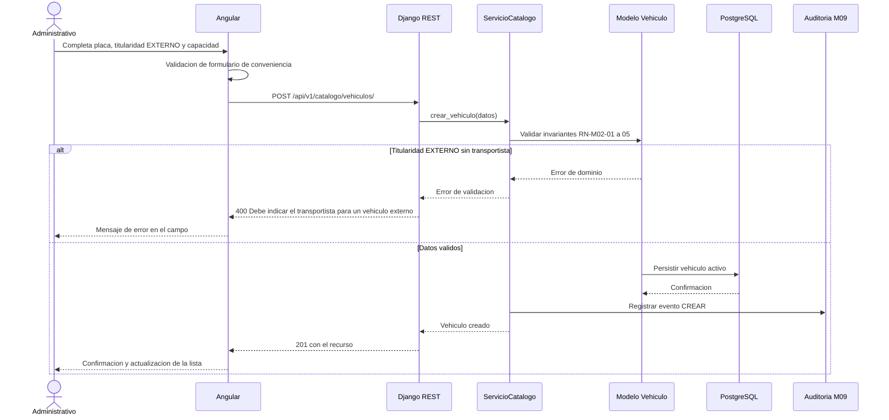
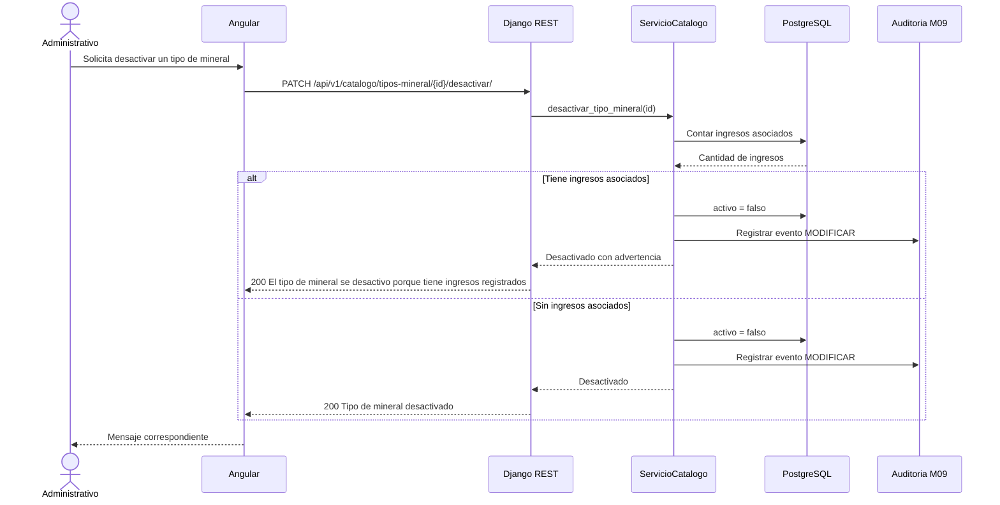
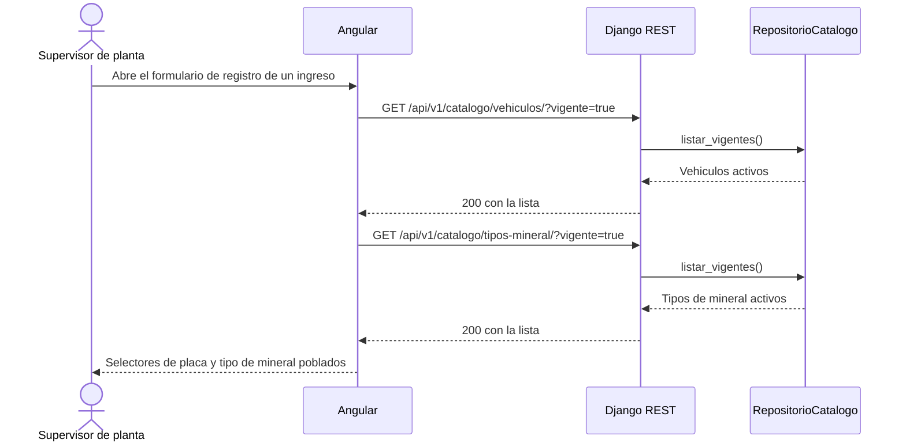

# Diagramas de secuencia — M02 Catálogo maestro

## S-M02-01 · Registro de un vehículo externo (HU-M02-01, CA04)

## S-M02-02 · Desactivación con registros dependientes (HU-M02-02, CA03)

## S-M02-03 · Consulta del catálogo desde el registro de ingresos (HU-M02-01, HU-M02-02)

