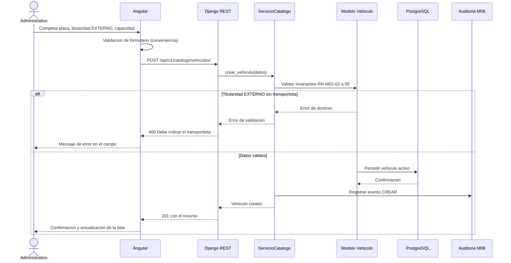
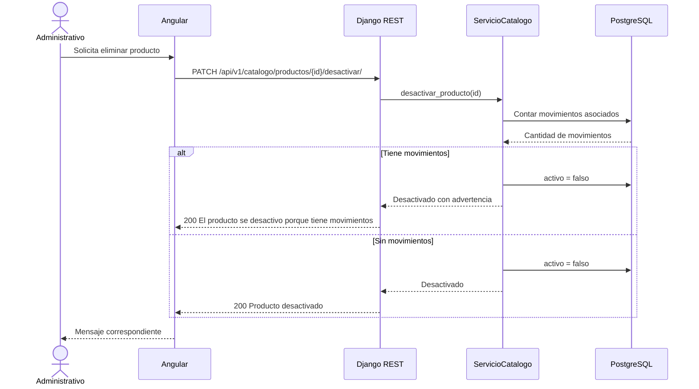
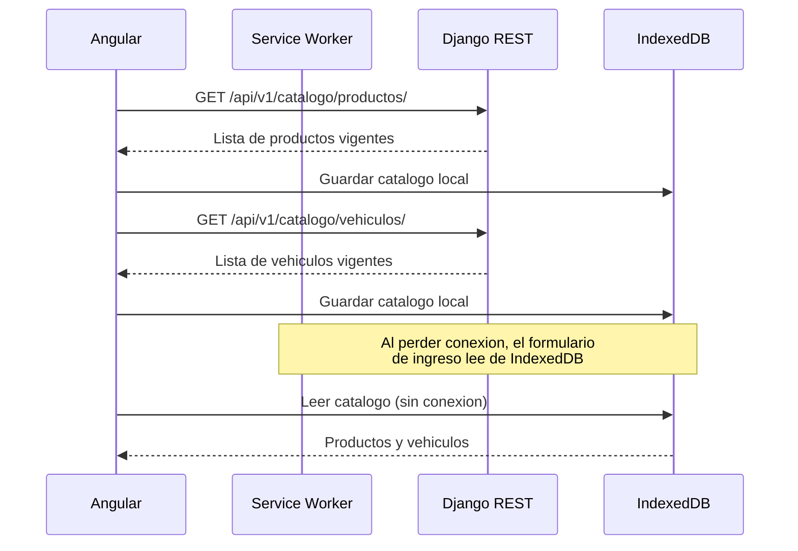

# Diagramas de secuencia — M02 Catálogo maestro

## S-M02-01 · Registro de vehículo externo (HU-M02-02, CA03)

## S-M02-02 · Desactivación con registros dependientes (HU-M02-01, CA03)

## S-M02-03 · Precarga de catálogos para operación offline (RNF-M02-03)

