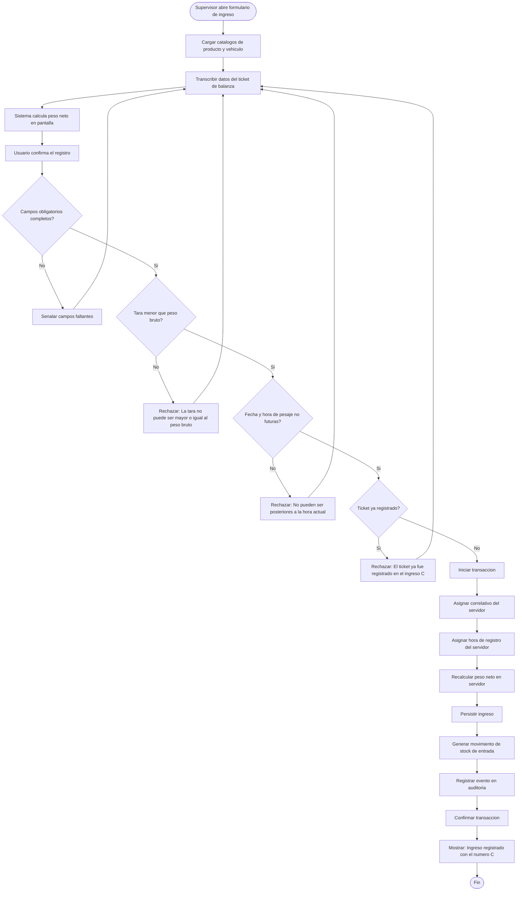
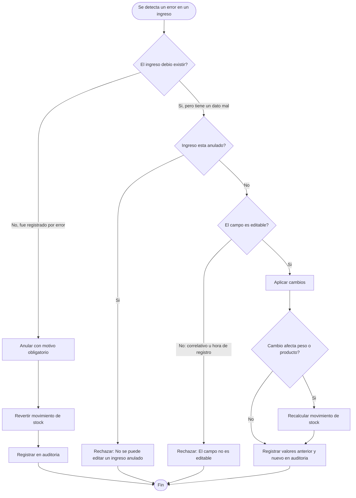
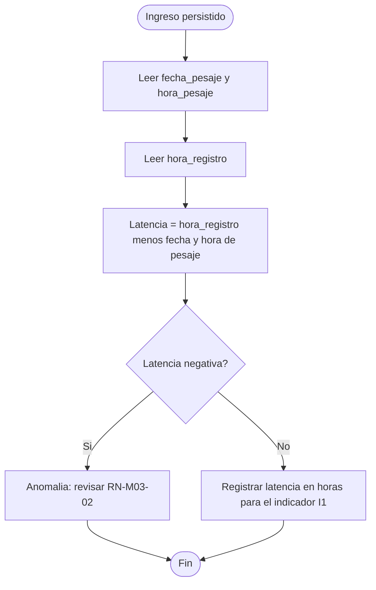

# Diagramas de actividades — M03 Registro de ingresos

## A-M03-01 · Registro de un ingreso (RN-M03-01 a RN-M03-08)

## A-M03-02 · Decisión entre editar y anular (RN-M03-09, RN-M03-10)

Este diagrama documenta una distinción que el usuario debe entender antes de operar: **editar** corrige un dato de un evento que sí ocurrió; **anular** invalida un registro de un evento que no ocurrió o que se duplicó. Confundirlas produce un histórico inconsistente.

## A-M03-03 · Cálculo del indicador I1 sobre los datos del módulo

Este cálculo no es una función del sistema sino un procedimiento de análisis sobre sus datos. Se documenta aquí porque explicita por qué los dos campos temporales deben permanecer separados y por qué RN-M03-02 existe.
