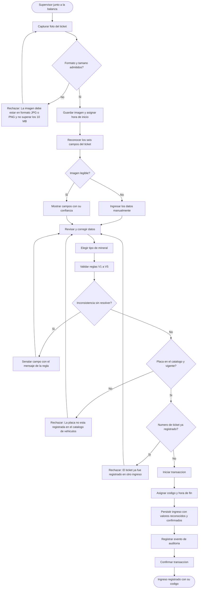
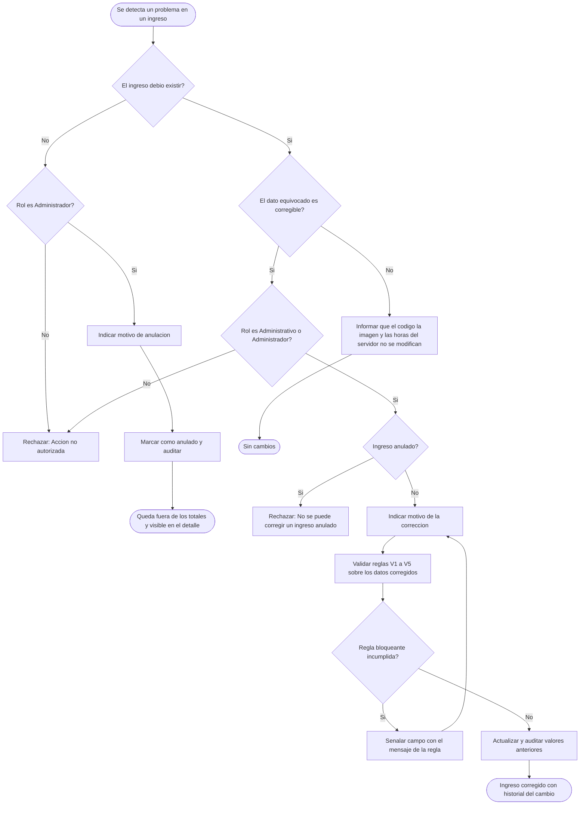
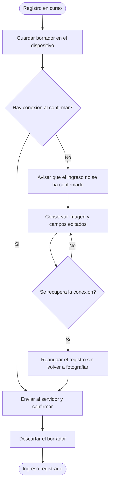

# Diagramas de actividades — M03 Registro de ingresos

## A-M03-01 · Registro de un ingreso a partir del ticket (RN-M03-01 a RN-M03-10)

## A-M03-02 · Decisión entre corregir y anular (RN-M03-11 a RN-M03-14)

## A-M03-03 · Conservación del borrador ante pérdida de conexión (RNF-M03-05)

El borrador vive solo en el dispositivo y no es un ingreso: no tiene código ni figura en ninguna
consulta hasta confirmarse contra el servidor.
