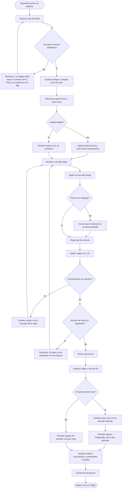
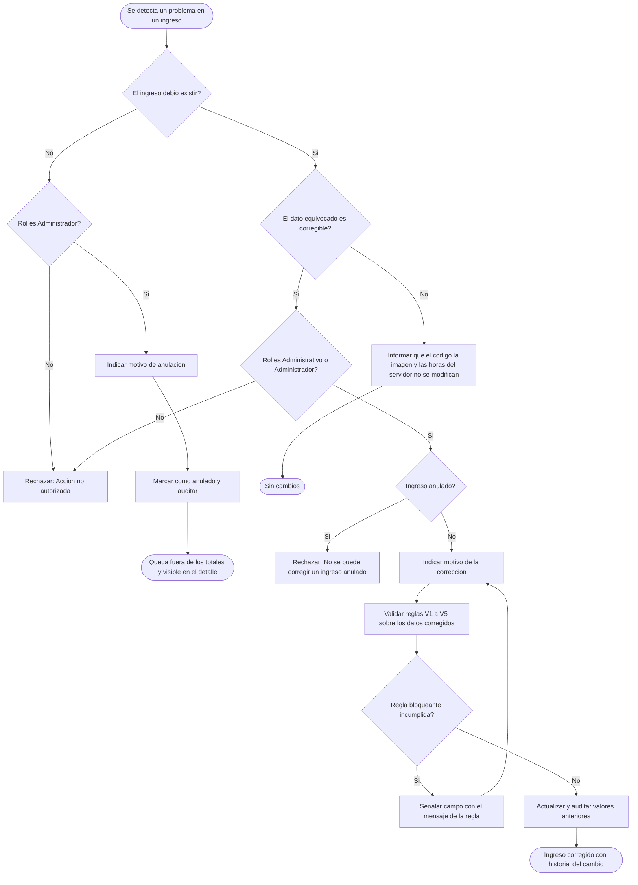
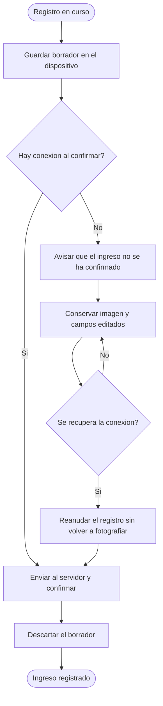
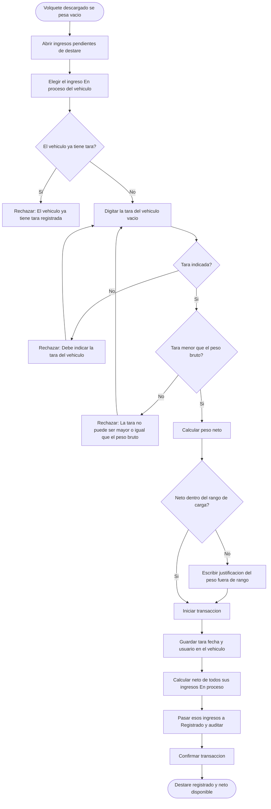

# Diagramas de actividades — M03 Registro de ingresos

## A-M03-01 · Registro de un ingreso a partir del ticket (RN-M03-01 a RN-M03-10, RN-M03-16, RN-M03-17)

```mermaid
flowchart TD
    I([Supervisor junto a la balanza]) --> C1[Capturar foto del ticket]
    C1 --> V1{Formato y tamano admitidos?}
    V1 -->|No| E1[Rechazar: La imagen debe estar en formato JPG o PNG y no superar los 10 MB]
    E1 --> C1
    V1 -->|Si| A1[Guardar imagen y asignar hora de inicio]
    A1 --> R1[Reconocer placa fecha y peso bruto]
    R1 --> D1{Imagen legible?}
    D1 -->|No| L1[Ingresar placa fecha y peso bruto manualmente]
    D1 -->|Si| C2[Mostrar campos con su confianza]
    L1 --> L2[Revisar y corregir datos]
    C2 --> L2
    L2 --> L3[Digitar la hora del pesaje]
    L3 --> D2{Placa en el catalogo?}
    D2 -->|No| L4[Dar de alta el vehiculo en la misma pantalla]
    L4 --> L5[Elegir tipo de mineral]
    D2 -->|Si| L5
    L5 --> V2[Validar reglas V1 a V5]
    V2 --> D3{Inconsistencia sin resolver?}
    D3 -->|Si| E2[Senalar campo con el mensaje de la regla]
    E2 --> L2
    D3 -->|No| V3{Numero de ticket ya registrado?}
    V3 -->|Si| E3[Rechazar: El ticket ya fue registrado en otro ingreso]
    E3 --> L2
    V3 -->|No| T1[Iniciar transaccion]
    T1 --> A2[Asignar codigo y hora de fin]
    A2 --> D4{El vehiculo tiene tara?}
    D4 -->|Si| A3[Calcular peso neto con la tara del vehiculo]
    A3 --> P1[Persistir ingreso Registrado con la tara aplicada]
    D4 -->|No| P2[Persistir ingreso En proceso sin peso neto]
    P1 --> P3[Guardar valores reconocidos y confirmados y auditar]
    P2 --> P3
    P3 --> T2[Confirmar transaccion]
    T2 --> F([Ingreso con su codigo])
```

Un vehículo dado de alta en la misma pantalla nunca tiene tara todavía, de modo que su ingreso
siempre termina En proceso: la tara llega con el destare (A-M03-04).

## A-M03-02 · Decisión entre corregir y anular (RN-M03-11 a RN-M03-14)

```mermaid
flowchart TD
    I([Se detecta un problema en un ingreso]) --> D1{El ingreso debio existir?}
    D1 -->|No| D2{Rol es Administrador?}
    D2 -->|No| E1[Rechazar: Accion no autorizada]
    D2 -->|Si| L1[Indicar motivo de anulacion]
    L1 --> P1[Marcar como anulado y auditar]
    P1 --> F1([Queda fuera de los totales y visible en el detalle])

    D1 -->|Si| D3{El dato equivocado es corregible?}
    D3 -->|No| M1[Informar que el codigo la imagen y las horas del servidor no se modifican]
    M1 --> F2([Sin cambios])
    D3 -->|Si| D4{Rol es Administrativo o Administrador?}
    D4 -->|No| E1
    D4 -->|Si| D5{Ingreso anulado?}
    D5 -->|Si| E2[Rechazar: No se puede corregir un ingreso anulado]
    D5 -->|No| L2[Indicar motivo de la correccion]
    L2 --> V1[Validar reglas V1 a V5 sobre los datos corregidos]
    V1 --> D6{Regla bloqueante incumplida?}
    D6 -->|Si| E3[Senalar campo con el mensaje de la regla]
    E3 --> L2
    D6 -->|No| P2[Actualizar y auditar valores anteriores]
    P2 --> F3([Ingreso corregido con historial del cambio])
```

## A-M03-03 · Conservación del borrador ante pérdida de conexión (RNF-M03-05)

```mermaid
flowchart TD
    I([Registro en curso]) --> A1[Guardar borrador en el dispositivo]
    A1 --> D1{Hay conexion al confirmar?}
    D1 -->|Si| P1[Enviar al servidor y confirmar]
    P1 --> A2[Descartar el borrador]
    A2 --> F1([Ingreso registrado])
    D1 -->|No| M1[Avisar que el ingreso no se ha confirmado]
    M1 --> A3[Conservar imagen y campos editados]
    A3 --> D2{Se recupera la conexion?}
    D2 -->|No| A3
    D2 -->|Si| L1[Reanudar el registro sin volver a fotografiar]
    L1 --> P1
```

El borrador vive solo en el dispositivo y no es un ingreso: no tiene código ni figura en ninguna
consulta hasta confirmarse contra el servidor.

## A-M03-04 · Registro del destare de un vehículo en su primer viaje (RN-M03-19, RN-M03-20)

```mermaid
flowchart TD
    I([Volquete descargado se pesa vacio]) --> C1[Abrir ingresos pendientes de destare]
    C1 --> L1[Elegir el ingreso En proceso del vehiculo]
    L1 --> V1{El vehiculo ya tiene tara?}
    V1 -->|Si| E1[Rechazar: El vehiculo ya tiene tara registrada]
    V1 -->|No| L2[Digitar la tara del vehiculo vacio]
    L2 --> V2{Tara indicada?}
    V2 -->|No| E2[Rechazar: Debe indicar la tara del vehiculo]
    E2 --> L2
    V2 -->|Si| V3{Tara menor que el peso bruto?}
    V3 -->|No| E3[Rechazar: La tara no puede ser mayor o igual que el peso bruto]
    E3 --> L2
    V3 -->|Si| A1[Calcular peso neto]
    A1 --> V4{Neto dentro del rango de carga?}
    V4 -->|No| L3[Escribir justificacion del peso fuera de rango]
    L3 --> T1
    V4 -->|Si| T1[Iniciar transaccion]
    T1 --> P1[Guardar tara fecha y usuario en el vehiculo]
    P1 --> P2[Calcular neto de todos sus ingresos En proceso]
    P2 --> P3[Pasar esos ingresos a Registrado y auditar]
    P3 --> T2[Confirmar transaccion]
    T2 --> F([Destare registrado y neto disponible])
```

La tara se digita, no se reconoce de la imagen: de ella depende el peso neto de todos los viajes
futuros del vehículo (RN-M03-19).
