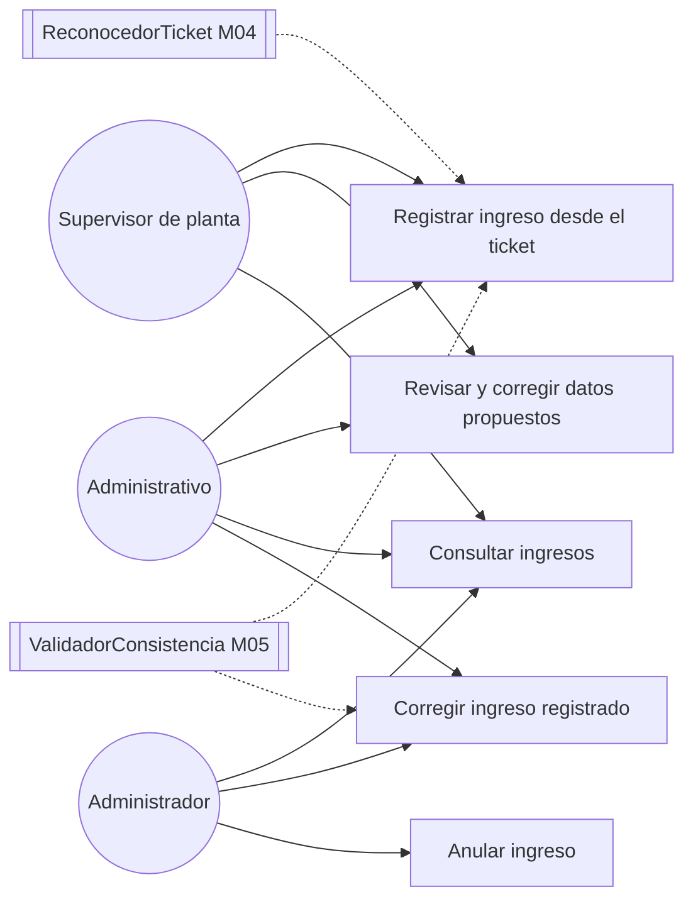

# Diagrama de casos de uso — M03 Registro de ingresos

## Casos de uso

| Caso | HU | Actores | Nota |
|---|---|---|---|
| Registrar ingreso desde el ticket | HU-M03-01 | Supervisor de planta, Administrativo | Empieza con la captura de la imagen; el código y la hora de fin los asigna el servidor |
| Revisar y corregir datos propuestos | HU-M03-01 | Supervisor de planta, Administrativo | Ocurre antes de confirmar; nada se persiste hasta entonces |
| Consultar ingresos | HU-M03-01 | Los tres roles | Listado y detalle del propio recurso. La búsqueda por placa y fecha es de M07 |
| Corregir ingreso registrado | HU-M03-02 | Administrativo, Administrador | Exige motivo y vuelve a validar. El Supervisor de planta no corrige |
| Anular ingreso | HU-M03-03 | Administrador | Exige motivo. No elimina: excluye de los totales y conserva el registro |

`ReconocedorTicket` y `ValidadorConsistencia` son interfaces que M03 invoca, no actores humanos: se
dibujan con línea discontinua para mostrar que el caso de uso depende de ellas.

Los actores se definen en `../../M01-autenticacion/diagramas/caso_uso.md` y no se redefinen aquí.
