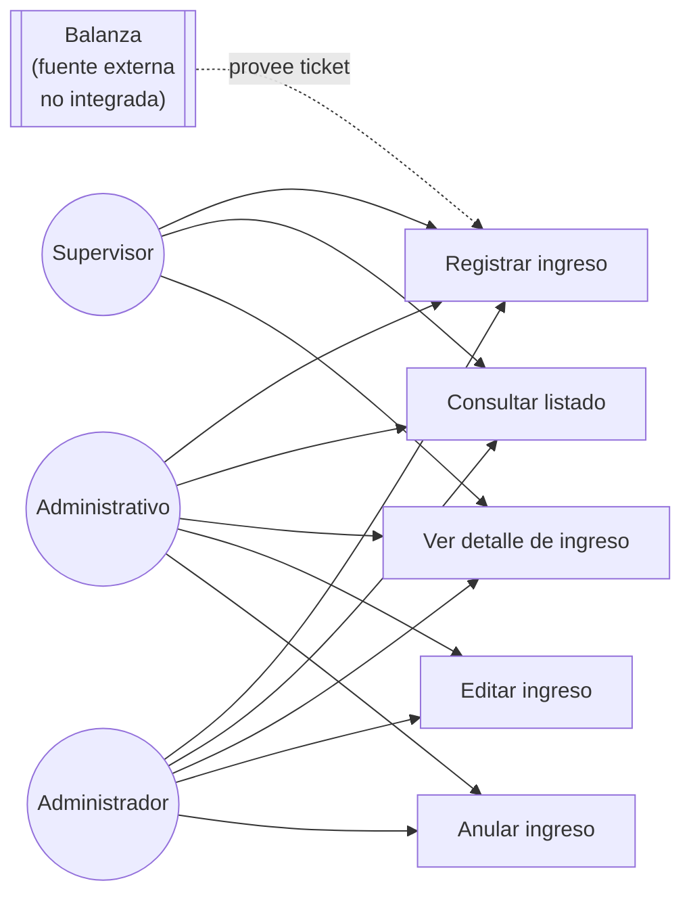

# Diagrama de casos de uso — M03 Registro de ingresos

## Nota sobre la balanza

La balanza **no está integrada** al sistema. Es una fuente externa que produce un ticket en papel; el usuario transcribe sus datos. La integración automática está fuera de alcance (ver `../../00-arquitectura/ARQ-01_Modulos_del_Sistema.md` §5).

Esta decisión tiene consecuencia sobre la medición: la latencia I1 incluye el tiempo de transcripción manual. Si la balanza estuviera integrada, la latencia tendería a cero y el indicador perdería variabilidad. La transcripción manual es parte del proceso real que se mide.

## Casos de uso

| Caso | HU | Actores | Precondición |
|---|---|---|---|
| Registrar ingreso | HU-M03-01, 02, 03 | Los tres roles | Sesión activa; catálogos cargados |
| Consultar listado | HU-M03-04 | Los tres roles | Sesión activa |
| Ver detalle | HU-M03-05 | Los tres roles | Ingreso existente |
| Editar ingreso | HU-M03-06 | Administrativo, Administrador | Ingreso no anulado |
| Anular ingreso | HU-M03-07 | Administrativo, Administrador | Ingreso en estado REGISTRADO |
