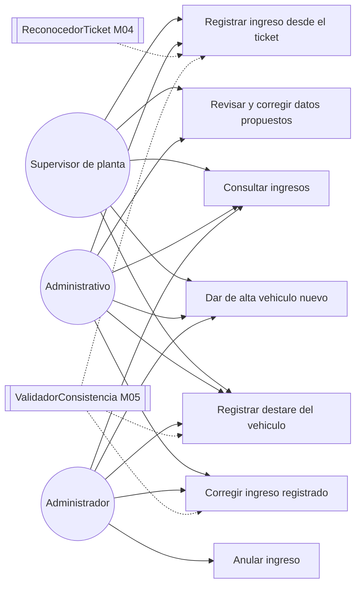

# Diagrama de casos de uso — M03 Registro de ingresos

```mermaid
flowchart LR
    SUP(("Supervisor de planta"))
    ADV(("Administrativo"))
    ADM(("Administrador"))
    REC[["ReconocedorTicket M04"]]
    VAL[["ValidadorConsistencia M05"]]

    UC1["Registrar ingreso desde el ticket"]
    UC2["Revisar y corregir datos propuestos"]
    UC3["Consultar ingresos"]
    UC4["Corregir ingreso registrado"]
    UC5["Anular ingreso"]
    UC6["Dar de alta vehiculo nuevo"]
    UC7["Registrar destare del vehiculo"]

    SUP --> UC1
    SUP --> UC2
    SUP --> UC3
    SUP --> UC6
    SUP --> UC7
    ADV --> UC1
    ADV --> UC2
    ADV --> UC3
    ADV --> UC4
    ADV --> UC6
    ADV --> UC7
    ADM --> UC3
    ADM --> UC4
    ADM --> UC5
    ADM --> UC6
    ADM --> UC7

    REC -.-> UC1
    VAL -.-> UC1
    VAL -.-> UC4
    VAL -.-> UC7
```

## Casos de uso

| Caso | HU | Actores | Nota |
|---|---|---|---|
| Registrar ingreso desde el ticket | HU-M03-01 | Supervisor de planta, Administrativo | Empieza con la captura de la imagen; la hora del pesaje la digita el usuario; el código, la hora de fin y el peso neto los asigna el servidor |
| Revisar y corregir datos propuestos | HU-M03-01 | Supervisor de planta, Administrativo | Ocurre antes de confirmar; nada se persiste hasta entonces |
| Consultar ingresos | HU-M03-01 | Los tres roles | Listado y detalle del propio recurso. La búsqueda por placa y fecha es de M07 |
| Corregir ingreso registrado | HU-M03-02 | Administrativo, Administrador | Exige motivo y vuelve a validar. El Supervisor de planta no corrige |
| Anular ingreso | HU-M03-03 | Administrador | Exige motivo. No elimina: excluye de los totales y conserva el registro |
| Dar de alta vehículo nuevo | HU-M03-01 | Los tres roles | En la misma pantalla del registro, sin perder lo capturado. Es el primer viaje: el ingreso queda En proceso |
| Registrar destare del vehículo | HU-M03-04 | Los tres roles | La tara se digita, no se reconoce. Completa el peso neto de los ingresos En proceso del vehículo |

`ReconocedorTicket` y `ValidadorConsistencia` son interfaces que M03 invoca, no actores humanos: se
dibujan con línea discontinua para mostrar que el caso de uso depende de ellas.

Los actores se definen en `../../M01-autenticacion/diagramas/caso_uso.md` y no se redefinen aquí.
