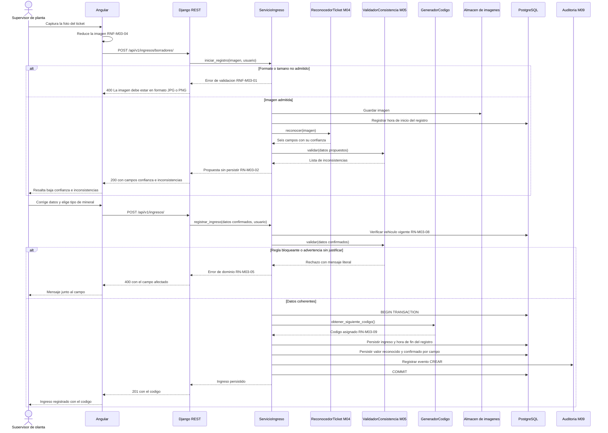
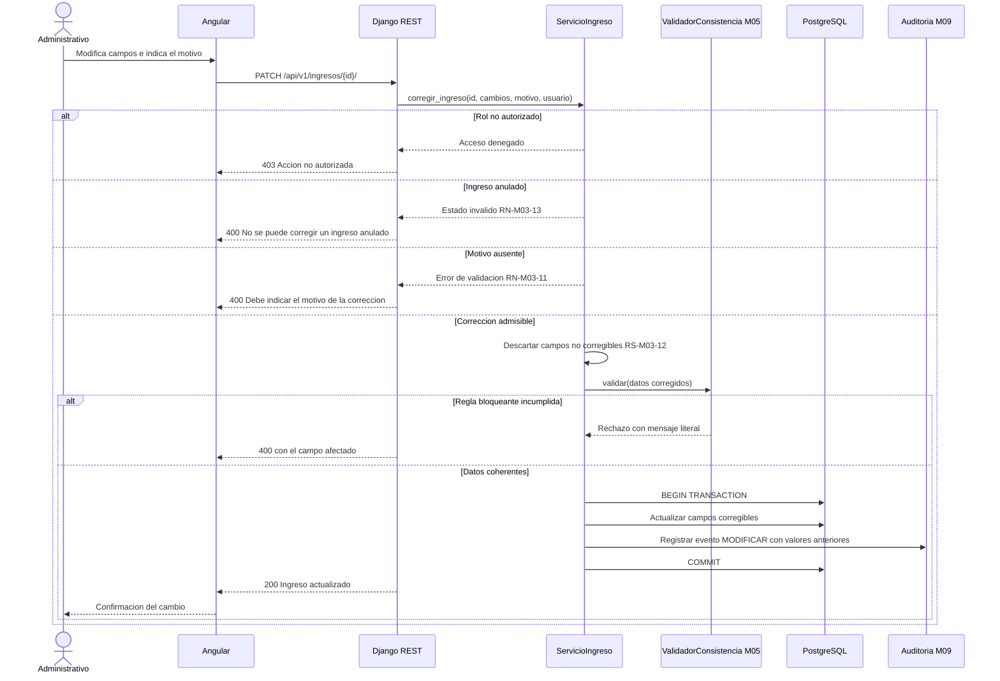
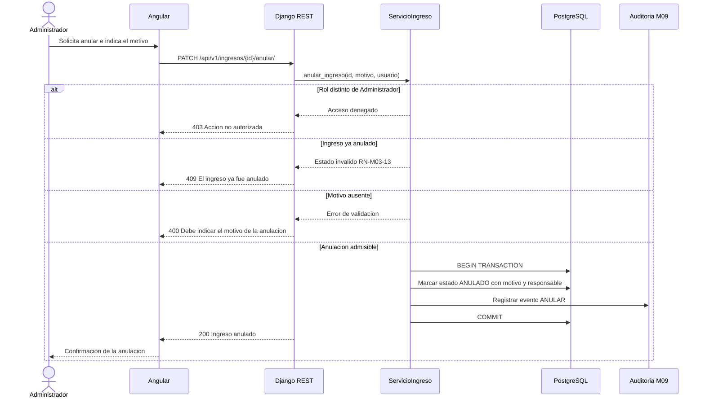

# Diagramas de secuencia — M03 Registro de ingresos

## S-M03-01 · Registro de un ingreso con reconocimiento y validación (HU-M03-01)

## S-M03-02 · Corrección de un ingreso registrado (HU-M03-02)

## S-M03-03 · Anulación de un ingreso (HU-M03-03)

La imagen del ticket no se elimina al anular: el ingreso permanece consultable con su respaldo
(RNF-M03-10).
