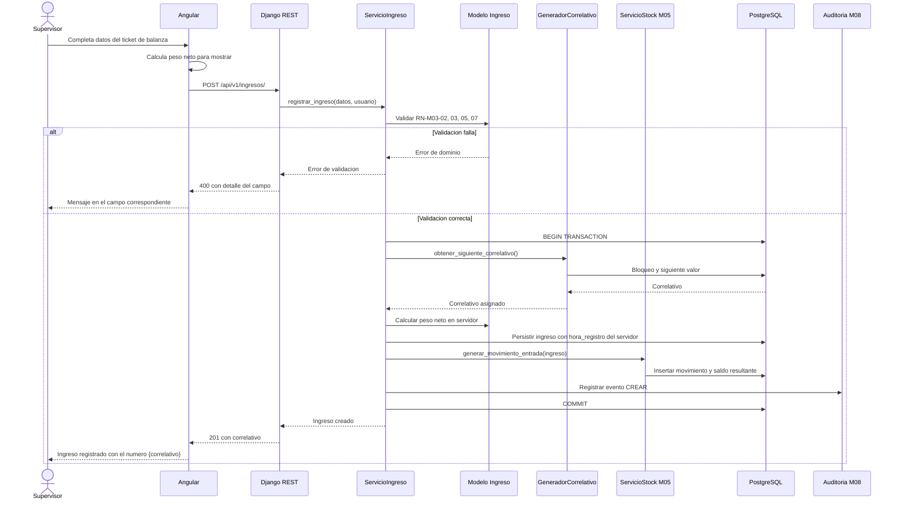
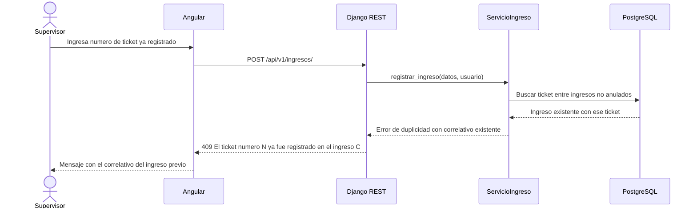
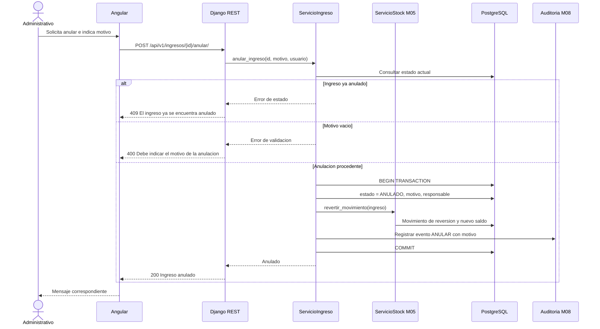
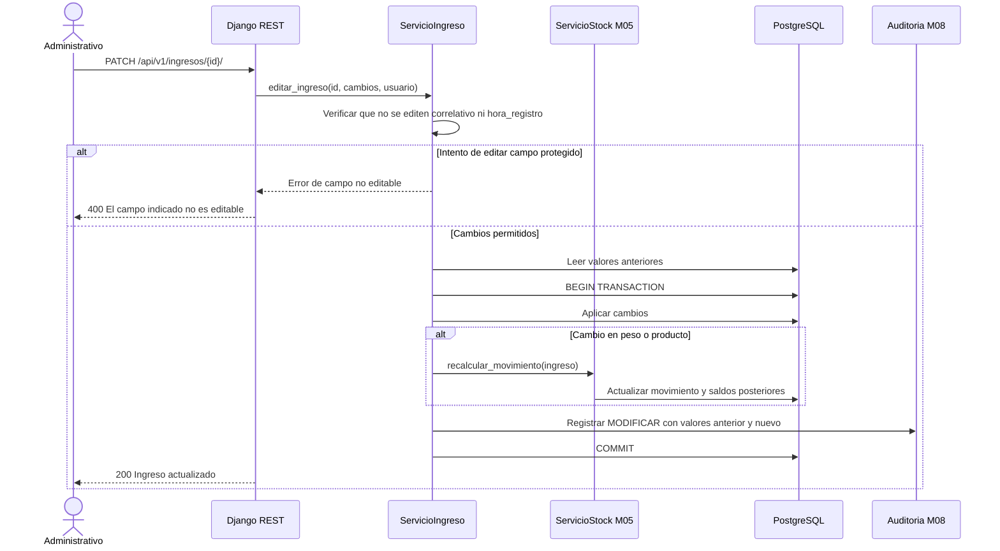

# Diagramas de secuencia — M03 Registro de ingresos

## S-M03-01 · Registro de un ingreso en línea (HU-M03-01)

## S-M03-02 · Detección de ticket duplicado (HU-M03-01, CA04)

El mensaje incluye el correlativo del ingreso previo deliberadamente: permite al supervisor verificar de inmediato si se trata de un registro duplicado real o de un error de transcripción del número de ticket.

## S-M03-03 · Anulación de un ingreso (HU-M03-07)

## S-M03-04 · Edición con recálculo de stock (HU-M03-06, CA03)

