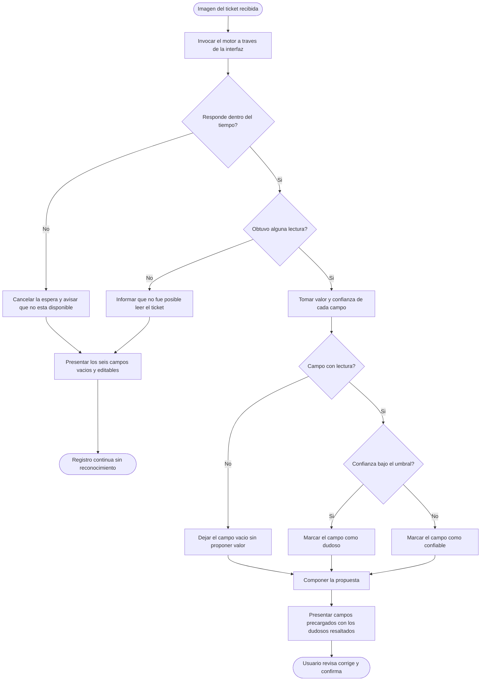
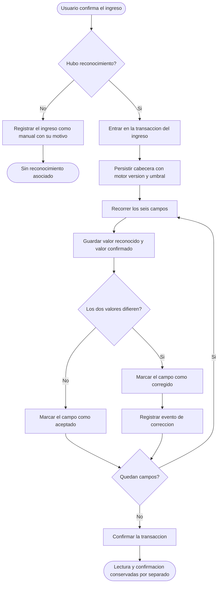
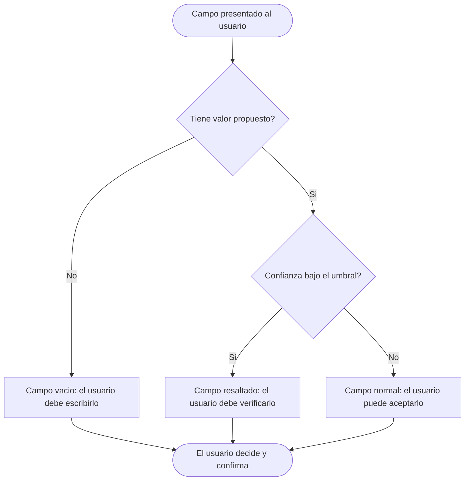

# Diagramas de actividades — M04 Reconocimiento automático del ticket

## A-M04-01 · Reconocimiento y presentación de la propuesta (RN-M04-01 a RN-M04-07)

Ninguna rama de este diagrama escribe en la base: todo lo que produce el reconocimiento es una
propuesta en memoria hasta que el usuario confirma el ingreso.

## A-M04-02 · Conservación de la lectura al confirmar (RN-M04-02, RN-M04-09, RN-M04-10)

## A-M04-03 · Decisión de revisar un campo (RN-M04-03, RN-M04-06)

Las tres situaciones son distintas y se presentan distintas. Un campo sin lectura no lleva confianza
cero: no lleva confianza, porque no hubo lectura que calificar.
