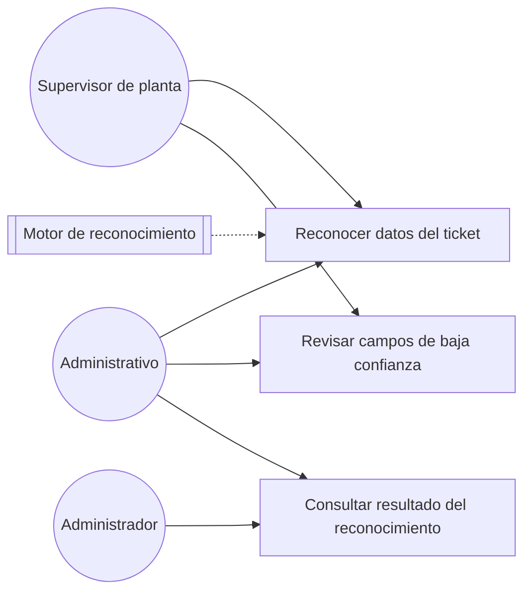

# Diagrama de casos de uso — M04 Reconocimiento automático del ticket

## Casos de uso

| Caso | HU | Actores | Nota |
|---|---|---|---|
| Reconocer datos del ticket | HU-M04-01 | Supervisor de planta, Administrativo | Ocurre dentro del registro de M03. El resultado es una propuesta y no se persiste sin confirmación |
| Revisar campos de baja confianza | HU-M04-01 | Supervisor de planta, Administrativo | Umbral por defecto de 0,80. Un campo sin lectura se presenta vacío, no resaltado |
| Consultar resultado del reconocimiento | HU-M04-02 | Administrativo, Administrador | Muestra el valor reconocido frente al confirmado, con el motor y la versión |

El motor de reconocimiento se dibuja como sistema externo con línea discontinua: participa del caso
de uso sin ser un actor humano, y su implementación concreta está pendiente de la decisión D-12.

Los actores se definen en `../../M01-autenticacion/diagramas/caso_uso.md` y no se redefinen aquí.
