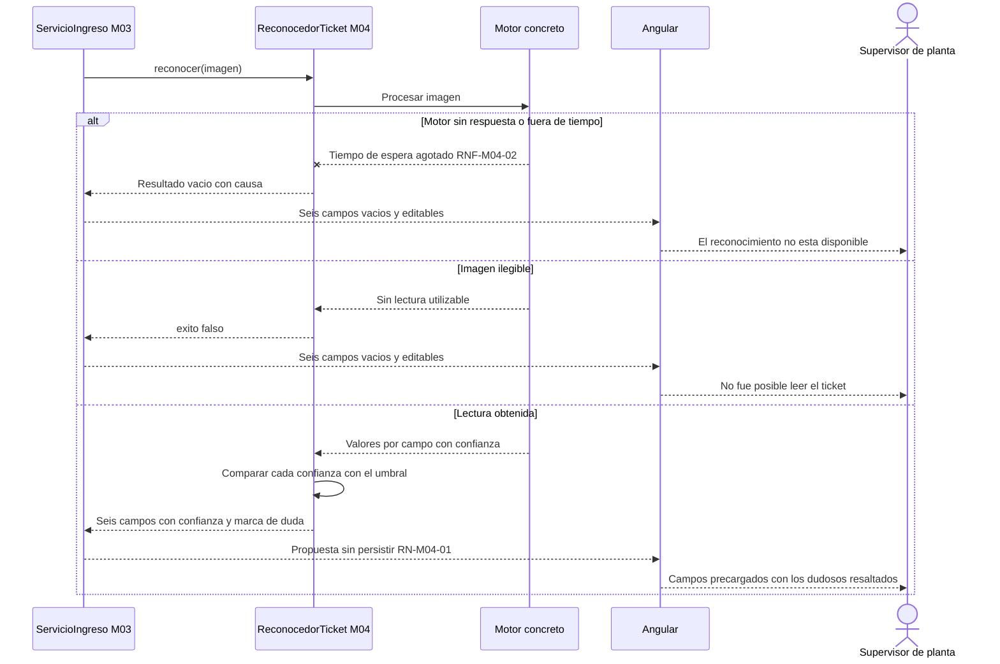
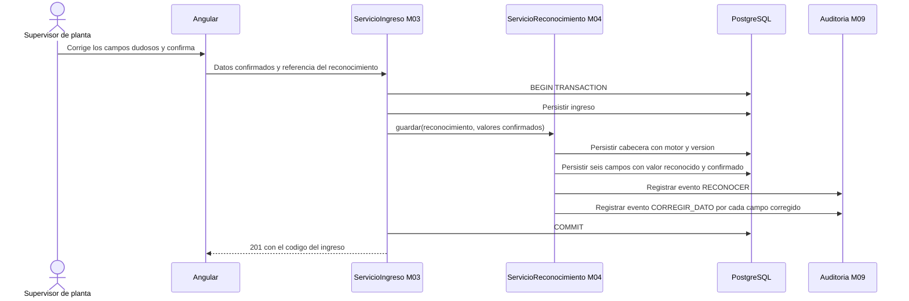
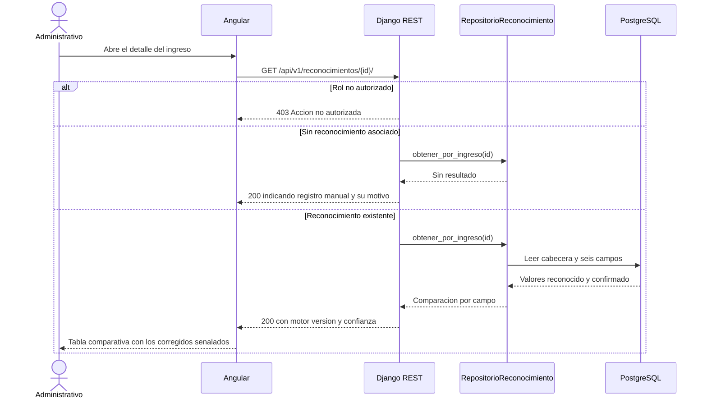

# Diagramas de secuencia — M04 Reconocimiento automático del ticket

## S-M04-01 · Reconocimiento de los datos del ticket (HU-M04-01)

## S-M04-02 · Persistencia del reconocimiento al confirmar el ingreso (HU-M04-01)

El reconocimiento se persiste dentro de la misma transacción del ingreso: si el ingreso no llega a
registrarse, tampoco queda constancia de la lectura, porque una lectura sin ingreso no describe
nada.

## S-M04-03 · Consulta del dato reconocido frente al confirmado (HU-M04-02)

