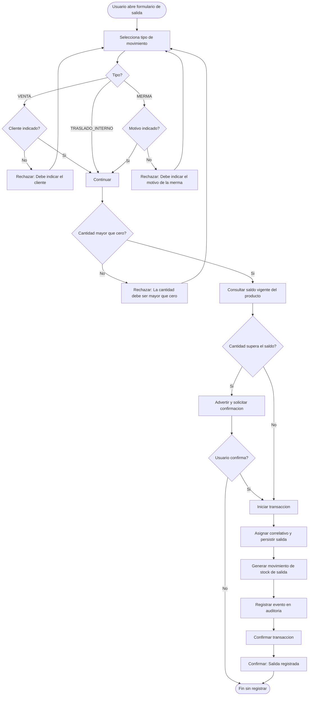
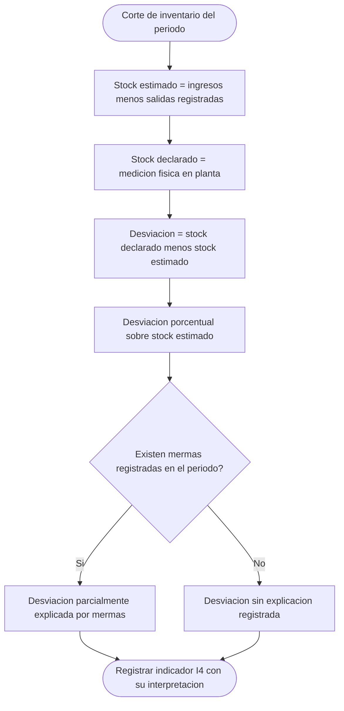

# Diagramas de actividades — M04 Salidas y movimientos

## A-M04-01 · Registro de salida según tipo de movimiento (RN-M04-02 a RN-M04-06)

## A-M04-02 · Composición del indicador I4

Este diagrama documenta por qué el tipo MERMA existe como categoría separada: sin él, toda desviación sería indistinguible de un error de registro. La rama I1 solo puede recorrerse si el criterio de merma por humedad está definido, pendiente registrado en `../requisitos/reglas_negocio.md`.
