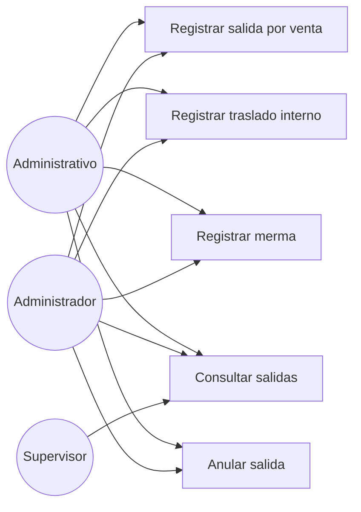

# Diagrama de casos de uso — M04 Salidas y movimientos

## Casos de uso

| Caso | HU | Actores | Precondición |
|---|---|---|---|
| Registrar salida por venta | HU-M04-01 | Administrativo, Administrador | Cliente y producto vigentes en catálogo |
| Registrar traslado interno | HU-M04-02 | Administrativo, Administrador | Producto vigente |
| Registrar merma | HU-M04-02 | Administrativo, Administrador | Producto vigente; motivo obligatorio |
| Consultar salidas | HU-M04-03 | Los tres roles | Sesión activa |
| Anular salida | HU-M04-03 | Administrativo, Administrador | Salida en estado REGISTRADO |

El Supervisor aparece únicamente en la consulta, coherente con la matriz de permisos de `../requerimientos/funcionales.md`.
