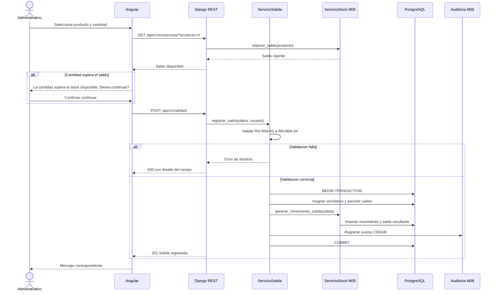
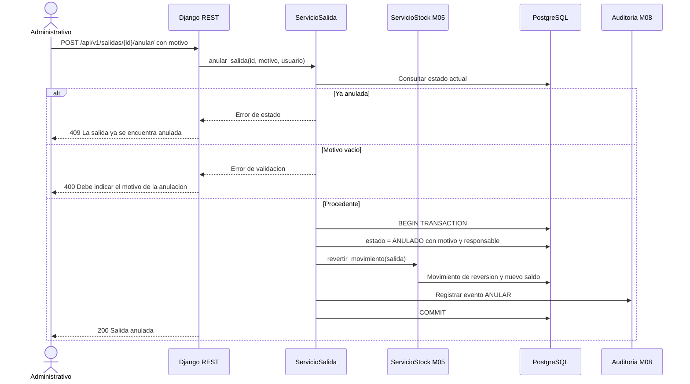

# Diagramas de secuencia — M04 Salidas y movimientos

## S-M04-01 · Registro de salida con advertencia de stock (HU-M04-01, CA02)

## S-M04-02 · Anulación con reversión de stock (HU-M04-03, CA02)

