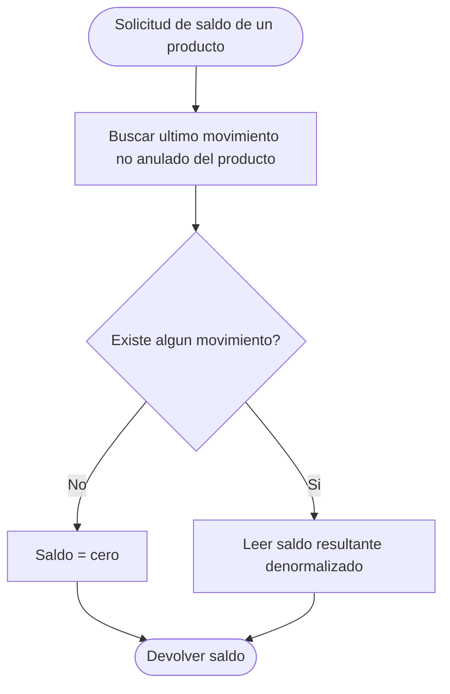
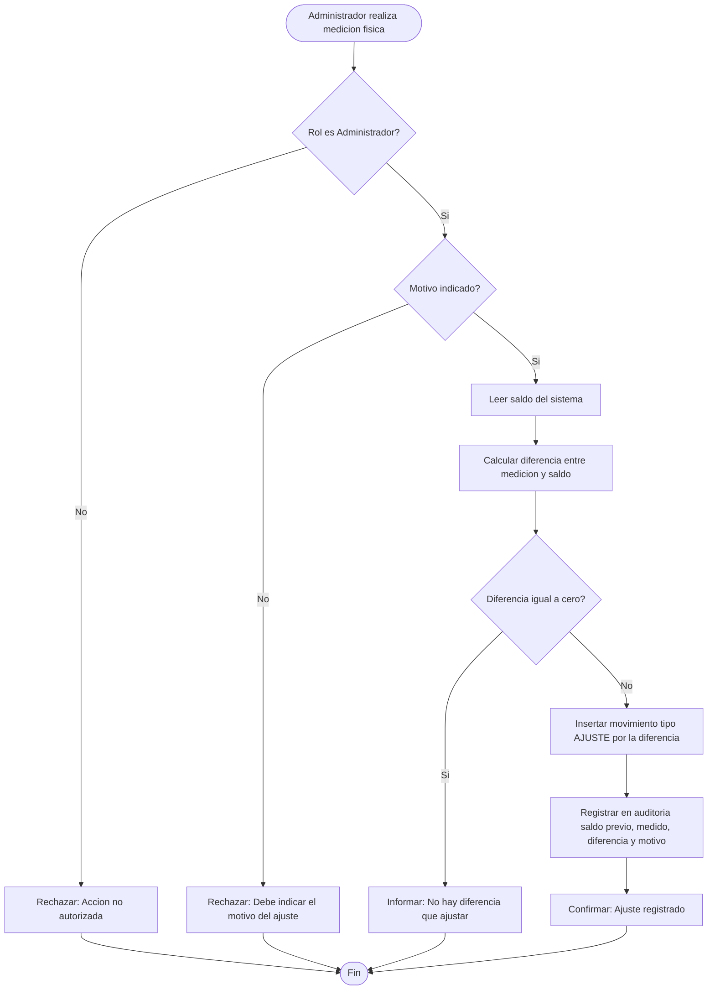
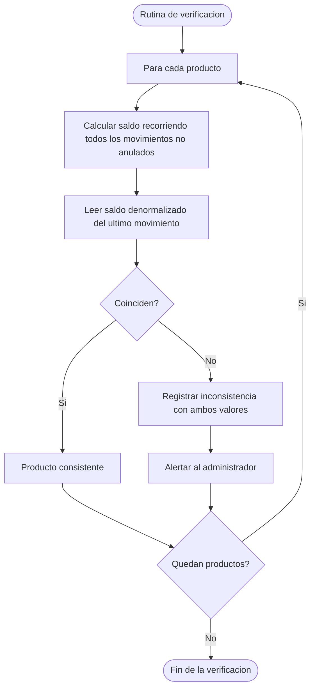

# Diagramas de actividades — M05 Existencias

## A-M05-01 · Determinación del saldo de un producto (RN-M05-01, RS-M05-03)

## A-M05-02 · Registro de un ajuste de inventario (RN-M05-06 a RN-M05-08)

## A-M05-03 · Verificación de consistencia del saldo denormalizado (RNF-M05-03)

Esta rutina no es una funcionalidad para el usuario: es un control interno que debe ejecutarse al menos al inicio y al cierre de la ventana de observación del postest. Su resultado es evidencia de la validez de los datos recolectados y conviene documentarlo como anexo de la tesis.
