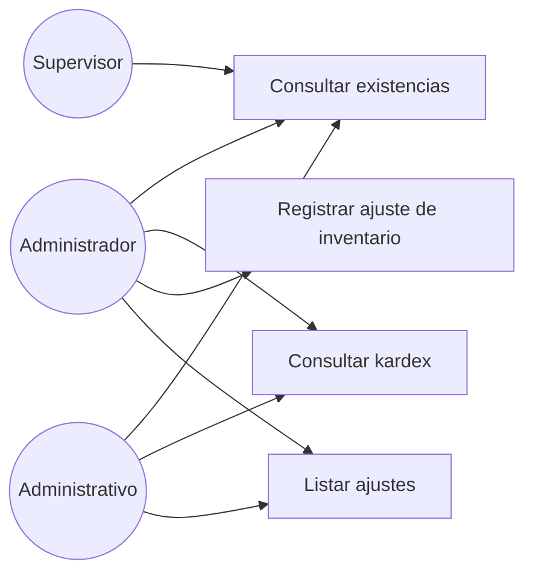

# Diagrama de casos de uso — M05 Existencias

## Casos de uso

| Caso | HU | Actores | Nota |
|---|---|---|---|
| Consultar existencias | HU-M05-01 | Los tres roles | Vista predeterminada del Administrativo |
| Consultar kardex | HU-M05-02 | Administrador, Administrativo | Detalle cronológico con saldo resultante |
| Registrar ajuste | HU-M05-03 | Administrador | Exclusivo: es la evidencia del indicador I4 |
| Listar ajustes | HU-M05-03 | Administrador, Administrativo | Histórico de desviaciones |

**No existe** un caso de uso "modificar existencias". Su ausencia es deliberada y corresponde a RN-M05-02.
