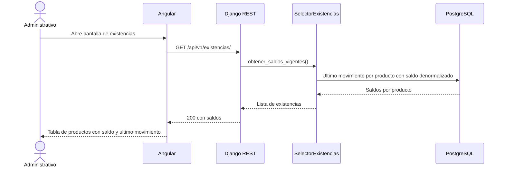
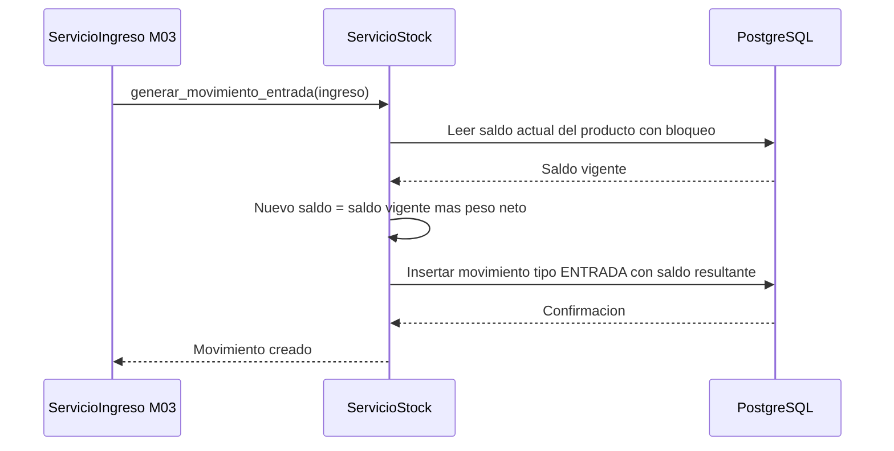
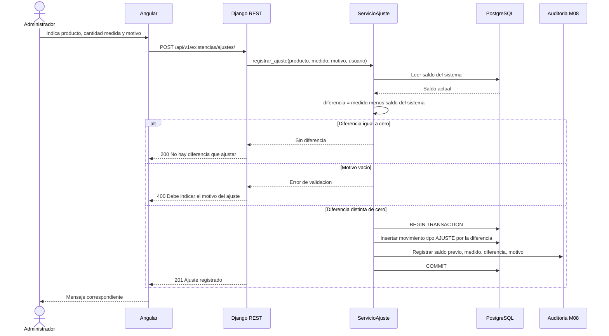

# Diagramas de secuencia — M05 Existencias

## S-M05-01 · Consulta de existencias (HU-M05-01)

La consulta lee el saldo denormalizado del último movimiento de cada producto (RS-M05-03). No recorre el histórico: si lo hiciera, el tiempo de respuesta crecería con el volumen y el indicador I3 se degradaría durante el periodo de medición.

## S-M05-02 · Generación de movimiento desde un ingreso (RN-M05-03)

La lectura del saldo se hace con bloqueo dentro de la transacción que abrió M03. Sin bloqueo, dos ingresos simultáneos del mismo producto calcularían el saldo resultante sobre la misma base y uno de los dos quedaría con un saldo denormalizado incorrecto.

## S-M05-03 · Registro de ajuste de inventario (HU-M05-03)

