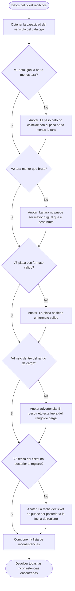
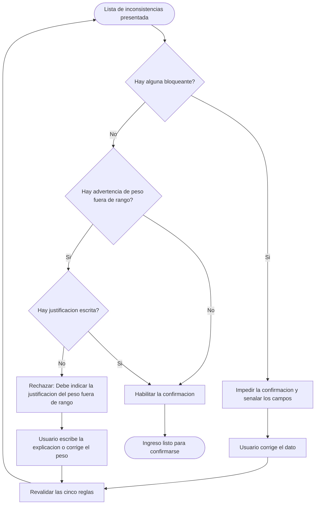
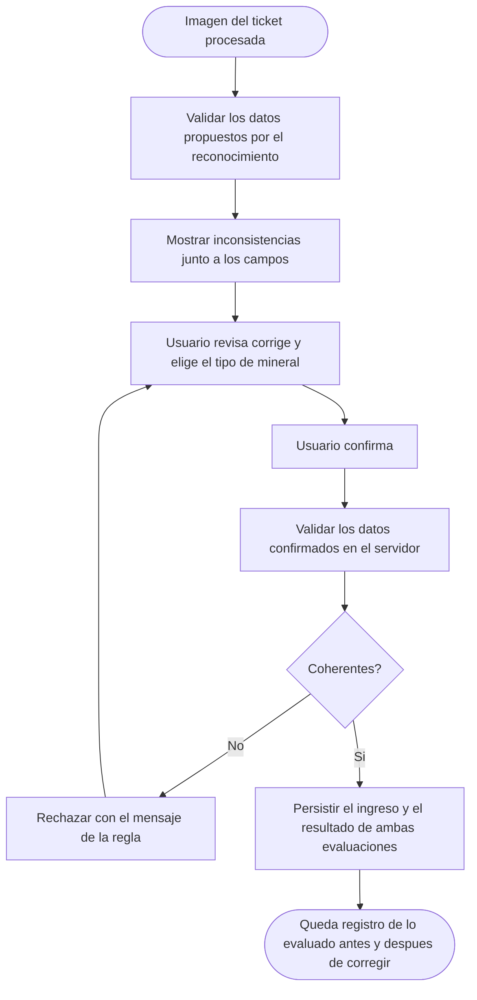

# Diagramas de actividades — M05 Validación automática de consistencia

## A-M05-01 · Evaluación de las cinco reglas (RN-M05-01 a RN-M05-07)

El flujo atraviesa las cinco reglas sin interrumpirse: cada incumplimiento se anota y la evaluación
continúa, de modo que el usuario reciba la lista completa en un solo intento.

## A-M05-02 · Resolución de las inconsistencias antes de confirmar (RN-M05-02, RN-M05-03)

## A-M05-03 · Momento en que se aplica cada evaluación (RN-M05-05)

La segunda evaluación no es redundante: entre una y otra el usuario editó los datos, y esa edición
puede haber introducido una incoherencia que la primera no podía conocer.
