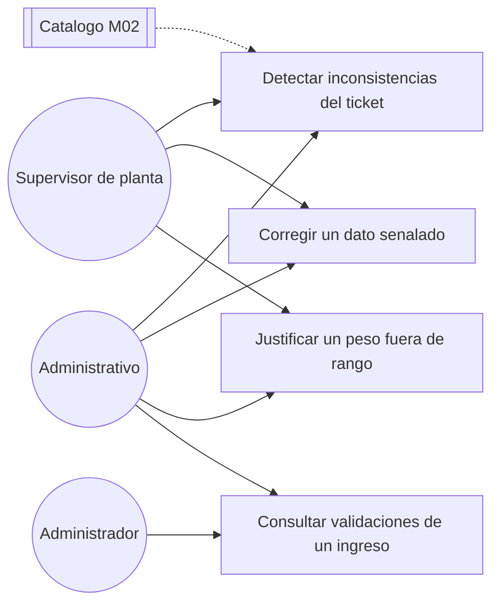

# Diagrama de casos de uso — M05 Validación automática de consistencia

## Casos de uso

| Caso | HU | Actores | Nota |
|---|---|---|---|
| Detectar inconsistencias del ticket | HU-M05-01 | Supervisor de planta, Administrativo | Ocurre dos veces: sobre los datos propuestos y sobre los confirmados |
| Corregir un dato señalado | HU-M05-01 | Supervisor de planta, Administrativo | Al corregir, el sistema revalida y retira la alerta si la regla ya se cumple |
| Justificar un peso fuera de rango | HU-M05-01 | Supervisor de planta, Administrativo | Única vía para confirmar con la advertencia V4 presente |
| Consultar validaciones de un ingreso | HU-M05-01 | Administrativo, Administrador | Muestra qué reglas se evaluaron, su resultado y la justificación |

El catálogo se dibuja como sistema de apoyo porque la regla V4 necesita la capacidad declarada del
vehículo; sin ese dato la regla no puede evaluarse.

Los actores se definen en `../../M01-autenticacion/diagramas/caso_uso.md` y no se redefinen aquí.
