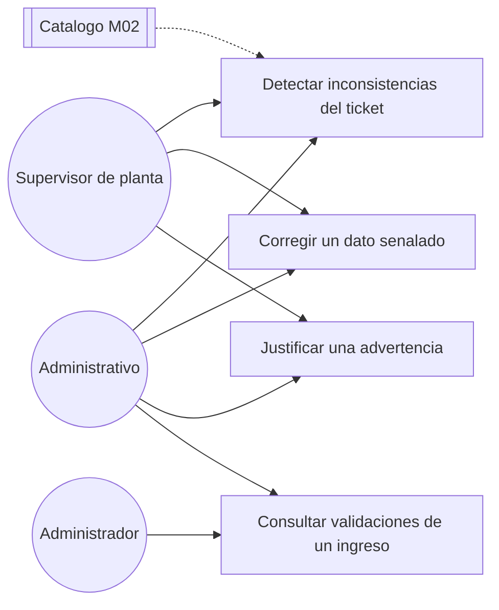

# Diagrama de casos de uso — M05 Validación automática de consistencia

```mermaid
flowchart LR
    SUP(("Supervisor de planta"))
    ADV(("Administrativo"))
    ADM(("Administrador"))
    CAT[["Catalogo M02"]]

    UC1["Detectar inconsistencias del ticket"]
    UC2["Corregir un dato senalado"]
    UC3["Justificar una advertencia"]
    UC4["Consultar validaciones de un ingreso"]

    SUP --> UC1
    SUP --> UC2
    SUP --> UC3
    ADV --> UC1
    ADV --> UC2
    ADV --> UC3
    ADV --> UC4
    ADM --> UC4
    CAT -.-> UC1
```

## Casos de uso

| Caso | HU | Actores | Nota |
|---|---|---|---|
| Detectar inconsistencias del ticket | HU-M05-01 | Supervisor de planta, Administrativo | Ocurre sobre los datos propuestos, sobre los confirmados y, en el primer viaje, al registrar el destare |
| Corregir un dato señalado | HU-M05-01 | Supervisor de planta, Administrativo | Al corregir, el sistema revalida y retira la alerta si la regla ya se cumple |
| Justificar una advertencia | HU-M05-01 | Supervisor de planta, Administrativo | Única vía para confirmar con la advertencia V1 de posible duplicado o V4 de peso fuera de rango |
| Consultar validaciones de un ingreso | HU-M05-01 | Administrativo, Administrador | Muestra qué reglas se evaluaron, su resultado y la justificación |

El catálogo se dibuja como sistema de apoyo porque V2 y V4 necesitan la tara y la capacidad
declaradas del vehículo; sin esos datos las reglas no pueden evaluarse.

Los actores se definen en `../../M01-autenticacion/diagramas/caso_uso.md` y no se redefinen aquí.
