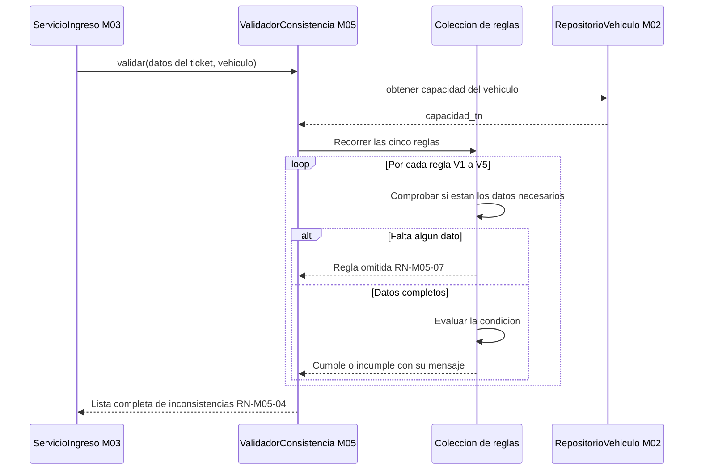
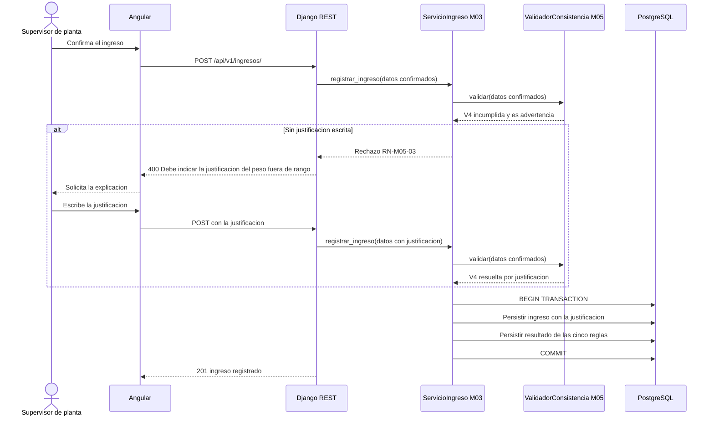
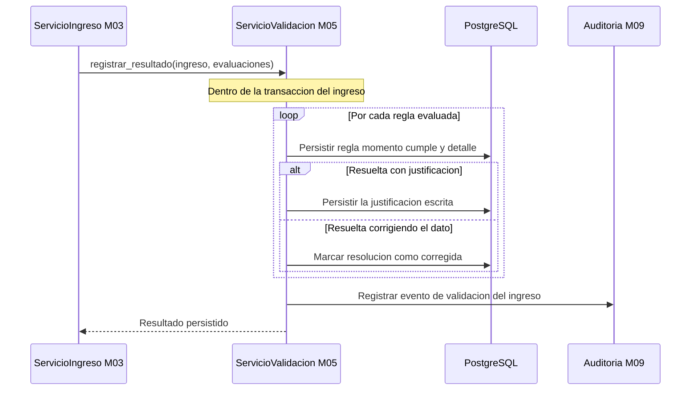

# Diagramas de secuencia — M05 Validación automática de consistencia

## S-M05-01 · Evaluación de las cinco reglas (HU-M05-01)

La colección se recorre entera aunque una regla falle: el usuario debe ver de una vez todo lo que
tiene que arreglar.

## S-M05-02 · Resolución de una advertencia de peso fuera de rango (HU-M05-01)

## S-M05-03 · Registro del resultado de la validación (HU-M05-01)

Las evaluaciones de los datos propuestos y las de los confirmados se guardan ambas, distinguidas por
su momento: la diferencia entre unas y otras es lo que muestra qué corrigió el usuario tras la
advertencia.
