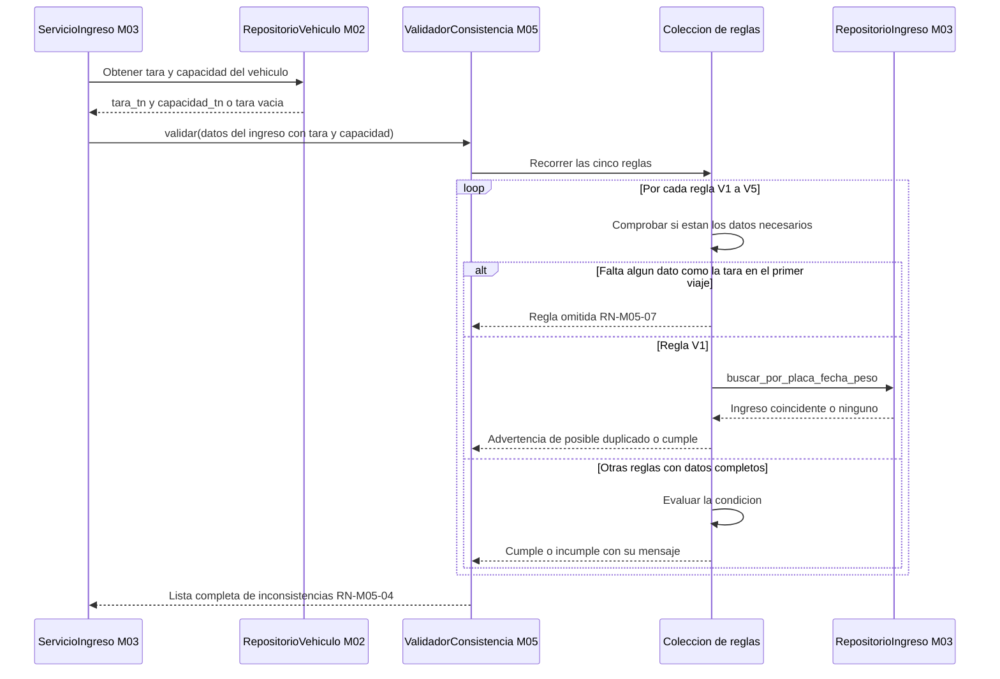
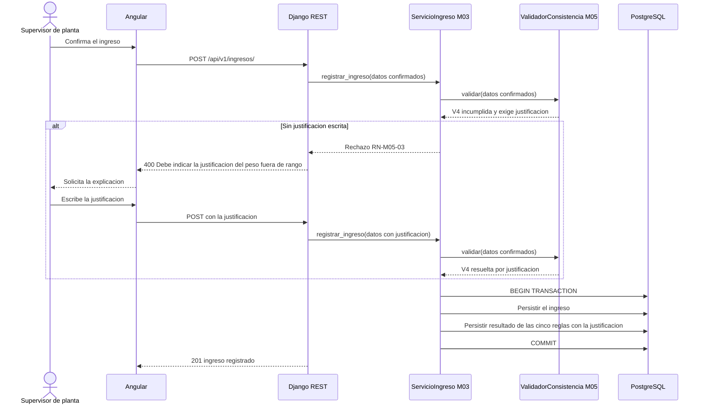
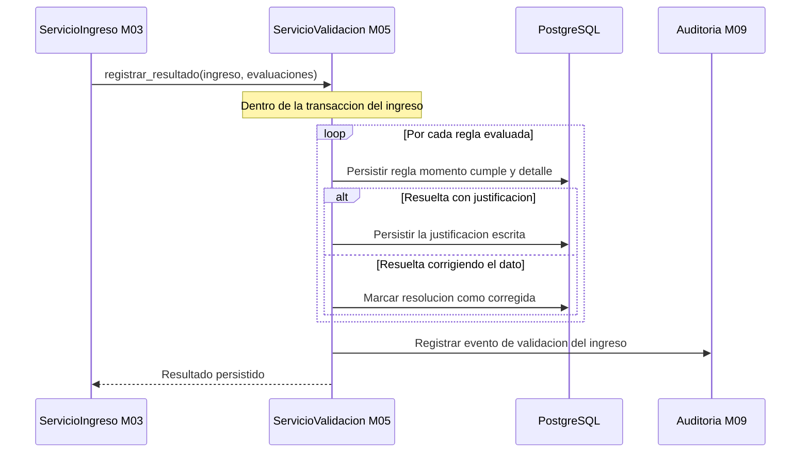

# Diagramas de secuencia — M05 Validación automática de consistencia

## S-M05-01 · Evaluación de las cinco reglas (HU-M05-01)

```mermaid
sequenceDiagram
    participant SRV as ServicioIngreso M03
    participant CAT as RepositorioVehiculo M02
    participant VAL as ValidadorConsistencia M05
    participant REG as Coleccion de reglas
    participant DUP as RepositorioIngreso M03

    SRV->>CAT: Obtener tara y capacidad del vehiculo
    CAT-->>SRV: tara_tn y capacidad_tn o tara vacia
    SRV->>VAL: validar(datos del ingreso con tara y capacidad)
    VAL->>REG: Recorrer las cinco reglas

    loop Por cada regla V1 a V5
        REG->>REG: Comprobar si estan los datos necesarios
        alt Falta algun dato como la tara en el primer viaje
            REG-->>VAL: Regla omitida RN-M05-07
        else Regla V1
            REG->>DUP: buscar_por_placa_fecha_peso
            DUP-->>REG: Ingreso coincidente o ninguno
            REG-->>VAL: Advertencia de posible duplicado o cumple
        else Otras reglas con datos completos
            REG->>REG: Evaluar la condicion
            REG-->>VAL: Cumple o incumple con su mensaje
        end
    end

    VAL-->>SRV: Lista completa de inconsistencias RN-M05-04
```

La colección se recorre entera aunque una regla falle: el usuario debe ver de una vez todo lo que
tiene que arreglar.

## S-M05-02 · Resolución de una advertencia que exige justificación (HU-M05-01)

```mermaid
sequenceDiagram
    actor S as Supervisor de planta
    participant NG as Angular
    participant API as Django REST
    participant SRV as ServicioIngreso M03
    participant VAL as ValidadorConsistencia M05
    participant DB as PostgreSQL

    S->>NG: Confirma el ingreso
    NG->>API: POST /api/v1/ingresos/
    API->>SRV: registrar_ingreso(datos confirmados)
    SRV->>VAL: validar(datos confirmados)
    VAL-->>SRV: V4 incumplida y exige justificacion

    alt Sin justificacion escrita
        SRV-->>API: Rechazo RN-M05-03
        API-->>NG: 400 Debe indicar la justificacion del peso fuera de rango
        NG-->>S: Solicita la explicacion
        S->>NG: Escribe la justificacion
        NG->>API: POST con la justificacion
        API->>SRV: registrar_ingreso(datos con justificacion)
        SRV->>VAL: validar(datos confirmados)
        VAL-->>SRV: V4 resuelta por justificacion
    end

    SRV->>DB: BEGIN TRANSACTION
    SRV->>DB: Persistir el ingreso
    SRV->>DB: Persistir resultado de las cinco reglas con la justificacion
    SRV->>DB: COMMIT
    API-->>NG: 201 ingreso registrado
```

El flujo es el mismo para la advertencia V1 de posible duplicado; solo cambia el mensaje, que en ese
caso es «Debe indicar la justificación del posible duplicado». La justificación se guarda en el
resultado de la regla que la exigió, no en el ingreso.

## S-M05-03 · Registro del resultado de la validación (HU-M05-01)

```mermaid
sequenceDiagram
    participant SRV as ServicioIngreso M03
    participant VLS as ServicioValidacion M05
    participant DB as PostgreSQL
    participant AUD as Auditoria M09

    SRV->>VLS: registrar_resultado(ingreso, evaluaciones)
    Note over VLS: Dentro de la transaccion del ingreso

    loop Por cada regla evaluada
        VLS->>DB: Persistir regla momento cumple y detalle
        alt Resuelta con justificacion
            VLS->>DB: Persistir la justificacion escrita
        else Resuelta corrigiendo el dato
            VLS->>DB: Marcar resolucion como corregida
        end
    end

    VLS->>AUD: Registrar evento de validacion del ingreso
    VLS-->>SRV: Resultado persistido
```

Las evaluaciones de los datos propuestos y las de los confirmados se guardan ambas, distinguidas por
su momento: la diferencia entre unas y otras es lo que muestra qué corrigió el usuario tras la
advertencia.
