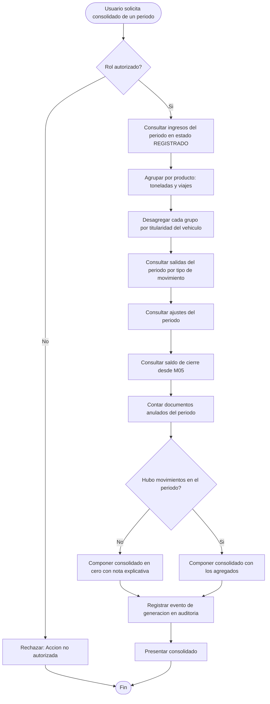
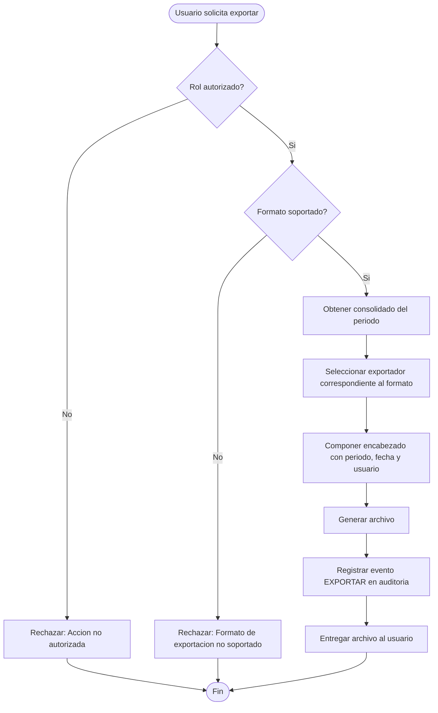
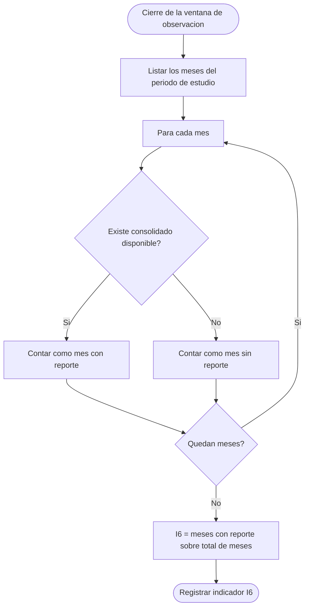

# Diagramas de actividades — M06 Consolidados y reportes

## A-M06-01 · Composición del consolidado mensual (RN-M06-01 a RN-M06-04)

La rama Z1 es la que sostiene el indicador I6: un mes sin producción debe producir reporte, no un error.

## A-M06-02 · Exportación de un reporte (RN-M06-06)

## A-M06-03 · Cálculo del indicador I6

En el pretest, este cálculo se realiza sobre el archivo documental de la empresa. En el postest, se lee directamente del endpoint de disponibilidad. La diferencia entre ambos valores es el efecto que la tesis mide para la dimensión D3.
