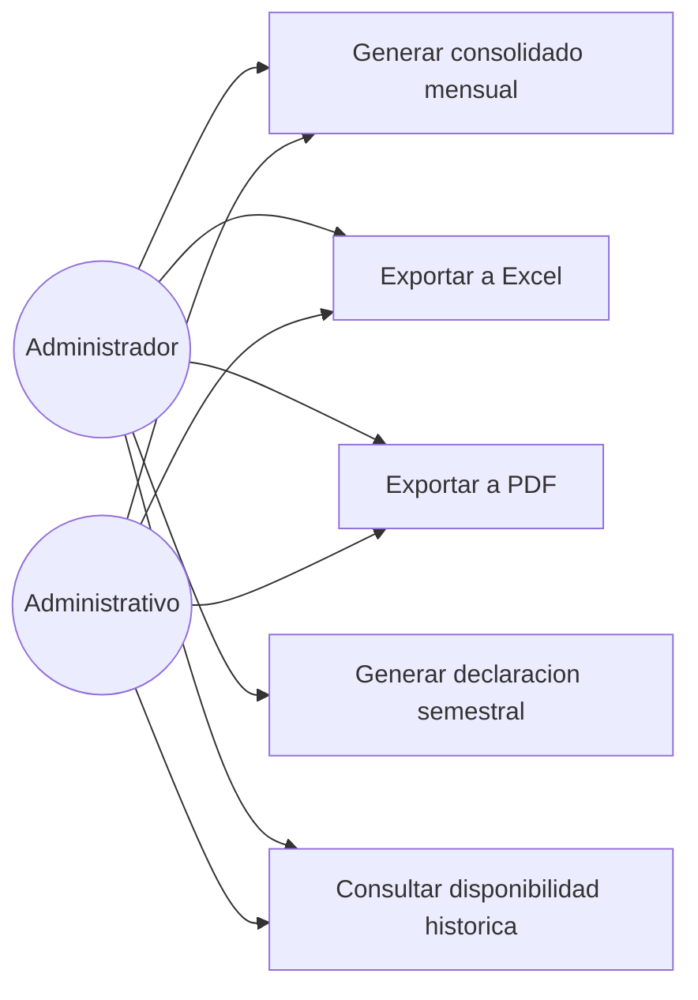

# Diagrama de casos de uso — M06 Consolidados y reportes

El Supervisor no participa en este módulo: su rol opera en la recepción de material, no en la consolidación administrativa.

## Casos de uso

| Caso | HU | Actores | Precondición |
|---|---|---|---|
| Generar consolidado mensual | HU-M06-01 | Administrador, Administrativo | Periodo seleccionado |
| Exportar a Excel | HU-M06-02 | Administrador, Administrativo | Consolidado generado |
| Exportar a PDF | HU-M06-02 | Administrador, Administrativo | Consolidado generado |
| Generar declaración semestral | HU-M06-03 | Administrador | Formato oficial disponible |
| Consultar disponibilidad histórica | HU-M06-01 | Administrador, Administrativo | — |
