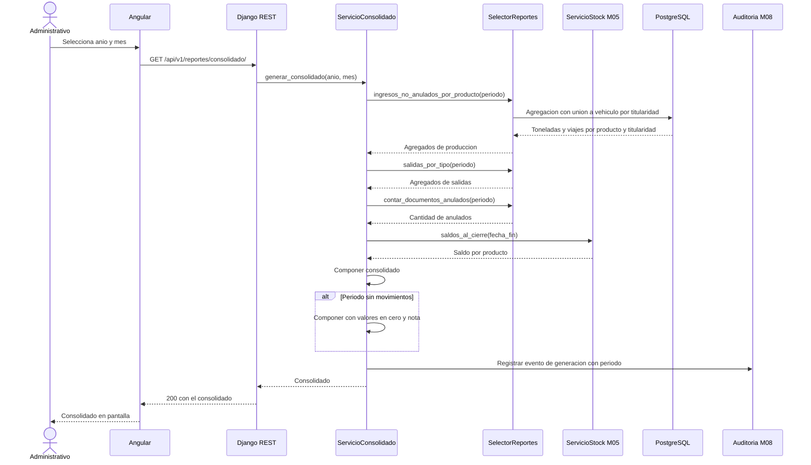
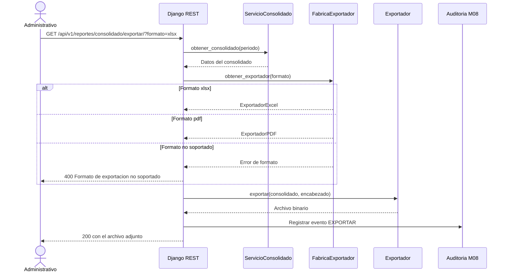
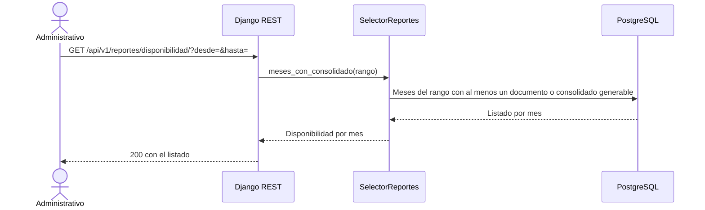

# Diagramas de secuencia — M06 Consolidados y reportes

## S-M06-01 · Generación del consolidado mensual (HU-M06-01)

## S-M06-02 · Exportación con estrategia por formato (HU-M06-02, RS-M06-05)

El servicio de consolidado no conoce los formatos concretos: recibe la abstracción desde la fábrica. Agregar un tercer formato no obliga a modificar `ServicioConsolidado` (principio de abierto/cerrado).

## S-M06-03 · Consulta de disponibilidad histórica y el indicador I6

