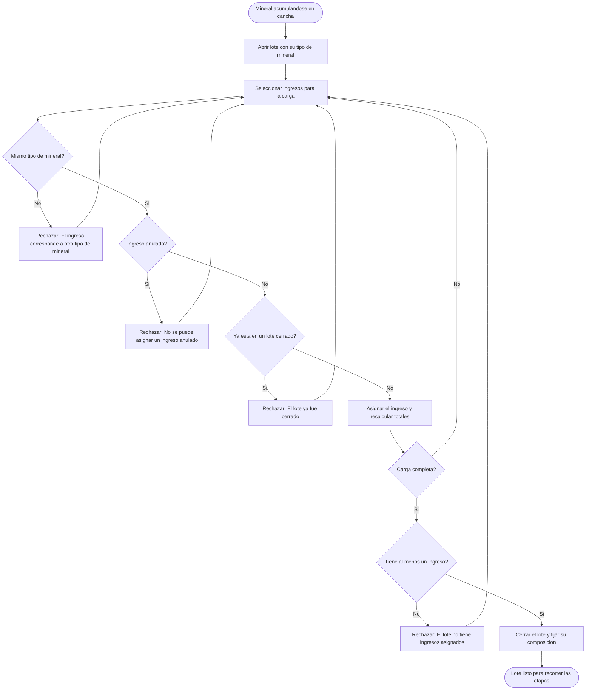
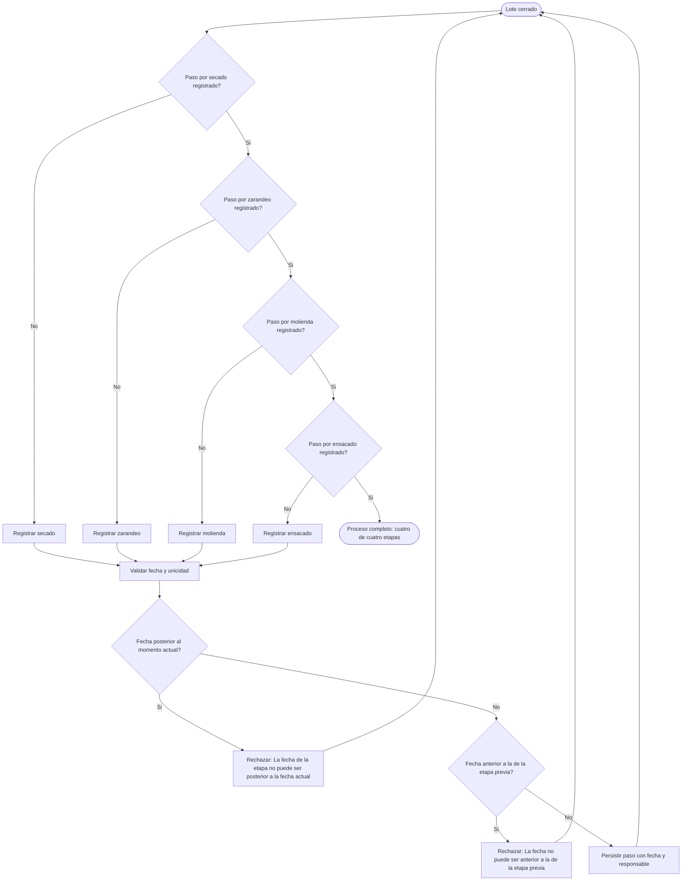
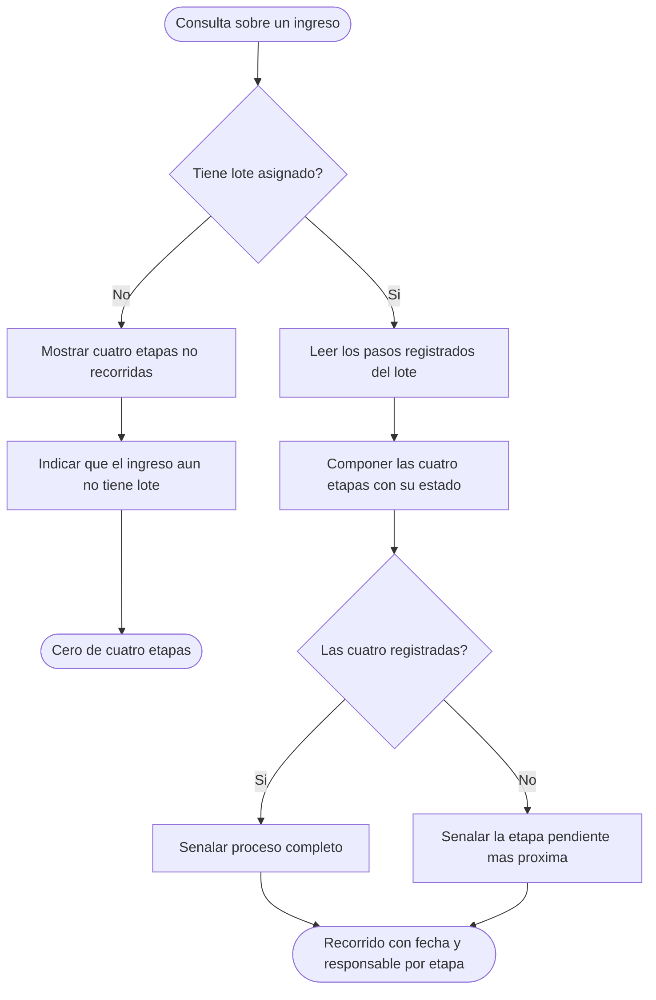

# Diagramas de actividades — M06 Trazabilidad del proceso

## A-M06-01 · Ciclo de vida de un lote (RN-M06-01 a RN-M06-05, RN-M06-10)

## A-M06-02 · Recorrido del lote por las cuatro etapas (RN-M06-06 a RN-M06-08)

La interfaz ofrece únicamente la etapa que corresponde registrar (RNF-M06-07); las decisiones de
este diagrama son las que el servidor comprueba de todas formas.

## A-M06-03 · Respuesta a la pregunta por dónde va un ingreso (RN-M06-11)

Un ingreso sin lote no es un dato faltante: es el estado normal de un ingreso recién registrado, y
se presenta como cero etapas recorridas.
