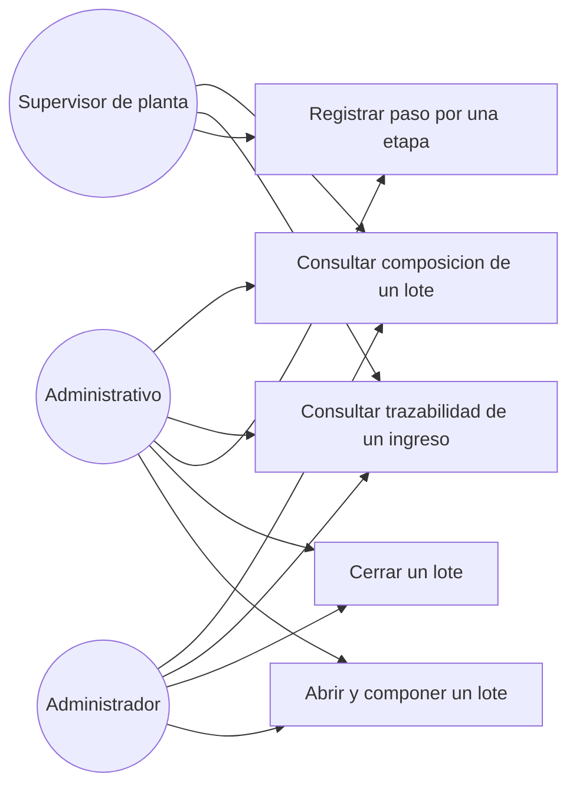

# Diagrama de casos de uso — M06 Trazabilidad del proceso

## Casos de uso

| Caso | HU | Actores | Nota |
|---|---|---|---|
| Abrir y componer un lote | HU-M06-01 | Administrativo, Administrador | Incluye asignar y retirar ingresos mientras el lote sigue abierto |
| Cerrar un lote | HU-M06-01 | Administrativo, Administrador | Fija la composición y habilita el registro de etapas. Exige al menos un ingreso |
| Registrar paso por una etapa | HU-M06-02 | Los tres roles | Solo sobre lotes cerrados y en el orden del proceso |
| Consultar trazabilidad de un ingreso | HU-M06-03 | Los tres roles | Responde a través del lote; un ingreso sin lote ha recorrido cero etapas |
| Consultar composición de un lote | HU-M06-01 | Los tres roles | Muestra los ingresos asignados y el total de toneladas |

El Supervisor de planta registra el paso por etapa porque está en el proceso, pero no decide la
composición de las cargas.

Los actores se definen en `../../M01-autenticacion/diagramas/caso_uso.md` y no se redefinen aquí.
