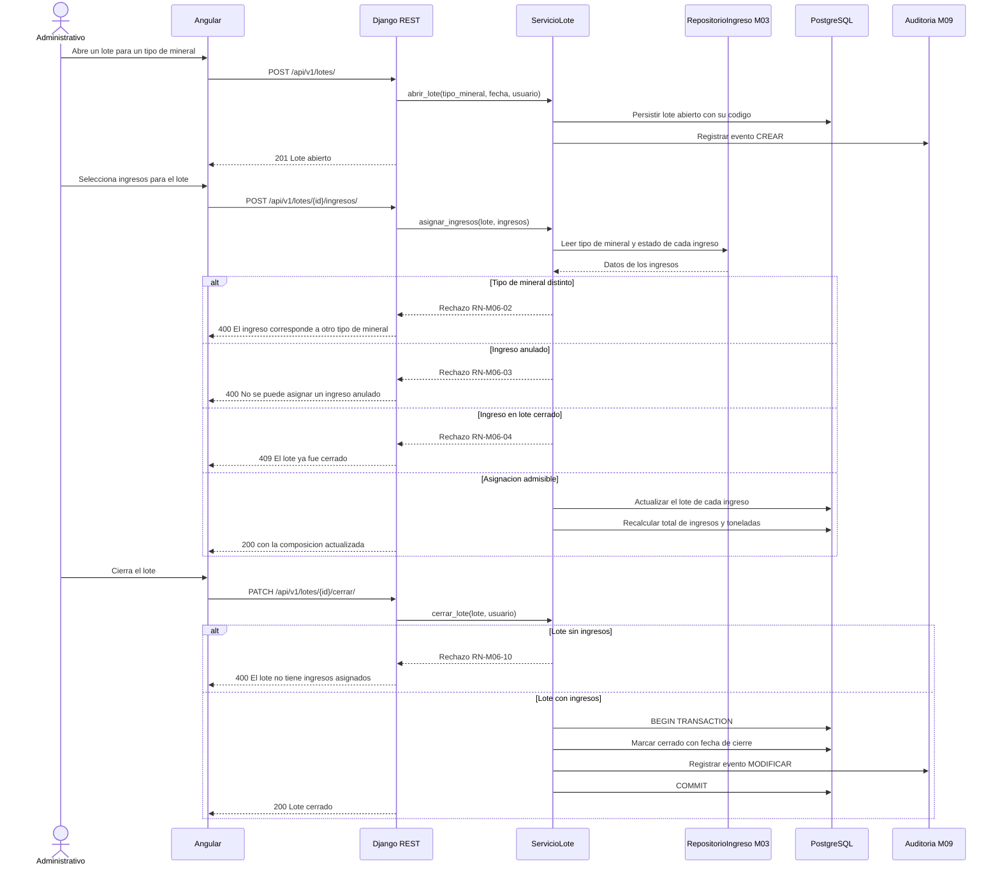
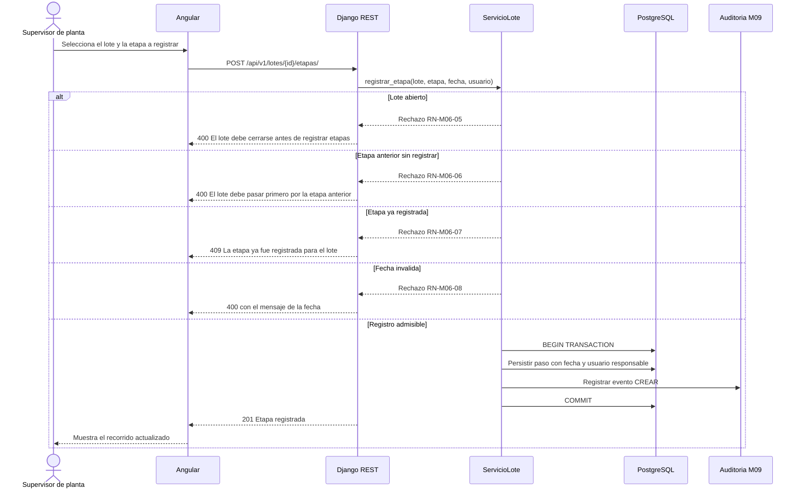
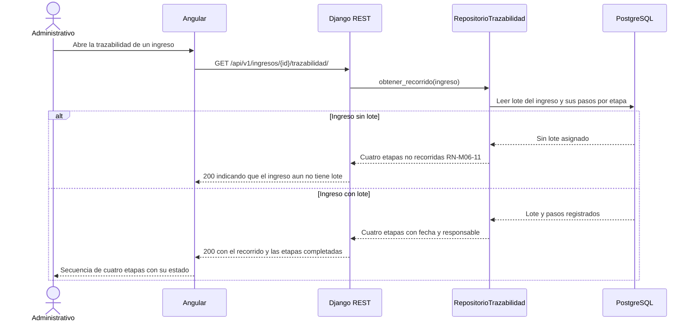

# Diagramas de secuencia — M06 Trazabilidad del proceso

## S-M06-01 · Composición y cierre de un lote (HU-M06-01)

## S-M06-02 · Registro del paso por una etapa (HU-M06-02)

## S-M06-03 · Consulta de la trazabilidad de un ingreso (HU-M06-03)

