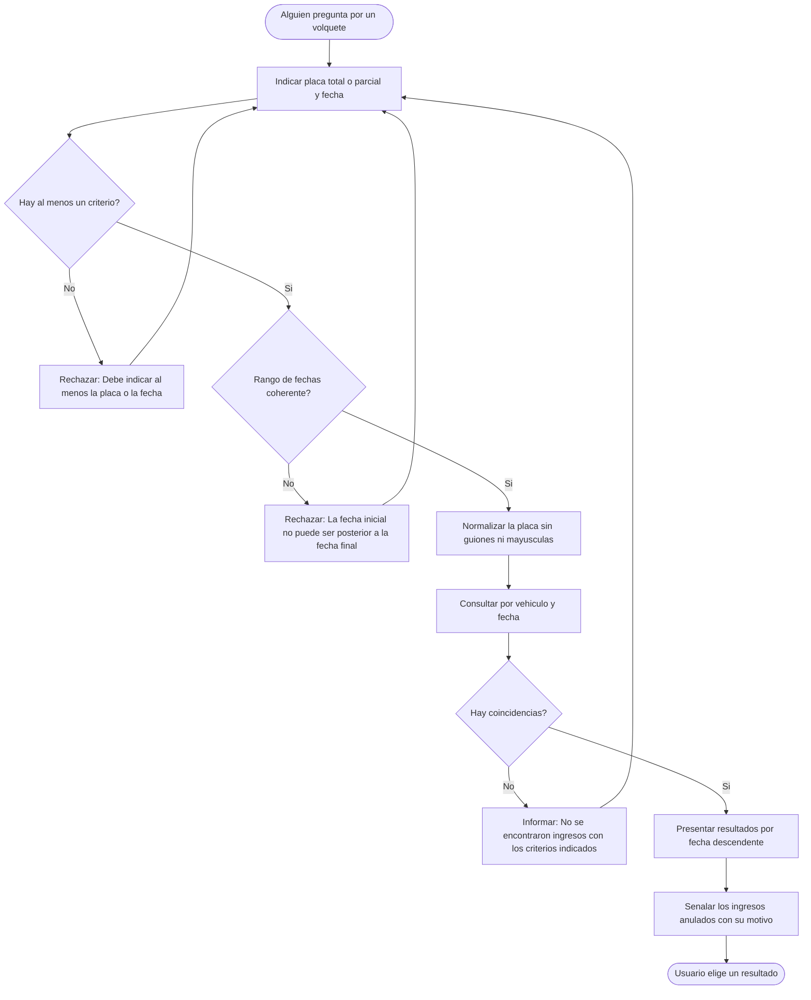
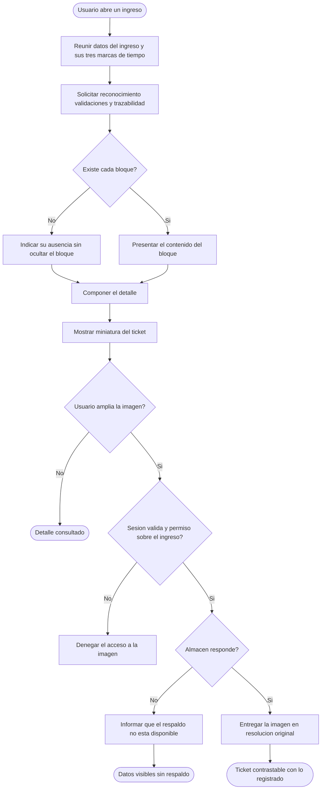
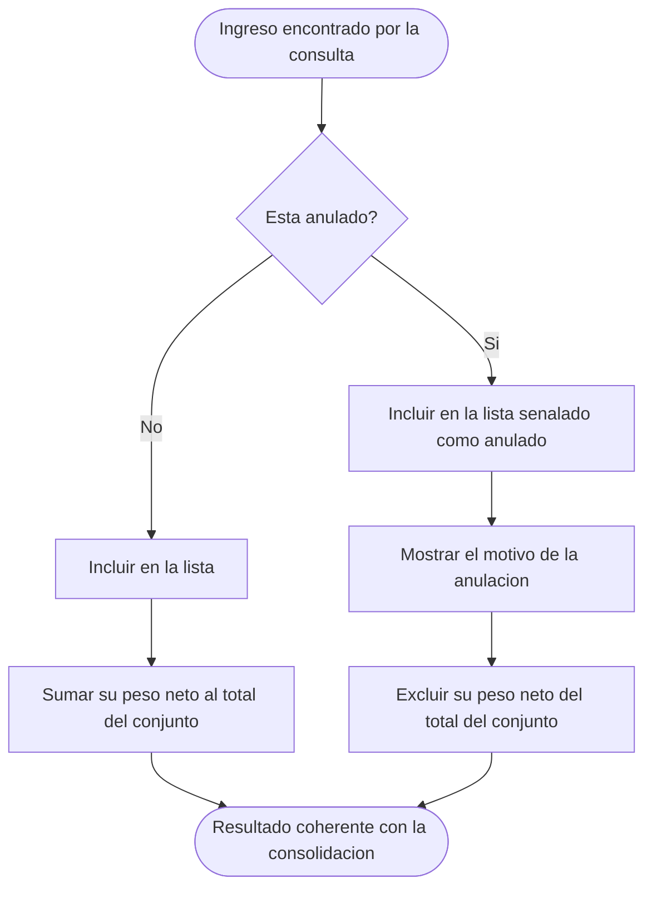

# Diagramas de actividades — M07 Consulta de ingresos y respaldo

## A-M07-01 · Búsqueda de un ingreso por placa y fecha (RN-M07-01, RN-M07-05)

## A-M07-02 · Presentación del detalle y su respaldo (RN-M07-03, RN-M07-04, RN-M07-08)

## A-M07-03 · Tratamiento de un ingreso anulado en las consultas (RN-M07-01, RN-M07-02)

Aparecer y sumar son decisiones distintas. El ingreso anulado aparece porque el hecho ocurrió, y no
suma porque fue retirado del cómputo; si sumara, el total contradiría al de la consolidación para el
mismo periodo.
