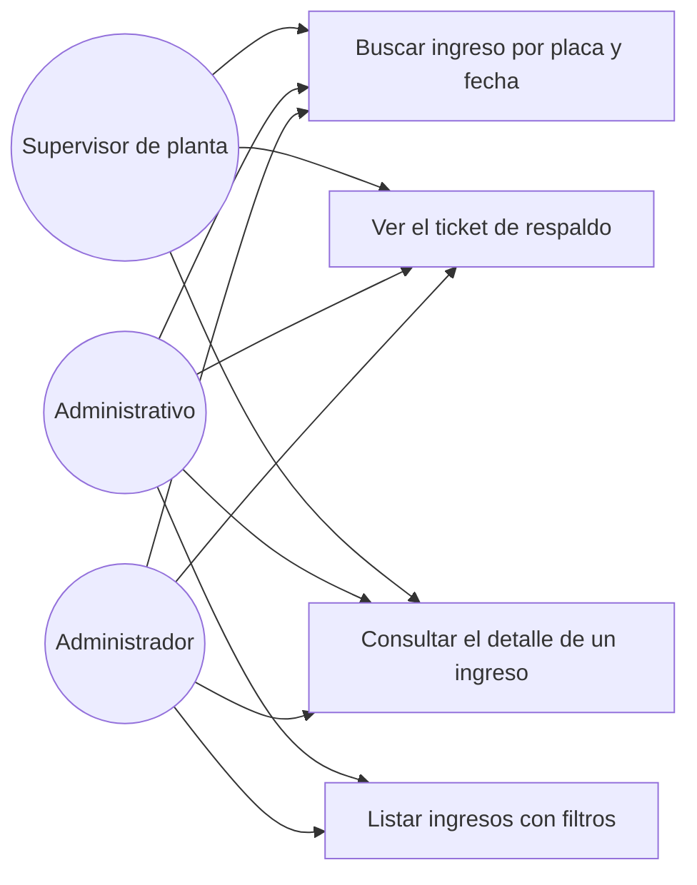

# Diagrama de casos de uso — M07 Consulta de ingresos y respaldo

## Casos de uso

| Caso | HU | Actores | Nota |
|---|---|---|---|
| Buscar ingreso por placa y fecha | HU-M07-01 | Los tres roles | Admite placa parcial. Exige al menos uno de los dos criterios |
| Ver el ticket de respaldo | HU-M07-01 | Los tres roles | La imagen se amplía para poder contrastarla con lo registrado |
| Listar ingresos con filtros | HU-M07-02 | Administrativo, Administrador | Filtros combinables, con el total de ingresos y de toneladas del conjunto |
| Consultar el detalle de un ingreso | HU-M07-01, HU-M07-02 | Los tres roles | Reúne datos, imagen, validaciones, reconocimiento y trazabilidad |

Los ingresos anulados aparecen en todos los casos de uso, señalados como tales: ocultarlos haría
creer que el volquete nunca se registró.

Los actores se definen en `../../M01-autenticacion/diagramas/caso_uso.md` y no se redefinen aquí.
