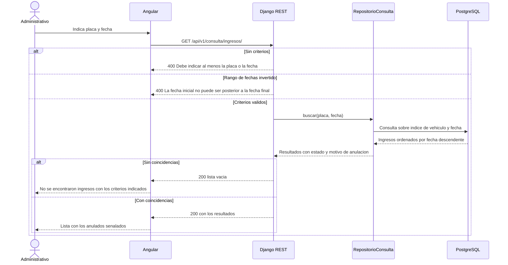
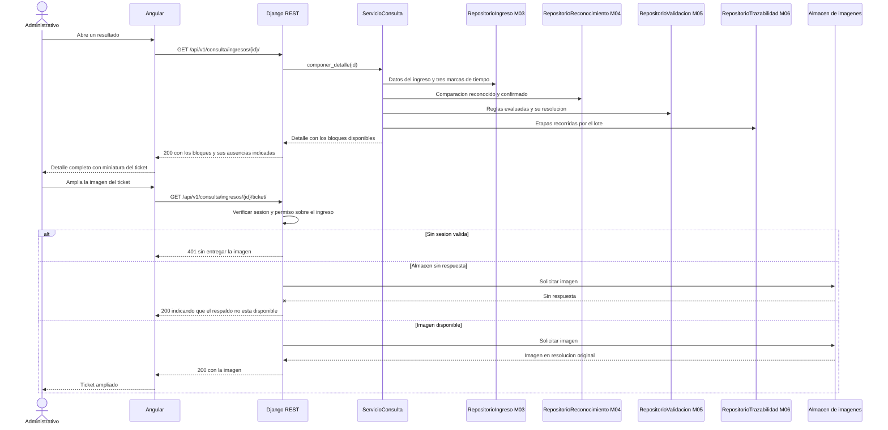
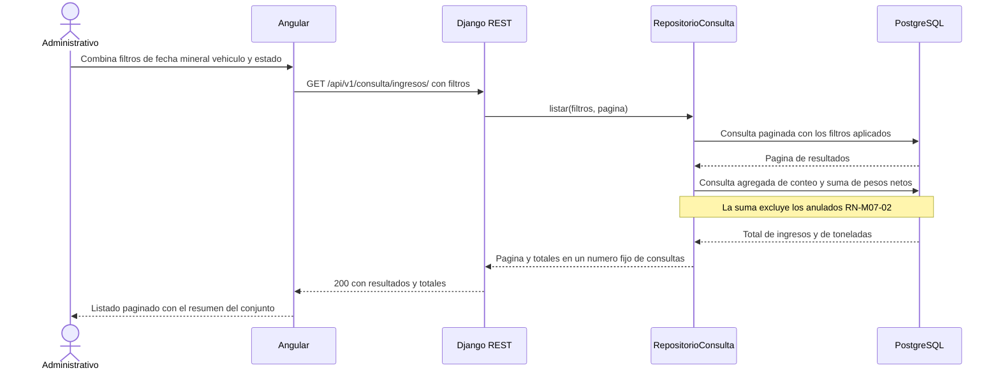

# Diagramas de secuencia — M07 Consulta de ingresos y respaldo

## S-M07-01 · Consulta por placa y fecha (HU-M07-01)

## S-M07-02 · Detalle de un ingreso con su respaldo (HU-M07-01, HU-M07-02)

## S-M07-03 · Listado con filtros y totales (HU-M07-02)

